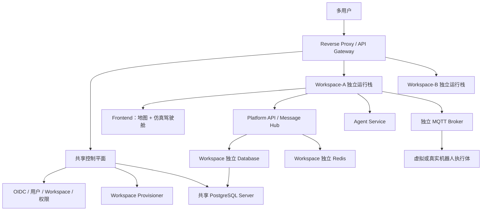

# 具身智能业务流程仿真平台实施文档

## 文档信息

| 项目 | 内容 |
|---|---|
| 文档类型 | 实施标准文档 |
| 版本 | v2.0 |
| 日期 | 2026-06-22 |
| 适用范围 | 1～20 Workspace、多用户、二维地图、仿真驾驶舱、智能体调度、MQTT 执行体、消息总成、Docker 部署 |
| 关联方案 | `.codex/plans/具身智能业务流程仿真平台方案_20260616.md` |
| 关联标准 | `.codex/docs/多用户与Workspace架构标准_20260622.md`、`.codex/docs/仿真驾驶舱规划_20260622.md` |

## 1. 建设目标

平台建设目标是形成一个基于二维数据的具身智能业务流程仿真平台，用于验证智能体规划、机器人动作指令、动作耗时、资源占用、机器人状态、上下游接口、消息审计和后续真实机器人接入能力。

核心目标：

- 前端支持二维地图环境编辑与运行态展示，不做调度控制、机器人指令下发或运行态修改。
- 地图编辑支持坐标轴、鼠标坐标点显示，以及区域、障碍物、工位、路径、资源点等环境对象直接编辑。
- 平台后端负责 API、消息总成、配置、导入导出、日志导出、查询和审计。
- 独立机器人执行体通过 MQTT 接收指令并上报状态。
- 首期使用虚拟机器人执行体，后续可替换为真实机器人或机器人网关。
- 智能体负责业务规划、状态收集、动作决策和指令下发。
- 所有服务使用 Docker 部署。
- 配置、过程、日志、事件、消息和联调记录可导入、导出、追踪和回放。
- 支持 1～20 个 Workspace；每个用户默认拥有独立 Workspace 和独立前后端运行栈。
- 建立 Task、Plan、Action、Observation、CurrentState、Snapshot、Trace 统一运行模型。
- 提供独立仿真驾驶舱，用于任务运行、状态观察、链路诊断、快照和回放。

## 2. 建设边界

### 2.1 包含范围

- 二维地图环境编辑。
- 坐标轴、鼠标坐标点、网格、吸附、对象选择、拖拽、节点编辑。
- 机器人状态展示。
- 指令执行状态展示。
- MQTT 机器人控制。
- 独立虚拟机器人执行体。
- 智能体调度接入。
- 消息总成。
- API 契约管理。
- MQTT 契约管理。
- 配置导入导出。
- 过程、日志、事件、消息、指标和联调记录导出。
- Docker 化部署。
- 基础可观测性。
- 多用户认证、Workspace 成员和角色权限。
- 每 Workspace 独立 Frontend、Platform API、Agent、MQTT Broker、Executor、Redis、Network 和 Volume。
- 共享控制平面、反向代理和 Workspace 生命周期管理。
- 仿真驾驶舱和统一运行领域模型。

### 2.2 不包含范围

- 三维物理仿真。
- 前端任务编排。
- 平台后端直接模拟机器人。
- 平台后端主动规划任务流。
- 真实机器人底盘控制算法。
- SLAM、导航、避障算法实现。
- AI 模型训练平台。
- Kubernetes、Service Mesh、Kafka 和跨宿主机高可用编排。
- 为每个用户复制独立源码仓库。

## 3. 总体架构



Workspace 内运行主链路：

```text
SimulationRun → Task → Plan → Action → MQTT command → result event
→ Observation → CurrentState → Snapshot

Trace 贯穿整条链路
```

## 4. 服务边界

| 服务 | 职责 | 不负责 |
|---|---|---|
| 共享控制平面 | 用户、Workspace、实例、路由、镜像、配额和全局审计 | 不发布机器人指令，不进行任务规划 |
| 反向代理/API Gateway | 统一 HTTP 路由、TLS 和 Workspace 入口 | 不处理业务状态 |
| Workspace 前端 | 地图编辑、仿真驾驶舱、协议、Trace、导出 | 不直连 MQTT，不直接修改运行态 |
| 平台 API | 查询、契约、配置导入导出、日志导出、审计、权限、状态视图 | 不模拟机器人，不主动规划任务 |
| 消息总成 | 统一接收、转换、分发、记录指令、result event、接口消息 | 不决定下一步动作 |
| Workspace MQTT Broker | command/result 通道和设备身份隔离 | 不做业务逻辑 |
| 独立虚拟机器人执行体 | 订阅 command，模拟动作执行，发布 result event | 不规划任务，不绕过 MQTT 契约 |
| 智能体服务 | 收集状态，规划动作，下发指令，评估反馈 | 不直接改写机器人状态 |
| 导出服务 | 异步导出配置、日志、事件、消息、指标、联调记录 | 不修改业务数据 |
| 数据库 | 保存配置、会话、指令、事件、消息索引、审计、指标 | 不保存每帧前端动画 |

## 5. 技术栈标准

| 类别 | 标准选型 |
|---|---|
| 前端 | React、TypeScript、Vite、Tailwind CSS、shadcn/ui、Framer Motion |
| 二维地图编辑 | Konva.js 起步，PixiJS 作为大规模渲染备选 |
| 图表 | ECharts |
| 后端 | Python、FastAPI、Pydantic、SQLAlchemy 或 SQLModel、Alembic |
| 数据库 | PostgreSQL |
| 缓存与轻量事件 | Redis |
| 机器人通信 | MQTT Broker |
| 内部消息 | Redis Streams；1～20 Workspace 阶段不引入 Kafka |
| API 契约 | OpenAPI |
| 异步契约 | AsyncAPI 或等价 MQTT 契约文档 |
| 部署 | Docker、参数化 Docker Compose、Reverse Proxy、Control Plane |
| 观测 | OpenTelemetry、Prometheus、Grafana、Loki 或 OpenSearch |
| 测试 | Pytest、Vitest、Playwright、k6 或 Locust |
| 身份认证 | Keycloak、OIDC、JWT |
| HTTP 入口 | Traefik 或 Nginx |
| Workspace 编排 | Control Plane + Docker Compose 模板 |

## 6. Docker 部署标准

### 6.1 共享服务清单

| 服务名 | 镜像职责 | 必选 |
|---|---|---|
| reverse-proxy | 多 Workspace HTTP 入口和 TLS | 是 |
| control-plane-api | User、Workspace、实例和资源编排 | 是 |
| identity | OIDC/JWT 用户认证 | 是 |
| postgres | 控制平面及 Workspace Database Server | 是 |
| observability | 集中日志、指标和追踪 | 建议 |

### 6.2 每 Workspace 服务清单

| 服务名 | 镜像职责 | 必选 |
|---|---|---|
| frontend | 地图、仿真驾驶舱、协议和 Trace | 是 |
| platform-api | API、消息总成、配置、状态、导出 | 是 |
| agent-service | Task、Plan、Action 和智能体适配 | 是 |
| mqtt-broker | Workspace 独立 command/result 通道 | 是 |
| virtual-robot-runner | 独立虚拟机器人执行体 | 是 |
| redis | CurrentState、会话和 WebSocket 缓冲 | 是 |
| exporter-worker | Run、Snapshot、Trace 导出 | 建议 |

### 6.3 部署要求

- 所有服务必须提供独立 Dockerfile。
- 所有服务配置通过环境变量注入。
- 每 Workspace 必须拥有独立 Network、Volume、Database、Database Role、Redis 和 MQTT Broker。
- PostgreSQL Server 可共享，但 Workspace Database 和 Role 必须独立。
- `redis`、`mqtt-broker`、导出、Snapshot 和 Trace 目录必须挂载独立持久化卷。
- 至少提供 `local` 和 `test` 两套 Docker Compose 配置。
- 所有服务必须提供健康检查。
- 虚拟机器人执行体支持多实例启动。
- 真实机器人接入时，不删除 MQTT Broker 和消息总成。
- Workspace 使用统一镜像版本，禁止复制源码目录。
- 1～20 Workspace 阶段通过 Control Plane 参数化启动 Docker Compose Stack。
- HTTP 使用反向代理统一暴露；MQTT 从端口池 `18830～18849` 分配。

## 7. 实施阶段

### 阶段 0：需求澄清与标准确认

目标：

- 确认首期场景。
- 确认地图编辑对象、坐标系、坐标轴、网格和吸附规则。
- 确认机器人动作集。
- 确认 MQTT Topic 契约。
- 确认 API 契约。
- 确认数据库结构。
- 确认导入导出范围。
- 确认 Docker 服务清单。

交付物：

- 场景清单。
- 动作集清单。
- MQTT 契约文档。
- API 契约文档。
- 数据库标准文档。
- 页面原型。
- 地图编辑交互原型。
- Docker 服务清单。

验收：

- 至少 1 个场景可完整描述。
- 地图环境编辑对象和坐标系规则明确。
- 至少 1 类机器人和 3 个动作完成定义。
- MQTT command/result Topic 明确。
- 配置导入导出和日志导出范围明确。

### 阶段 1：MVP 闭环

目标：

- 打通智能体下发指令到独立虚拟机器人执行体执行再到前端展示的闭环。

交付物：

- 前端地图编辑与展示页。
- 平台 API。
- MQTT Broker。
- 独立虚拟机器人执行体。
- 消息总成雏形。
- 规则智能体。
- Docker Compose。

验收：

- 所有核心服务可用 Docker Compose 启动。
- 智能体可下发动作指令。
- 指令通过 MQTT 到达虚拟机器人执行体。
- 执行体可上报 result event。
- 前端可显示坐标轴、鼠标坐标点，并可编辑地图环境对象。
- 前端可展示状态变化。
- 消息中心可追踪完整链路。

### 阶段 2：并发、资源和事件

目标：

- 支持多机器人、多指令、资源占用、随机事件和控制台事件。

交付物：

- 资源占用模型。
- 多机器人执行体实例。
- 控制台事件入口。
- 随机事件规则。
- 基础指标。

验收：

- 多机器人并发执行状态一致。
- 资源冲突可进入等待或失败。
- 控制台事件进入消息总成。
- 随机事件可影响执行体状态。

### 阶段 3：契约、导出和回放

目标：

- 完成 REST、WebSocket、MQTT 契约治理。
- 支持配置导入导出。
- 支持过程、日志、消息、事件、指标和联调记录导出。
- 支持事件回放。

交付物：

- OpenAPI 文档。
- MQTT 契约文档。
- 导入导出接口。
- 导出任务服务。
- 回放查询能力。

验收：

- 任意指令可追踪到智能体决策、MQTT command、result event 和最终结果。
- 可导出单次会话完整过程。
- 可导出配置版本。
- 可按事件时间线回放。

### 阶段 4：AI 调度增强

目标：

- 接入 AI 智能体。
- 支持规则智能体和 AI 智能体策略对比。

交付物：

- AI 适配层。
- 策略评估指标。
- 决策审计记录。
- 规则回退机制。

验收：

- AI 指令必须经过校验。
- 非法指令被拒绝并记录原因。
- AI 不可用时可回退规则智能体。
- 同场景、同随机种子下可对比策略效果。

### 阶段 5：真实机器人联调

目标：

- 用真实机器人或机器人网关替换虚拟机器人执行体。

交付物：

- 真实机器人 MQTT 接入说明。
- 真实机器人能力上报。
- 真实机器人联调记录。
- 替换验证报告。

验收：

- 真实机器人实现同一 MQTT 契约。
- 平台主体无需改造。
- 指令与 result event 链路保持一致。

### 阶段 6：统一运行模型与仿真驾驶舱

目标：

- 落地 SimulationRun、Task、Plan、Action、Observation、CurrentState、Snapshot、Trace。
- 建立独立 `/simulation` 仿真驾驶舱。

交付物：

- Task/Plan/Action 状态机和 API 契约。
- Observation 标准化和 CurrentState 聚合。
- Snapshot 检查点和 Trace 时间线。
- 驾驶舱 Task/Plan、二维状态、Action/Observation、诊断区。
- 单次 Run 完整导出包。

验收：

- Task 可追踪到 Plan、Action、MQTT command、result、Observation 和最终状态。
- Plan 重规划产生新版本，不覆盖历史版本。
- Snapshot 可恢复指定状态版本的只读视图。
- Trace 可说明任务成功、失败、等待和重规划原因。

### 阶段 7：多用户与 1～20 Workspace

目标：

- 建立共享控制平面。
- 每个用户默认创建独立私有 Workspace。
- 每 Workspace 独立部署前端、后端、Agent、Broker、Executor、Redis、Network 和 Volume。

交付物：

- OIDC/JWT 认证和 Workspace RBAC。
- Workspace 生命周期和实例编排。
- 参数化 Docker Compose 模板。
- HTTP 路由和 MQTT 端口池。
- 独立 Database/Role、Volume、日志和备份。

验收：

- 可同时运行多个 Workspace，设计容量达到 20 个。
- Workspace 之间页面、API、MQTT、数据库、日志和文件互相隔离。
- 相同 `robotCode` 在不同 Workspace 中互不影响。
- 使用统一镜像批量升级，禁止复制源码。

## 8. 工作分解

| 模块 | 工作项 |
|---|---|
| 前端 | 地图编辑、仿真驾驶舱、Task/Plan、CurrentState、Trace、协议、导入导出 |
| 控制平面 | User、Workspace、成员、实例、路由、配额、镜像和全局审计 |
| 平台 API | REST API、权限、查询、配置导入导出、日志导出、审计 |
| 消息总成 | 指令桥接、MQTT 消息消费、消息记录、WebSocket 推送 |
| MQTT | Broker 部署、Topic 权限、连接参数、Last Will、联调配置 |
| 执行体 | MQTT 订阅、动作执行、状态机、事件处理、回执上报 |
| 智能体 | 观测收集、规则策略、指令生成、反馈评估、AI 接入 |
| 数据库 | 表结构、索引、迁移、审计字段、数据生命周期 |
| 运维 | Docker Compose、健康检查、日志、监控、备份 |
| 测试 | 单测、接口测试、MQTT 联调测试、E2E、压测 |

## 9. 验收清单

- [ ] 全服务 Docker Compose 启动成功。
- [ ] 前端可编辑地图环境配置草稿。
- [ ] 地图显示 X/Y 坐标轴。
- [ ] 鼠标移动到地图上可显示当前坐标点。
- [ ] 地图上的区域、障碍物、工位、路径、资源点可创建、选择、移动、调整和删除。
- [ ] 前端不修改运行态。
- [ ] 智能体能下发动作指令。
- [ ] MQTT command 能到达独立执行体。
- [ ] 执行体能上报 result event。
- [ ] command Topic 禁止 retained。
- [ ] result event 可记录并追踪。
- [ ] commandId 和 idempotencyKey 可防止重复执行。
- [ ] Last Will 可产生离线事件。
- [ ] 配置可导入、校验、预览、版本化、导出。
- [ ] 过程、日志、消息、事件、指标、联调记录可导出。
- [ ] 单次会话可回放。
- [ ] 虚拟执行体可被真实机器人网关替换。
- [ ] Task、Plan、Action、Observation、CurrentState、Snapshot、Trace 可完整串联。
- [ ] 仿真驾驶舱与地图编辑页职责分离。
- [ ] 每个用户默认拥有独立 Workspace。
- [ ] 每 Workspace 使用独立前后端、Broker、Redis、Network、Volume 和 Database Role。
- [ ] 两个 Workspace 使用相同 `robotCode` 时互不影响。
- [ ] 用户不能访问未授权 Workspace 的页面、API、MQTT、Snapshot、Trace 和导出文件。

## 10. 风险控制

| 风险 | 控制措施 |
|---|---|
| MQTT 契约漂移 | 契约版本化，破坏性变更新增版本 |
| 重复执行指令 | commandId、idempotencyKey、去重记录 |
| 旧命令误执行 | command Topic 禁止 retained |
| 执行体耦合平台 | 执行体只依赖 MQTT 契约 |
| Docker 环境漂移 | 镜像、Compose、环境变量版本化 |
| 导出数据泄露 | 权限、脱敏、审计、过期清理 |
| 前端越权 | 前端只读展示，导入导出通过后端 |
