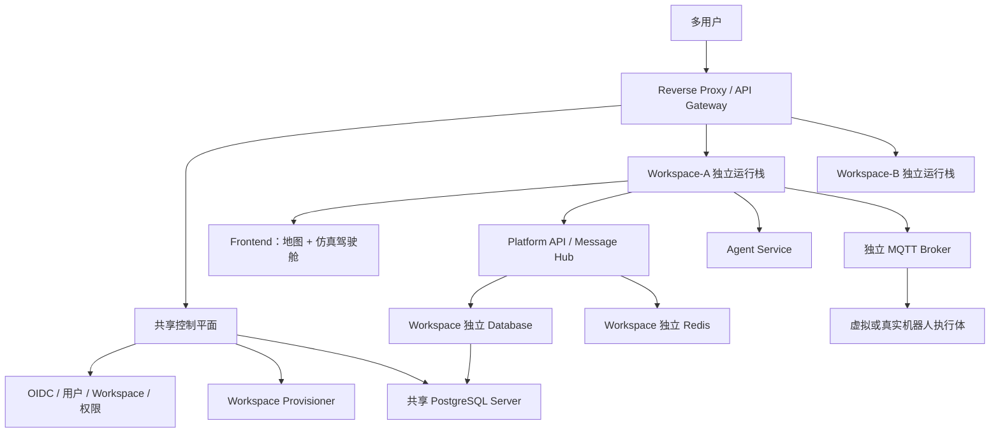

# 具身智能业务流程仿真平台实施文档

## 文档信息

| 项目 | 内容 |
|---|---|
| 文档类型 | 实施标准文档 |
| 版本 | v2.0 |
| 日期 | 2026-06-22 |
| 适用范围 | 1～20 Workspace、多用户、二维地图、仿真驾驶舱、智能体调度、MQTT 执行体、消息总成、Docker 部署 |
| 关联方案 | `.codex/plans/具身智能业务流程仿真平台方案_20260616.md` |
| 关联标准 | `.codex/docs/多用户与Workspace架构标准_20260622.md`、`.codex/docs/仿真驾驶舱规划_20260622.md` |

## 1. 建设目标

平台建设目标是形成一个基于二维数据的具身智能业务流程仿真平台，用于验证智能体规划、机器人动作指令、动作耗时、资源占用、机器人状态、上下游接口、消息审计和后续真实机器人接入能力。

核心目标：

- 前端支持二维地图环境编辑与运行态展示，不做调度控制、机器人指令下发或运行态修改。
- 地图编辑支持坐标轴、鼠标坐标点显示，以及区域、障碍物、工位、路径、资源点等环境对象直接编辑。
- 平台后端负责 API、消息总成、配置、导入导出、日志导出、查询和审计。
- 独立机器人执行体通过 MQTT 接收指令并上报状态。
- 首期使用虚拟机器人执行体，后续可替换为真实机器人或机器人网关。
- 智能体负责业务规划、状态收集、动作决策和指令下发。
- 所有服务使用 Docker 部署。
- 配置、过程、日志、事件、消息和联调记录可导入、导出、追踪和回放。
- 支持 1～20 个 Workspace；每个用户默认拥有独立 Workspace 和独立前后端运行栈。
- 建立 Task、Plan、Action、Observation、CurrentState、Snapshot、Trace 统一运行模型。
- 提供独立仿真驾驶舱，用于任务运行、状态观察、链路诊断、快照和回放。

## 2. 建设边界

### 2.1 包含范围

- 二维地图环境编辑。
- 坐标轴、鼠标坐标点、网格、吸附、对象选择、拖拽、节点编辑。
- 机器人状态展示。
- 指令执行状态展示。
- MQTT 机器人控制。
- 独立虚拟机器人执行体。
- 智能体调度接入。
- 消息总成。
- API 契约管理。
- MQTT 契约管理。
- 配置导入导出。
- 过程、日志、事件、消息、指标和联调记录导出。
- Docker 化部署。
- 基础可观测性。
- 多用户认证、Workspace 成员和角色权限。
- 每 Workspace 独立 Frontend、Platform API、Agent、MQTT Broker、Executor、Redis、Network 和 Volume。
- 共享控制平面、反向代理和 Workspace 生命周期管理。
- 仿真驾驶舱和统一运行领域模型。

### 2.2 不包含范围

- 三维物理仿真。
- 前端任务编排。
- 平台后端直接模拟机器人。
- 平台后端主动规划任务流。
- 真实机器人底盘控制算法。
- SLAM、导航、避障算法实现。
- AI 模型训练平台。
- Kubernetes、Service Mesh、Kafka 和跨宿主机高可用编排。
- 为每个用户复制独立源码仓库。

## 3. 总体架构



Workspace 内运行主链路：

```text
SimulationRun → Task → Plan → Action → MQTT command → result event
→ Observation → CurrentState → Snapshot

Trace 贯穿整条链路
```

## 4. 服务边界

| 服务 | 职责 | 不负责 |
|---|---|---|
| 共享控制平面 | 用户、Workspace、实例、路由、镜像、配额和全局审计 | 不发布机器人指令，不进行任务规划 |
| 反向代理/API Gateway | 统一 HTTP 路由、TLS 和 Workspace 入口 | 不处理业务状态 |
| Workspace 前端 | 地图编辑、仿真驾驶舱、协议、Trace、导出 | 不直连 MQTT，不直接修改运行态 |
| 平台 API | 查询、契约、配置导入导出、日志导出、审计、权限、状态视图 | 不模拟机器人，不主动规划任务 |
| 消息总成 | 统一接收、转换、分发、记录指令、result event、接口消息 | 不决定下一步动作 |
| Workspace MQTT Broker | command/result 通道和设备身份隔离 | 不做业务逻辑 |
| 独立虚拟机器人执行体 | 订阅 command，模拟动作执行，发布 result event | 不规划任务，不绕过 MQTT 契约 |
| 智能体服务 | 收集状态，规划动作，下发指令，评估反馈 | 不直接改写机器人状态 |
| 导出服务 | 异步导出配置、日志、事件、消息、指标、联调记录 | 不修改业务数据 |
| 数据库 | 保存配置、会话、指令、事件、消息索引、审计、指标 | 不保存每帧前端动画 |

## 5. 技术栈标准

| 类别 | 标准选型 |
|---|---|
| 前端 | React、TypeScript、Vite、Tailwind CSS、shadcn/ui、Framer Motion |
| 二维地图编辑 | Konva.js 起步，PixiJS 作为大规模渲染备选 |
| 图表 | ECharts |
| 后端 | Python、FastAPI、Pydantic、SQLAlchemy 或 SQLModel、Alembic |
| 数据库 | PostgreSQL |
| 缓存与轻量事件 | Redis |
| 机器人通信 | MQTT Broker |
| 内部消息 | Redis Streams；1～20 Workspace 阶段不引入 Kafka |
| API 契约 | OpenAPI |
| 异步契约 | AsyncAPI 或等价 MQTT 契约文档 |
| 部署 | Docker、参数化 Docker Compose、Reverse Proxy、Control Plane |
| 观测 | OpenTelemetry、Prometheus、Grafana、Loki 或 OpenSearch |
| 测试 | Pytest、Vitest、Playwright、k6 或 Locust |
| 身份认证 | Keycloak、OIDC、JWT |
| HTTP 入口 | Traefik 或 Nginx |
| Workspace 编排 | Control Plane + Docker Compose 模板 |

## 6. Docker 部署标准

### 6.1 共享服务清单

| 服务名 | 镜像职责 | 必选 |
|---|---|---|
| reverse-proxy | 多 Workspace HTTP 入口和 TLS | 是 |
| control-plane-api | User、Workspace、实例和资源编排 | 是 |
| identity | OIDC/JWT 用户认证 | 是 |
| postgres | 控制平面及 Workspace Database Server | 是 |
| observability | 集中日志、指标和追踪 | 建议 |

### 6.2 每 Workspace 服务清单

| 服务名 | 镜像职责 | 必选 |
|---|---|---|
| frontend | 地图、仿真驾驶舱、协议和 Trace | 是 |
| platform-api | API、消息总成、配置、状态、导出 | 是 |
| agent-service | Task、Plan、Action 和智能体适配 | 是 |
| mqtt-broker | Workspace 独立 command/result 通道 | 是 |
| virtual-robot-runner | 独立虚拟机器人执行体 | 是 |
| redis | CurrentState、会话和 WebSocket 缓冲 | 是 |
| exporter-worker | Run、Snapshot、Trace 导出 | 建议 |

### 6.3 部署要求

- 所有服务必须提供独立 Dockerfile。
- 所有服务配置通过环境变量注入。
- 每 Workspace 必须拥有独立 Network、Volume、Database、Database Role、Redis 和 MQTT Broker。
- PostgreSQL Server 可共享，但 Workspace Database 和 Role 必须独立。
- `redis`、`mqtt-broker`、导出、Snapshot 和 Trace 目录必须挂载独立持久化卷。
- 至少提供 `local` 和 `test` 两套 Docker Compose 配置。
- 所有服务必须提供健康检查。
- 虚拟机器人执行体支持多实例启动。
- 真实机器人接入时，不删除 MQTT Broker 和消息总成。
- Workspace 使用统一镜像版本，禁止复制源码目录。
- 1～20 Workspace 阶段通过 Control Plane 参数化启动 Docker Compose Stack。
- HTTP 使用反向代理统一暴露；MQTT 从端口池 `18830～18849` 分配。

## 7. 实施阶段

### 阶段 0：需求澄清与标准确认

目标：

- 确认首期场景。
- 确认地图编辑对象、坐标系、坐标轴、网格和吸附规则。
- 确认机器人动作集。
- 确认 MQTT Topic 契约。
- 确认 API 契约。
- 确认数据库结构。
- 确认导入导出范围。
- 确认 Docker 服务清单。

交付物：

- 场景清单。
- 动作集清单。
- MQTT 契约文档。
- API 契约文档。
- 数据库标准文档。
- 页面原型。
- 地图编辑交互原型。
- Docker 服务清单。

验收：

- 至少 1 个场景可完整描述。
- 地图环境编辑对象和坐标系规则明确。
- 至少 1 类机器人和 3 个动作完成定义。
- MQTT command/result Topic 明确。
- 配置导入导出和日志导出范围明确。

### 阶段 1：MVP 闭环

目标：

- 打通智能体下发指令到独立虚拟机器人执行体执行再到前端展示的闭环。

交付物：

- 前端地图编辑与展示页。
- 平台 API。
- MQTT Broker。
- 独立虚拟机器人执行体。
- 消息总成雏形。
- 规则智能体。
- Docker Compose。

验收：

- 所有核心服务可用 Docker Compose 启动。
- 智能体可下发动作指令。
- 指令通过 MQTT 到达虚拟机器人执行体。
- 执行体可上报 result event。
- 前端可显示坐标轴、鼠标坐标点，并可编辑地图环境对象。
- 前端可展示状态变化。
- 消息中心可追踪完整链路。

### 阶段 2：并发、资源和事件

目标：

- 支持多机器人、多指令、资源占用、随机事件和控制台事件。

交付物：

- 资源占用模型。
- 多机器人执行体实例。
- 控制台事件入口。
- 随机事件规则。
- 基础指标。

验收：

- 多机器人并发执行状态一致。
- 资源冲突可进入等待或失败。
- 控制台事件进入消息总成。
- 随机事件可影响执行体状态。

### 阶段 3：契约、导出和回放

目标：

- 完成 REST、WebSocket、MQTT 契约治理。
- 支持配置导入导出。
- 支持过程、日志、消息、事件、指标和联调记录导出。
- 支持事件回放。

交付物：

- OpenAPI 文档。
- MQTT 契约文档。
- 导入导出接口。
- 导出任务服务。
- 回放查询能力。

验收：

- 任意指令可追踪到智能体决策、MQTT command、result event 和最终结果。
- 可导出单次会话完整过程。
- 可导出配置版本。
- 可按事件时间线回放。

### 阶段 4：AI 调度增强

目标：

- 接入 AI 智能体。
- 支持规则智能体和 AI 智能体策略对比。

交付物：

- AI 适配层。
- 策略评估指标。
- 决策审计记录。
- 规则回退机制。

验收：

- AI 指令必须经过校验。
- 非法指令被拒绝并记录原因。
- AI 不可用时可回退规则智能体。
- 同场景、同随机种子下可对比策略效果。

### 阶段 5：真实机器人联调

目标：

- 用真实机器人或机器人网关替换虚拟机器人执行体。

交付物：

- 真实机器人 MQTT 接入说明。
- 真实机器人能力上报。
- 真实机器人联调记录。
- 替换验证报告。

验收：

- 真实机器人实现同一 MQTT 契约。
- 平台主体无需改造。
- 指令与 result event 链路保持一致。

### 阶段 6：统一运行模型与仿真驾驶舱

目标：

- 落地 SimulationRun、Task、Plan、Action、Observation、CurrentState、Snapshot、Trace。
- 建立独立 `/simulation` 仿真驾驶舱。

交付物：

- Task/Plan/Action 状态机和 API 契约。
- Observation 标准化和 CurrentState 聚合。
- Snapshot 检查点和 Trace 时间线。
- 驾驶舱 Task/Plan、二维状态、Action/Observation、诊断区。
- 单次 Run 完整导出包。

验收：

- Task 可追踪到 Plan、Action、MQTT command、result、Observation 和最终状态。
- Plan 重规划产生新版本，不覆盖历史版本。
- Snapshot 可恢复指定状态版本的只读视图。
- Trace 可说明任务成功、失败、等待和重规划原因。

### 阶段 7：多用户与 1～20 Workspace

目标：

- 建立共享控制平面。
- 每个用户默认创建独立私有 Workspace。
- 每 Workspace 独立部署前端、后端、Agent、Broker、Executor、Redis、Network 和 Volume。

交付物：

- OIDC/JWT 认证和 Workspace RBAC。
- Workspace 生命周期和实例编排。
- 参数化 Docker Compose 模板。
- HTTP 路由和 MQTT 端口池。
- 独立 Database/Role、Volume、日志和备份。

验收：

- 可同时运行多个 Workspace，设计容量达到 20 个。
- Workspace 之间页面、API、MQTT、数据库、日志和文件互相隔离。
- 相同 `robotCode` 在不同 Workspace 中互不影响。
- 使用统一镜像批量升级，禁止复制源码。

## 8. 工作分解

| 模块 | 工作项 |
|---|---|
| 前端 | 地图编辑、仿真驾驶舱、Task/Plan、CurrentState、Trace、协议、导入导出 |
| 控制平面 | User、Workspace、成员、实例、路由、配额、镜像和全局审计 |
| 平台 API | REST API、权限、查询、配置导入导出、日志导出、审计 |
| 消息总成 | 指令桥接、MQTT 消息消费、消息记录、WebSocket 推送 |
| MQTT | Broker 部署、Topic 权限、连接参数、Last Will、联调配置 |
| 执行体 | MQTT 订阅、动作执行、状态机、事件处理、回执上报 |
| 智能体 | 观测收集、规则策略、指令生成、反馈评估、AI 接入 |
| 数据库 | 表结构、索引、迁移、审计字段、数据生命周期 |
| 运维 | Docker Compose、健康检查、日志、监控、备份 |
| 测试 | 单测、接口测试、MQTT 联调测试、E2E、压测 |

## 9. 验收清单

- [ ] 全服务 Docker Compose 启动成功。
- [ ] 前端可编辑地图环境配置草稿。
- [ ] 地图显示 X/Y 坐标轴。
- [ ] 鼠标移动到地图上可显示当前坐标点。
- [ ] 地图上的区域、障碍物、工位、路径、资源点可创建、选择、移动、调整和删除。
- [ ] 前端不修改运行态。
- [ ] 智能体能下发动作指令。
- [ ] MQTT command 能到达独立执行体。
- [ ] 执行体能上报 result event。
- [ ] command Topic 禁止 retained。
- [ ] result event 可记录并追踪。
- [ ] commandId 和 idempotencyKey 可防止重复执行。
- [ ] Last Will 可产生离线事件。
- [ ] 配置可导入、校验、预览、版本化、导出。
- [ ] 过程、日志、消息、事件、指标、联调记录可导出。
- [ ] 单次会话可回放。
- [ ] 虚拟执行体可被真实机器人网关替换。
- [ ] Task、Plan、Action、Observation、CurrentState、Snapshot、Trace 可完整串联。
- [ ] 仿真驾驶舱与地图编辑页职责分离。
- [ ] 每个用户默认拥有独立 Workspace。
- [ ] 每 Workspace 使用独立前后端、Broker、Redis、Network、Volume 和 Database Role。
- [ ] 两个 Workspace 使用相同 `robotCode` 时互不影响。
- [ ] 用户不能访问未授权 Workspace 的页面、API、MQTT、Snapshot、Trace 和导出文件。

## 10. 风险控制

| 风险 | 控制措施 |
|---|---|
| MQTT 契约漂移 | 契约版本化，破坏性变更新增版本 |
| 重复执行指令 | commandId、idempotencyKey、去重记录 |
| 旧命令误执行 | command Topic 禁止 retained |
| 执行体耦合平台 | 执行体只依赖 MQTT 契约 |
| Docker 环境漂移 | 镜像、Compose、环境变量版本化 |
| 导出数据泄露 | 权限、脱敏、审计、过期清理 |
| 前端越权 | 前端只读展示，导入导出通过后端 |

## 11. 标准化补充

本章节用于固化后续实施中必须统一遵守的扩展标准。所有后续开发应以本章节为约束，避免不同模块各自定义目标对象、机器人、执行体、调度、通信和验收口径。

### 11.1 Target Registry 标准

目标：

- 建立统一的目标对象注册中心，管理 `cargo`、`container`、`station`、`resource`、`mapObject`、`inspectionPoint`、`pathGroup` 等目标对象。
- 让 `targetId` 可校验、可展示、可追踪，避免前端、后端、智能体和执行体各自使用自由字符串。
- 支撑 `pick`、`place`、`load`、`unload`、`inspect`、`goto_pose` 等动作的目标解析。

核心字段：

| 字段 | 说明 |
|---|---|
| targetId | Workspace 内唯一目标对象编号 |
| targetType | 目标类型，如 `cargo`、`station`、`inspectionPoint` |
| displayName | 前端展示名称 |
| mapId | 所属地图 |
| pose | 可选坐标姿态，包含 `x`、`y`、`z`、`yaw` |
| geometryRef | 可选地图几何对象引用 |
| status | `active`、`inactive`、`blocked`、`deleted` |
| metadata | 业务扩展属性 |
| version | 目标对象版本 |

实施要求：

- Action 参数中的 `targetId` 必须经过 Target Registry 校验。
- Trace、Observation、Message 中必须记录 `targetType` 和 `targetId`，便于跨模块追踪。
- 前端选择目标对象时应使用注册表选择器，不应让用户直接输入无约束字符串。
- 分段路径组必须注册为 `targetType=pathGroup`，并在 `metadata.edgeIds`、`metadata.allowedRobotCodes` 中记录路径边集合和可用机器人集合。
- 地图对象被删除或禁用后，引用该对象的任务模板、Plan 和 Action 必须进入不可直接执行状态。

### 11.1.1 分段路径组标准

目标：

- 将地图上的路径从单一全局大路径拆分为多个 `PathGroup`。
- 支持机器人 A 使用路径组 A、机器人 B 使用路径组 B，后续可扩展为规则调度器自动选择路径组。

核心字段：

| 字段 | 说明 |
|---|---|
| pathGroupId | 路径组编号，Workspace + 地图版本内唯一 |
| name | 前端展示名称 |
| edgeIds | 路径组包含的 `pathEdges` 顺序集合 |
| allowedRobotCodes | 允许使用该路径组的机器人编号，空数组表示通用 |
| color | 前端地图展示颜色 |
| status | `active`、`disabled`、`blocked` |
| priority | 调度优先级 |
| metadata.nodeIds | 可选路径点顺序，用于前端继续追加路径段 |

实施要求：

- `pathEdges` 必须允许携带 `pathGroupId`、`sequence`、`speedLimit` 和 `allowedRobotTypes`。
- 地图编辑器新增路径点时，只能连接到当前选中的路径组，不再自动连接到全局最后一个路径点。
- 地图校验必须检查路径组 ID 唯一、`edgeIds` 引用存在、路径边声明的 `pathGroupId` 与所在路径组一致、组内路径连续性和 `allowedRobotCodes` 是否存在。
- `goto_pose` 可选参数 `pathGroupId` 必须由前端路径组下拉选择，后端按 `robotCode` 校验机器人是否允许使用该路径组。
- Trace、Message、Observation、异常事件和 PathOccupancy 中涉及路径影响范围时，应优先记录 `pathGroupId`，并可进一步记录 `edgeId`。

### 11.2 机器人配置管理标准

目标：

- 统一机器人配置、能力、动作集和地图初始位置管理。
- 区分机器人配置、机器人实例、执行体实例，避免新增机器人时隐式启动执行体。

机器人配置生命周期：

| 状态 | 说明 |
|---|---|
| created | 已创建但未启用 |
| enabled | 可参与任务分配和仿真 |
| disabled | 暂停使用，不参与调度 |
| deleted | 逻辑删除，历史数据保留 |

核心配置：

| 字段 | 说明 |
|---|---|
| robotCode | Workspace 内唯一机器人编码 |
| robotName | 展示名称 |
| robotType | 机器人类型 |
| capabilities | 能力集合，如搬运、分拣、巡检、充电 |
| actionSetId | 绑定动作集 |
| mapId | 绑定地图 |
| initialPose | 初始坐标姿态 |
| enabled | 是否启用 |

新增机器人模式：

- 仅登记配置：只创建机器人配置，不启动执行体。
- 同步启动虚拟执行体：创建配置后请求控制平面启动虚拟执行体。
- 绑定真实机器人网关：创建配置后绑定外部真实机器人或网关的接入信息。

实施要求：

- 支持机器人新增、编辑、删除、启用、停用。
- 机器人能力必须用于 Action 参数校验和调度候选机器人筛选。
- 机器人动作集绑定必须决定驾驶舱可下发的指令类型。
- 初始位置必须来自地图坐标系，并与地图版本关联。

### 11.3 机器人实例与执行体实例绑定标准

定义：

- RobotInstance 表示平台中的业务机器人实例。
- ExecutorInstance 表示执行机器人动作的独立执行体，可以是虚拟执行体，也可以是真实机器人网关。

绑定关系：

| 对象 | 职责 |
|---|---|
| RobotInstance | 任务分配、状态聚合、驾驶舱展示、权限控制 |
| ExecutorInstance | 接收 MQTT command，执行动作，发布 result/event/telemetry |
| Binding | 记录机器人与执行体的当前绑定关系 |

执行体核心字段：

| 字段 | 说明 |
|---|---|
| executorId | 执行体实例编号 |
| robotCode | 绑定机器人编码 |
| executorType | `virtual` 或 `real_gateway` |
| mqttClientId | MQTT 客户端标识 |
| status | `unbound`、`binding`、`active`、`offline`、`error`、`replaced` |
| lastHeartbeatAt | 最近心跳时间 |
| containerName | 虚拟执行体容器名称 |
| gatewayEndpoint | 真实网关地址，可选 |

实施要求：

- 一个 RobotInstance 同一时刻最多绑定一个 `active` ExecutorInstance。
- 虚拟执行体与真实机器人网关必须复用同一 MQTT 契约。
- 替换为真实机器人时，不应修改 Task、Plan、Action、Trace 的上层模型。
- 解除绑定后，未完成 Action 必须进入 `Stopped`、`Cancelled` 或 `Failed`，并记录原因。

### 11.4 虚拟执行体动态部署标准

目标：

- 支持按机器人动态启动、停止、重启多个虚拟执行体。
- 让平台后续迁移到真实机器人时，只替换执行体，不重写平台主链路。

部署方式：

- 1～20 Workspace 阶段优先采用 Docker Compose 模板化部署。
- 后续可扩展为控制平面直接创建容器或接入 Kubernetes。

模板参数：

| 参数 | 说明 |
|---|---|
| ROBOT_CODE | 机器人编码 |
| ROBOT_ID | 机器人实例编号 |
| ROBOT_TYPE | 机器人类型 |
| MQTT_URL | Workspace MQTT Broker 地址 |
| MQTT_CLIENT_ID | MQTT 客户端标识 |
| START_X | 初始 X 坐标 |
| START_Y | 初始 Y 坐标 |
| START_YAW | 初始朝向 |
| TIME_SCALE | 时间缩放比例 |
| RANDOM_EVENT_RATE | 随机事件概率 |

运行管理：

- 控制平面负责执行体启动、停止、重启、替换和健康检查。
- 执行体必须上报心跳、在线状态、当前动作、最近错误和版本信息。
- 执行体日志必须可按 Workspace、robotCode、executorId 查询和导出。
- 执行体异常退出时，平台应将机器人状态聚合为离线或执行体异常。

### 11.5 多机器人驾驶舱交互规范

页面目标：

- 同时展示多个机器人在线状态、任务进度、Action 队列、消息流、Trace 和异常影响范围。
- 支持按机器人进行局部观察和操作，但所有指令仍必须通过消息总成下发。

核心交互：

| 能力 | 要求 |
|---|---|
| 机器人筛选 | 支持按 `robotCode`、机器人类型、在线状态筛选 |
| Task 筛选 | 支持查看单个 Task 的 Plan、Action、消息和 Trace |
| Action 队列 | 区分待下发、执行中、阻塞、失败、完成 |
| 消息流 | 支持按 Command、Ack、Telemetry、Event、Alert、AgentDecision 分类筛选 |
| 单机器人详情 | 展示当前任务、当前 Action、最近消息、异常记录、资源占用 |
| Trace 跳转 | 支持 Action、Command、Ack、Observation、CurrentState、Trace 互相跳转 |
| 异常影响范围 | 展示受影响机器人、路径、资源、工位、接口和消息 |
| 路径组展示 | 地图中按 `pathGroupId` 对路径段着色，并支持按机器人过滤可用路径组 |

实施要求：

- 多机器人地图展示必须支持在线、离线、执行中、异常、阻塞等状态区分。
- 路径阻塞、路径占用和异常定位必须支持 `pathGroupId`；当事件只指向路径组时，前端可定位到该组第一段路径边的中点。
- 异常注入必须支持单机器人注入和场景级注入。
- 驾驶舱只做交互和展示，不直接绕过后端或 MQTT 操作执行体。

### 11.6 Action 状态机 v2

状态定义：

| 状态 | 说明 |
|---|---|
| Pending | Action 已创建，等待下发 |
| Issued | 已生成 Command 并提交消息总成 |
| Accepted | 执行体已确认接收 |
| Queued | 执行体内部排队 |
| Running | 执行中 |
| Blocked | 因路径、资源、工位、接口等原因阻塞 |
| Retrying | 正在重试 |
| Succeeded | 成功完成 |
| Failed | 执行失败 |
| Timeout | 执行超时 |
| Stopped | 被停止 |
| Cancelled | 被取消 |
| Rejected | 被平台或执行体拒绝 |

状态来源：

- 平台 API：创建 Action、停止 Action、取消 Action。
- 消息总成：Command 下发、Ack 接收、超时判断。
- 执行体：result、event、telemetry。
- 调度器：重试、重规划、资源等待。
- 异常事件：离线、路径阻塞、接口超时、消息丢失。

状态规则：

- `Succeeded`、`Failed`、`Timeout`、`Stopped`、`Cancelled`、`Rejected` 为终态。
- 终态不可逆；重试必须创建新的 attempt 记录或新的 Action。
- 每次状态变化必须记录 `traceId`、`actionId`、`robotCode`、`fromStatus`、`toStatus`、`reason`、`occurredAt`。
- `POST /actions/{action_id}/stop` 表示平台停止指定 Action。
- `command=stop` 表示向机器人下发停止类动作，必须作为独立 Command 进入消息链路。

补充字段：

- `startedAt`
- `finishedAt`
- `durationMs`
- `failureReason`
- `attemptNo`
- `retryPolicy`
- `resourceLocks`
- `pathOccupancyRefs`

### 11.7 资源锁、路径占用、工位容量模型

目标：

- 为多机器人并发、路径冲突、工位排队和资源争用提供统一状态模型。
- 为规则调度器和 Agent Service 提供可计算的 CurrentState。

ResourceLock：

| 字段 | 说明 |
|---|---|
| lockId | 资源锁编号 |
| resourceType | `station`、`path`、`zone`、`tool`、`charger` 等 |
| resourceId | 资源编号 |
| holderType | `task`、`plan`、`action`、`robot` |
| holderId | 持有者编号 |
| status | `pending`、`locked`、`released`、`expired`、`failed` |
| expiresAt | 锁过期时间 |

PathOccupancy：

| 字段 | 说明 |
|---|---|
| occupancyId | 路径占用编号 |
| pathGroupId | 路径组编号 |
| edgeId | 可选路径边编号 |
| robotCode | 占用机器人 |
| actionId | 关联 Action |
| fromPose | 起点 |
| toPose | 终点 |
| timeWindow | 预计占用时间窗口 |
| status | `reserved`、`occupied`、`released`、`blocked` |

StationCapacity：

| 字段 | 说明 |
|---|---|
| stationId | 工位编号 |
| capacity | 最大容量 |
| occupied | 当前占用数量 |
| queue | 等待队列 |
| policy | `fifo`、`priority`、`manual` |

冲突处理策略：

- 等待：Action 进入 `Blocked`，等待资源释放。
- 重规划：生成新的 Plan 版本。
- 抢占：高优先级任务抢占资源，需记录审计。
- 失败：资源不可用时 Action 进入 `Failed` 或 `Rejected`。

### 11.8 规则调度器设计

目标：

- 先建立可解释、可验证的规则调度能力。
- 为后续 AI Agent 接入提供相同输入输出契约。

输入：

- Task
- CurrentState
- RobotState
- Target Registry
- ResourceLock
- PathOccupancy
- StationCapacity
- Trace

输出：

- Plan
- Action
- AgentDecision
- ReplanDecision

基础策略：

| 策略 | 说明 |
|---|---|
| 指定机器人 | Task 明确指定 `robotCode` 时优先使用 |
| 空闲优先 | 优先选择 `idle` 且在线机器人 |
| 最近优先 | 按当前位置到目标距离排序 |
| 负载最低 | 按当前队列长度和资源占用排序 |
| 能力匹配 | 按机器人能力和动作集匹配 |
| 资源可用 | 过滤路径、工位和资源不可用的候选 |

调度流程：

1. 接收 Task 或重规划请求。
2. 校验 Target Registry、机器人能力、动作参数和资源状态。
3. 生成候选机器人列表。
4. 生成 Plan 和 Action。
5. 通过消息总成下发 Command。
6. 根据 Observation 和 CurrentState 判断是否等待、重试、重规划或升级人工处理。

实施要求：

- 规则调度器必须输出可追踪的 AgentDecision。
- 调度原因必须可读，便于驾驶舱展示和问题复盘。
- AI Agent 接入后，也必须经过同一校验和下发链路。

### 11.9 AgentDecision 数据模型

目标：

- 记录智能体或规则调度器每一次决策的输入、输出、理由和影响范围。
- 支撑 Observation -> CurrentState -> AgentDecision -> Action 闭环追踪。

核心字段：

| 字段 | 说明 |
|---|---|
| decisionId | 决策编号 |
| workspaceId | Workspace 编号 |
| runId | 仿真运行编号 |
| taskId | 关联 Task |
| traceId | 关联 Trace |
| agentId | Agent 实例编号 |
| agentType | `rule` 或 `ai` |
| decisionType | `plan_created`、`action_created`、`wait`、`retry`、`replan`、`stop`、`escalate` |
| inputRefs | 输入引用，如 Observation、CurrentState、Task、Trace |
| currentStateVersion | CurrentState 版本 |
| selectedRobotCode | 选中的机器人 |
| planId | 生成或影响的 Plan |
| actionIds | 生成或影响的 Action 集合 |
| reason | 决策理由 |
| confidence | 决策置信度，可选 |
| createdAt | 创建时间 |

实施要求：

- 每次 AgentDecision 必须写入消息总成和 Trace。
- AI Agent 的原始输出不得直接下发，必须转换为平台可校验的 Plan 或 Action。
- AgentDecision 必须支持按 Task、Action、robotCode 和 traceId 查询。

### 11.10 Agent Service 通信规范

服务边界：

- Agent Service 负责根据 CurrentState、Observation、Trace 和 Task 生成 Plan、Action 或重规划决策。
- Agent Service 不直连 MQTT Broker，不直接操作执行体。
- 所有动作下发必须经过平台 API 和消息总成。

输入来源：

| 数据 | 来源 |
|---|---|
| Task | 平台 API |
| Observation | 消息总成和执行体上报 |
| CurrentState | 状态聚合服务 |
| Target Registry | 配置服务 |
| Trace | Trace 服务 |
| ResourceState | 资源锁、路径占用、工位容量投影 |

输出内容：

- AgentDecision
- Plan
- Action
- ReplanDecision
- StopDecision

通信要求：

- Agent Service 与平台 API 使用内部 HTTP 或内部消息通道通信。
- Agent Service 输出必须携带 `traceId`、`decisionId`、`taskId`、`workspaceId`。
- 平台 API 必须对 Agent 输出进行权限、目标对象、机器人能力、动作参数和资源可用性校验。
- Rule Agent 与 AI Agent 必须复用同一输入输出模型。
- AI Agent 决策必须保留输入引用和输出摘要，敏感信息不得写入 Trace 或导出包。

### 11.11 OpenAPI / AsyncAPI 契约导出规范

目标：

- 固化 REST、WebSocket、MQTT 的契约导出方式，降低前后端、执行体和 Agent 联调成本。
- 将契约作为基线版本的一部分进行验收。

OpenAPI 范围：

- Workspace API
- 地图配置 API
- Target Registry API
- Robot Configuration API
- Robot Instance API
- Executor Instance API
- Task、Plan、Action API
- CurrentState、Snapshot、Trace API
- 日志、导入导出和审计 API

AsyncAPI 范围：

- MQTT command topic
- MQTT result/event/telemetry/alert topic
- WebSocket 事件推送
- 消息总成内部事件分类

导出要求：

- 契约文件建议输出到 `docs/contracts/openapi.json` 和 `docs/contracts/asyncapi.yaml`。
- 每次形成基线版本前必须导出契约文件。
- CI 或本地验证必须检查契约文件是否可解析。
- 破坏性变更必须提升契约版本，并在变更记录中说明迁移方式。
- 前端、执行体、Agent 不应依赖未进入契约文件的隐式字段。

### 11.12 多 Workspace 控制平面设计

目标：

- 支持 1～20 个 Workspace 独立运行。
- 每个用户默认拥有独立前端、API、MQTT、Redis、DB、Network 和 Volume 逻辑隔离。

核心对象：

| 对象 | 说明 |
|---|---|
| User | 用户 |
| Role | 平台角色 |
| Workspace | 独立业务空间 |
| WorkspaceMember | Workspace 成员和角色 |
| Quota | 资源配额 |
| WorkspaceInstance | 运行实例 |
| Route | HTTP 和 WebSocket 路由 |
| PortAllocation | MQTT 端口分配 |
| Backup | 备份记录 |
| Export | 导出记录 |

生命周期：

- create
- start
- stop
- restart
- backup
- restore
- export
- upgrade
- delete

隔离要求：

- 每 Workspace 使用独立数据库或独立 schema/role，优先独立 database/role。
- 每 Workspace 使用独立 MQTT Broker 或独立命名空间加 ACL，1～20 Workspace 阶段优先独立 Broker。
- 每 Workspace 使用独立 Redis namespace 或独立 Redis 实例。
- 每 Workspace 使用独立 Docker Network、Volume、日志目录和导出目录。
- Workspace 停止后不得继续接收外部指令。

端口池：

- MQTT 非 TLS 端口建议使用 `18830`～`18849`。
- MQTT TLS 端口建议使用 `88830`～`88849`。
- 端口分配必须由控制平面记录，禁止人工硬编码。

### 11.13 MQTT ACL 与安全规范

目标：

- 防止机器人越权订阅或发布其他机器人、其他 Workspace 的消息。
- 防止前端、导出包、Trace 泄露 MQTT 凭证。

身份要求：

- 生产环境禁止匿名 MQTT 访问。
- 每个 Workspace、机器人和执行体必须具备独立身份。
- 每个机器人建议使用独立 username/password 或证书。
- 凭证由控制平面生成、轮换和撤销。

Topic ACL：

| 身份 | 允许订阅 | 允许发布 |
|---|---|---|
| robot executor | `factory/dogs/{robotCode}/command` | `factory/dogs/{robotCode}/result`、`factory/dogs/{robotCode}/telemetry`、`factory/dogs/{robotCode}/event`、`factory/dogs/{robotCode}/alert` |
| platform api | 当前 Workspace 内机器人 result/telemetry/event/alert | 当前 Workspace 内机器人 command |
| agent service | 不直连 MQTT | 不直连 MQTT |
| frontend | 不直连 MQTT | 不直连 MQTT |

安全要求：

- command topic 禁止 retained。
- result、event、telemetry 必须携带 `workspaceId`、`robotCode`、`messageId`、`traceId`。
- Last Will 用于上报机器人或执行体异常离线。
- MQTT 凭证不得进入前端配置、Snapshot、Trace、日志导出和运行导出包。
- TLS、证书轮换、凭证吊销和机器人解绑必须纳入真实机器人联调前置验收。

### 11.14 前端 smoke test 与验收标准

目标：

- 建立最小前端冒烟测试，确保每次迭代后核心页面可打开、关键链路可交互、无白屏和明显运行错误。

推荐工具：

- Playwright。
- 本地测试环境使用 Docker Compose 启动完整依赖。

冒烟用例：

| 用例 | 验收点 |
|---|---|
| 打开首页 | 页面无白屏，基础布局渲染成功 |
| 打开地图编辑页 | 坐标轴、鼠标坐标、地图对象展示正常 |
| 打开仿真驾驶舱 | 场景选择、机器人列表、消息流区域渲染正常 |
| 获取配置数据 | 地图、机器人、动作集、任务流请求成功 |
| 新增机器人入口 | 表单可打开，必填项校验生效 |
| 创建模拟任务 | Task 可创建并出现在任务列表 |
| 下发 `where` | 生成 Command，消息流出现对应记录 |
| 下发 `goto_pose` | 坐标参数表单校验生效，Action 状态变化可见 |
| 注入异常 | 离线、动作失败、路径阻塞等异常可展示 |
| 查看 Trace | 可从 Action 跳转到消息和 Trace |
| 导出数据 | 配置、过程、日志、Trace 导出入口可用 |

验收标准：

- 页面加载无未捕获前端异常。
- 关键 API 返回状态符合预期。
- 关键按钮、筛选器、抽屉、详情面板可操作。
- 多机器人场景下可按 `robotCode` 过滤 Action、消息、Observation 和 Trace。
- Smoke test 通过后，才允许进入更完整的 E2E、接口测试和 MQTT 联调测试。
