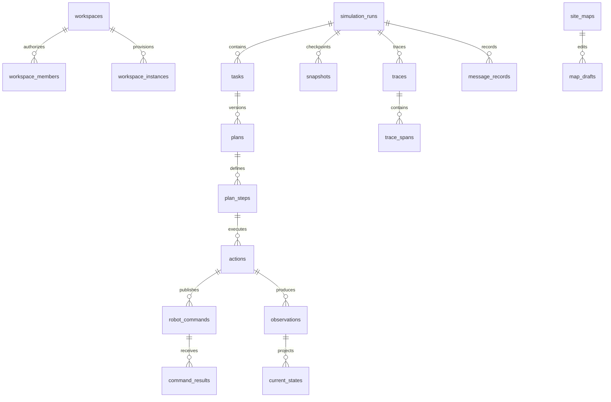

# 数据库与数据结构规范

## 文档信息

| 项目 | 内容 |
|---|---|
| 文档类型 | 数据库与数据结构标准文档 |
| 版本 | v2.0 |
| 日期 | 2026-06-22 |
| 数据库 | PostgreSQL |
| 适用范围 | 控制平面、1～20 Workspace、配置、运行模型、机器人、消息、Snapshot、Trace、导出、审计、指标 |
| 关联标准 | `多用户与Workspace架构标准_20260622.md`、`仿真驾驶舱规划_20260622.md` |

## 1. 数据设计目标

数据库设计目标：

- 支撑二维场地、机器人类型、动作集、资源和场景配置版本化。
- 支撑前端二维地图环境编辑，包括坐标轴、鼠标坐标、对象几何、草稿、校验、发布和审计。
- 支撑智能体指令、MQTT 消息、机器人状态、事件、回执全链路追踪。
- 支撑配置导入导出。
- 支撑过程、日志、消息、事件、指标和联调记录导出。
- 支撑历史会话回放。
- 支撑后续真实机器人替换虚拟机器人执行体。
- 支撑 Tenant、User、Workspace、成员、实例、路由和配额。
- 支撑 Task、Plan、Action、Observation、CurrentState、Snapshot、Trace 统一运行模型。
- 支撑每 Workspace 独立 Database/Role 和跨 Workspace 数据隔离。

## 2. 数据库分区与 Schema

数据库分为控制平面和 Workspace 业务数据两类：

- 控制平面使用独立 `control_plane` Database。
- 每个 Workspace 使用独立 Database 和独立 Role，例如 `workspace_{workspace_id}`。
- 各 Workspace Database 内继续按业务域划分 Schema。
- Workspace API 的数据库凭证只能访问当前 Workspace Database。

| Schema | 说明 |
|---|---|
| config | 地图、区域、工位、路径、机器人类型、动作集、场景配置 |
| runtime | 会话、指令、动作、机器人状态、资源占用 |
| message | MQTT、REST、WebSocket、内部事件消息记录 |
| agent | 智能体观测、规划、决策、反馈 |
| integration | API 契约、MQTT 契约、上下游接口、联调参数 |
| export | 导入任务、导出任务、导出文件、配置包 |
| metric | 指标聚合、策略对比 |
| audit | 审计日志、权限操作 |

1～20 Workspace 阶段共享一个 PostgreSQL Server，不为每个 Workspace 启动独立 PostgreSQL 容器。

## 3. 命名规范

| 类型 | 规范 | 示例 |
|---|---|---|
| 表名 | 小写蛇形，复数或明确领域名 | `robot_instances` |
| 字段名 | 小写蛇形 | `robot_id` |
| 主键 | `id` | `id uuid primary key` |
| 外键 | `{entity}_id` | `session_id` |
| 时间字段 | `_at` 后缀 | `created_at` |
| 状态字段 | `_status` 后缀 | `command_status` |
| JSON 字段 | `_json` 或明确语义 | `payload_json` |
| 索引 | `idx_{table}_{columns}` | `idx_commands_session_id` |
| 唯一索引 | `uk_{table}_{columns}` | `uk_robots_robot_code` |

## 4. 通用字段

所有核心业务表建议包含：

| 字段 | 类型 | 说明 |
|---|---|---|
| id | uuid | 主键 |
| created_at | timestamptz | 创建时间 |
| updated_at | timestamptz | 更新时间 |
| created_by | varchar(128) | 创建人或服务 |
| updated_by | varchar(128) | 更新人或服务 |
| is_deleted | boolean | 逻辑删除 |
| version | integer | 乐观锁或数据版本 |

Workspace 业务表额外包含：

| 字段 | 类型 | 说明 |
|---|---|---|
| workspace_id | uuid | Workspace 隔离标识 |
| run_id | uuid | 运行域数据所属 SimulationRun；配置表可为空 |

配置类表额外包含：

| 字段 | 类型 | 说明 |
|---|---|---|
| config_version | varchar(64) | 配置版本 |
| effective_from | timestamptz | 生效时间 |
| effective_to | timestamptz | 失效时间 |
| status | varchar(32) | draft、active、archived |

消息类表额外包含：

| 字段 | 类型 | 说明 |
|---|---|---|
| message_id | varchar(128) | 全局消息 ID |
| trace_id | varchar(128) | 链路关联 ID |
| schema_version | varchar(32) | 消息结构版本 |
| source | varchar(64) | 来源 |
| target | varchar(64) | 目标 |

### 4.1 P1 已实施物理模型

本文后续表结构是 P1-P5 的目标数据模型，按阶段通过 Alembic 增量落地。P1 Migration `20260622_0001` 已上线的物理子集如下，不应将尚未实施的 P3-P5 字段视为当前数据库能力：

| 物理表 | 当前用途 | 关键字段 |
|---|---|---|
| `config.site_maps` | 地图版本与完整配置 | `workspace_id`、`map_id`、`config_version`、`status`、`map_json` |
| `config.map_drafts` | 地图草稿和发布状态 | `workspace_id`、`draft_id`、`map_id`、`status`、`map_json` |
| `runtime.robot_instances` | 当前机器人状态投影 | `workspace_id`、`robot_code`、`robot_state`、`x`、`y`、`progress` |
| `message.message_records` | command/result/event 统一原始记录 | `workspace_id`、`message_id`、`command_id`、`task_id`、`request_id`、`trace_id`、`payload_json` |
| `audit.audit_logs` | 地图、导出和初始化审计 | `workspace_id`、`audit_id`、`action`、`before_json`、`after_json` |
| `export.export_jobs` | 导出任务元数据 | `workspace_id`、`export_id`、`export_type`、`export_status`、`file_name` |

P1 使用 `workspace_id` 兼容未来隔离，但当前仍是单 Workspace Database。P3 开始后再新增 SimulationRun、Task、Plan、Action、Observation、CurrentState、Snapshot 和 Trace 表，不在 P1 表中预埋空业务字段。

Redis 只保存可重建运行态：

| Key | 类型 | 用途 |
|---|---|---|
| `sim:workspace:{workspaceId}:runtime:robots` | Hash | 最新机器人状态 |
| `sim:workspace:{workspaceId}:runtime:messages` | List | 有界最近消息缓冲 |
| `sim:workspace:{workspaceId}:events` | Pub/Sub Channel | WebSocket 广播辅助事件 |

Redis Key 必须设置 TTL 或长度上限，Redis 故障时读取回退 PostgreSQL，Redis 不作为审计或恢复数据源。

多机器人当前实现约束：

- `runtime.robot_instances` 以 `workspace_id + robot_code` 表示同一 Workspace 内唯一机器人。
- 默认开发编队为 `robot-001`、`robot-002`、`robot-003`，启动时只补齐缺失机器人，不覆盖已有状态。
- `runtime.current_states.robot_states_json` 使用数组保存当前 Run 内全部机器人状态投影。
- `runtime.actions.robot_code` 必须引用已登记机器人；未知 `robot_code` 的 Action 必须拒绝。

## 5. 核心实体关系



## 6. 配置域表结构

### 6.1 `config.site_maps`

| 字段 | 类型 | 说明 |
|---|---|---|
| id | uuid | 主键 |
| map_code | varchar(64) | 地图编码 |
| map_name | varchar(128) | 地图名称 |
| width | numeric | 宽度 |
| height | numeric | 高度 |
| unit | varchar(16) | 单位 |
| coordinate_system | varchar(32) | 坐标系 |
| origin_json | jsonb | 原点配置 |
| grid_json | jsonb | 网格配置 |
| axis_json | jsonb | 坐标轴配置 |
| config_version | varchar(64) | 配置版本 |
| status | varchar(32) | draft、active、archived |
| metadata_json | jsonb | 扩展信息 |

约束：

- `map_code + config_version` 唯一。
- 历史会话绑定具体 `config_version`。

### 6.2 `config.zones`

| 字段 | 类型 | 说明 |
|---|---|---|
| id | uuid | 主键 |
| map_id | uuid | 地图 ID |
| zone_code | varchar(64) | 区域编码 |
| zone_type | varchar(32) | working、forbidden、buffer、charging |
| geometry_json | jsonb | 二维几何 |
| rules_json | jsonb | 区域规则 |
| config_version | varchar(64) | 配置版本 |

### 6.3 `config.stations`

| 字段 | 类型 | 说明 |
|---|---|---|
| id | uuid | 主键 |
| map_id | uuid | 地图 ID |
| station_code | varchar(64) | 工位编码 |
| station_name | varchar(128) | 工位名称 |
| station_type | varchar(32) | pick、sort、drop、charge |
| position_json | jsonb | 坐标 |
| capacity | integer | 容量 |
| action_constraints_json | jsonb | 动作约束 |
| config_version | varchar(64) | 配置版本 |

### 6.4 `config.path_nodes`

| 字段 | 类型 | 说明 |
|---|---|---|
| id | uuid | 主键 |
| map_id | uuid | 地图 ID |
| node_code | varchar(64) | 节点编码 |
| position_json | jsonb | 坐标 |
| node_type | varchar(32) | normal、station、charging |
| config_version | varchar(64) | 配置版本 |

### 6.5 `config.path_edges`

| 字段 | 类型 | 说明 |
|---|---|---|
| id | uuid | 主键 |
| map_id | uuid | 地图 ID |
| edge_code | varchar(64) | 边编码 |
| from_node_id | uuid | 起点 |
| to_node_id | uuid | 终点 |
| path_group_id | uuid/varchar(64) | 所属路径组 |
| sequence | integer | 路径组内顺序 |
| length | numeric | 长度 |
| direction | varchar(16) | one_way、two_way |
| capacity | integer | 容量 |
| speed_limit | numeric | 可选速度上限 |
| allowed_robot_types_json | jsonb | 可选机器人类型约束 |
| weight | numeric | 权重 |
| config_version | varchar(64) | 配置版本 |

### 6.6 `config.path_groups`

| 字段 | 类型 | 说明 |
|---|---|---|
| id | uuid/varchar(64) | 主键 |
| map_id | uuid | 地图 ID |
| path_group_code | varchar(64) | 路径组编号 |
| path_group_name | varchar(128) | 路径组名称 |
| edge_ids_json | jsonb | 路径组内路径边顺序集合 |
| allowed_robot_codes_json | jsonb | 允许使用的机器人编号，空数组表示通用 |
| color | varchar(32) | 前端展示颜色 |
| status | varchar(32) | active、disabled、blocked |
| priority | integer | 调度优先级 |
| metadata_json | jsonb | 扩展信息，如 nodeIds |
| config_version | varchar(64) | 配置版本 |

约束：
- `map_id + path_group_code + config_version` 唯一。
- `edge_ids_json` 中的路径边必须存在于同一地图版本。
- `allowed_robot_codes_json` 中的机器人必须存在于当前 Workspace。
- `status=blocked` 的路径组不得被新 Action 分配；已有 Action 进入 Blocked、Retrying 或 Replan。

### 6.7 `config.resource_points`

| 字段 | 类型 | 说明 |
|---|---|---|
| id | uuid | 主键 |
| map_id | uuid | 地图 ID |
| resource_code | varchar(64) | 资源点编码 |
| resource_type | varchar(32) | charger、buffer、parking、device_interface |
| position_json | jsonb | 坐标 |
| capacity | integer | 容量 |
| rules_json | jsonb | 占用和释放规则 |
| config_version | varchar(64) | 配置版本 |

### 6.8 `config.map_drafts`

| 字段 | 类型 | 说明 |
|---|---|---|
| id | uuid | 主键 |
| map_id | uuid | 地图 ID |
| base_config_version | varchar(64) | 草稿基于的配置版本 |
| draft_name | varchar(128) | 草稿名称 |
| draft_status | varchar(32) | editing、validated、published、discarded |
| client_revision | integer | 前端修订号 |
| validation_result_json | jsonb | 校验结果 |
| created_by | varchar(128) | 创建人 |
| published_config_version | varchar(64) | 发布后的配置版本 |
| created_at | timestamptz | 创建时间 |
| published_at | timestamptz | 发布时间 |

### 6.9 `config.map_edit_operations`

| 字段 | 类型 | 说明 |
|---|---|---|
| id | uuid | 主键 |
| draft_id | uuid | 地图草稿 ID |
| operation_type | varchar(32) | create、update、move、resize、delete |
| object_type | varchar(32) | zone、obstacle、station、pathNode、pathEdge、resourcePoint |
| object_id | uuid | 对象 ID |
| before_json | jsonb | 编辑前数据 |
| after_json | jsonb | 编辑后数据 |
| cursor_position_json | jsonb | 操作发生时鼠标坐标 |
| client_revision | integer | 前端修订号 |
| created_by | varchar(128) | 操作人 |
| created_at | timestamptz | 操作时间 |

### 6.10 `config.map_validation_results`

| 字段 | 类型 | 说明 |
|---|---|---|
| id | uuid | 主键 |
| draft_id | uuid | 地图草稿 ID |
| validation_type | varchar(64) | coordinate、topology、reference、collision、resource |
| severity | varchar(16) | info、warning、error |
| object_type | varchar(32) | 对象类型 |
| object_id | uuid | 对象 ID |
| message | text | 校验说明 |
| detail_json | jsonb | 校验详情 |
| created_at | timestamptz | 创建时间 |

### 6.11 `config.robot_types`

| 字段 | 类型 | 说明 |
|---|---|---|
| id | uuid | 主键 |
| robot_type_code | varchar(64) | 类型编码 |
| robot_type_name | varchar(128) | 类型名称 |
| max_speed | numeric | 最大速度 |
| max_payload | numeric | 最大载荷 |
| capability_json | jsonb | 能力描述 |
| config_version | varchar(64) | 配置版本 |

### 6.12 `config.action_definitions`

| 字段 | 类型 | 说明 |
|---|---|---|
| id | uuid | 主键 |
| robot_type_id | uuid | 机器人类型 |
| action_code | varchar(64) | 动作编码 |
| action_name | varchar(128) | 动作名称 |
| min_duration_ms | integer | 最小耗时 |
| max_duration_ms | integer | 最大耗时 |
| timeout_ms | integer | 超时时间 |
| interruptible | boolean | 是否可中断 |
| requires_resource | boolean | 是否需要资源 |
| failure_rate | numeric | 失败概率 |
| parameters_schema_json | jsonb | 参数 schema |
| config_version | varchar(64) | 配置版本 |

## 7. 机器人与运行域表结构

### 7.1 `runtime.robot_instances`

| 字段 | 类型 | 说明 |
|---|---|---|
| id | uuid | 主键 |
| robot_code | varchar(64) | 机器人编码 |
| robot_type_id | uuid | 机器人类型 |
| executor_type | varchar(32) | virtual、real、gateway |
| mqtt_client_id | varchar(128) | MQTT clientId |
| initial_position_json | jsonb | 初始位置 |
| status | varchar(32) | active、inactive |
| config_version | varchar(64) | 配置版本 |

约束：

- 同一 Workspace 内 `robot_code` 唯一。
- 虚拟执行体和真实机器人网关必须复用同一 `robot_code` 语义，替换真实设备时不改变 Action、Message、Observation 和 CurrentState 的关联方式。

### 7.2 `runtime.robot_executor_instances`

| 字段 | 类型 | 说明 |
|---|---|---|
| id | uuid | 主键 |
| executor_code | varchar(64) | 执行体编码 |
| executor_type | varchar(32) | virtual、real、gateway |
| executor_version | varchar(64) | 执行体版本 |
| robot_id | uuid | 机器人实例 |
| mqtt_client_id | varchar(128) | MQTT clientId |
| connection_status | varchar(32) | online、offline、unknown |
| last_heartbeat_at | timestamptz | 最近心跳 |
| metadata_json | jsonb | 扩展信息 |

### 7.3 `runtime.simulation_sessions`

| 字段 | 类型 | 说明 |
|---|---|---|
| id | uuid | 主键 |
| session_code | varchar(64) | 会话编码 |
| session_name | varchar(128) | 会话名称 |
| map_version | varchar(64) | 地图版本 |
| robot_config_version | varchar(64) | 机器人配置版本 |
| action_config_version | varchar(64) | 动作配置版本 |
| agent_version | varchar(64) | 智能体版本 |
| random_seed | varchar(64) | 随机种子 |
| session_status | varchar(32) | created、running、completed、failed |
| started_at | timestamptz | 开始时间 |
| finished_at | timestamptz | 结束时间 |

### 7.4 `runtime.robot_commands`

| 字段 | 类型 | 说明 |
|---|---|---|
| id | uuid | 主键 |
| command_id | varchar(128) | 外部指令 ID |
| session_id | uuid | 会话 ID |
| robot_id | uuid | 机器人 ID |
| command_type | varchar(64) | move、pick、sort、carry 等 |
| command_status | varchar(32) | created、sent、accepted、running、succeeded、failed、timeout |
| idempotency_key | varchar(128) | 幂等键 |
| target_json | jsonb | 目标 |
| parameters_json | jsonb | 参数 |
| timeout_ms | integer | 超时 |
| priority | integer | 优先级 |
| issued_by | varchar(64) | agent、console |
| issued_at | timestamptz | 下发时间 |
| finished_at | timestamptz | 完成时间 |

约束：

- `command_id` 唯一。
- `idempotency_key` 唯一或在会话内唯一。
- `session_id + robot_id + command_status` 建索引。

### 7.5 `runtime.action_runs`

| 字段 | 类型 | 说明 |
|---|---|---|
| id | uuid | 主键 |
| action_id | varchar(128) | 动作实例 ID |
| command_id | uuid | 指令表 ID |
| action_code | varchar(64) | 动作编码 |
| action_status | varchar(32) | pending、running、succeeded、failed、timeout |
| planned_duration_ms | integer | 本次随机生成耗时 |
| actual_duration_ms | integer | 实际耗时 |
| started_at | timestamptz | 开始时间 |
| finished_at | timestamptz | 结束时间 |
| result_json | jsonb | 执行结果 |

### 7.6 `runtime.robot_state_snapshots`

| 字段 | 类型 | 说明 |
|---|---|---|
| id | uuid | 主键 |
| session_id | uuid | 会话 ID |
| robot_id | uuid | 机器人 ID |
| command_id | uuid | 当前指令 |
| robot_state | varchar(32) | Idle、Moving、Working、Error 等 |
| position_json | jsonb | 位置 |
| progress | numeric | 进度 |
| resource_locks_json | jsonb | 占用资源 |
| error_code | varchar(64) | 异常编码 |
| error_message | text | 异常说明 |
| reported_at | timestamptz | 上报时间 |

建议：

- 高频状态可只保存关键快照。
- 最新状态可放 Redis，历史快照按策略落库。

### 7.7 `runtime.resource_locks`

| 字段 | 类型 | 说明 |
|---|---|---|
| id | uuid | 主键 |
| session_id | uuid | 会话 ID |
| resource_type | varchar(32) | station、path_edge、charger、buffer |
| resource_id | uuid | 资源 ID |
| robot_id | uuid | 机器人 ID |
| command_id | uuid | 指令 ID |
| lock_status | varchar(32) | locked、released、expired |
| locked_at | timestamptz | 占用时间 |
| released_at | timestamptz | 释放时间 |

## 8. 消息与事件域表结构

### 8.1 `message.message_records`

| 字段 | 类型 | 说明 |
|---|---|---|
| id | uuid | 主键 |
| message_id | varchar(128) | 全局消息 ID |
| session_id | uuid | 会话 ID |
| robot_id | uuid | 机器人 ID |
| command_id | uuid | 指令 ID |
| message_channel | varchar(32) | REST、WebSocket、MQTT、internal |
| message_type | varchar(32) | command、event |
| direction | varchar(32) | inbound、outbound |
| topic_or_path | varchar(256) | MQTT Topic 或 API Path |
| qos | integer | MQTT QoS |
| retained | boolean | MQTT Retain |
| payload_json | jsonb | 消息体 |
| schema_version | varchar(32) | 消息版本 |
| trace_id | varchar(128) | 链路 ID |
| occurred_at | timestamptz | 发生时间 |

索引：

- `message_id` 唯一索引。
- `session_id + occurred_at`。
- `robot_id + occurred_at`。
- `command_id + occurred_at`。
- `message_channel + message_type`。
- `trace_id + occurred_at`。

### 8.2 `message.command_results`

| 字段 | 类型 | 说明 |
|---|---|---|
| id | uuid | 主键 |
| command_id | uuid | 指令 ID |
| task_id | varchar(128) | 任务 ID |
| request_id | varchar(128) | 查询请求 ID |
| trace_id | varchar(128) | 链路 ID |
| robot_code | varchar(128) | 机器狗编码 |
| event | varchar(64) | command.accepted、task.started、task.succeeded 等 |
| data_json | jsonb | result.data |
| error_json | jsonb | result.error |
| result_at | timestamptz | 回传时间 |

### 8.3 `message.event_records`

| 字段 | 类型 | 说明 |
|---|---|---|
| id | uuid | 主键 |
| event_id | varchar(128) | 事件 ID |
| session_id | uuid | 会话 ID |
| robot_id | uuid | 机器人 ID |
| command_id | uuid | 指令 ID |
| task_id | varchar(128) | 任务 ID |
| request_id | varchar(128) | 查询请求 ID |
| trace_id | varchar(128) | 链路 ID |
| robot_code | varchar(128) | 机器狗编码 |
| action_id | uuid | 动作 ID |
| event_type | varchar(64) | 事件类型 |
| severity | varchar(16) | info、warning、error、critical |
| affected_object_json | jsonb | 影响对象 |
| event_data_json | jsonb | 事件数据 |
| recoverable | boolean | 是否可恢复 |
| occurred_at | timestamptz | 发生时间 |

### 8.4 `message.mqtt_topic_contracts`

| 字段 | 类型 | 说明 |
|---|---|---|
| id | uuid | 主键 |
| topic_pattern | varchar(256) | Topic 模式 |
| message_type | varchar(32) | command、event |
| direction | varchar(32) | platform_to_device、device_to_platform |
| qos | integer | QoS |
| retained | boolean | 是否 Retain |
| payload_schema_json | jsonb | Payload Schema |
| schema_version | varchar(32) | 版本 |
| status | varchar(32) | draft、active、deprecated |

### 8.5 `message.mqtt_connection_profiles`

| 字段 | 类型 | 说明 |
|---|---|---|
| id | uuid | 主键 |
| profile_name | varchar(128) | 配置名称 |
| env | varchar(32) | 环境 |
| broker_host | varchar(256) | Broker 地址 |
| broker_port | integer | 端口 |
| protocol_version | varchar(16) | MQTT 5 或 3.1.1 |
| tls_enabled | boolean | 是否 TLS |
| keep_alive | integer | Keep Alive |
| clean_start | boolean | Clean Start |
| topic_prefix | varchar(128) | Topic 前缀 |
| heartbeat_interval_ms | integer | 心跳间隔 |
| command_timeout_ms | integer | 指令超时 |
| sensitive_ref | varchar(256) | 敏感信息引用，不直接保存明文 |

## 9. 智能体域表结构

### 9.1 `agent.business_intents`

| 字段 | 类型 | 说明 |
|---|---|---|
| id | uuid | 主键 |
| intent_id | varchar(128) | 业务意图 ID |
| session_id | uuid | 会话 ID |
| intent_type | varchar(64) | 意图类型 |
| intent_status | varchar(32) | created、planning、running、succeeded、failed |
| priority | integer | 优先级 |
| context_json | jsonb | 上下文 |
| created_at | timestamptz | 创建时间 |

### 9.2 `agent.agent_decisions`

| 字段 | 类型 | 说明 |
|---|---|---|
| id | uuid | 主键 |
| session_id | uuid | 会话 ID |
| intent_id | uuid | 业务意图 |
| agent_version | varchar(64) | 智能体版本 |
| observation_json | jsonb | 观测输入 |
| decision_json | jsonb | 决策输出 |
| validation_result_json | jsonb | 校验结果 |
| decision_latency_ms | integer | 决策耗时 |
| created_at | timestamptz | 决策时间 |

## 10. 导入导出域表结构

### 10.1 `export.import_jobs`

| 字段 | 类型 | 说明 |
|---|---|---|
| id | uuid | 主键 |
| import_type | varchar(64) | map、robot_type、action_set、mqtt_profile |
| file_name | varchar(256) | 文件名 |
| file_uri | varchar(512) | 文件地址 |
| schema_version | varchar(32) | 文件版本 |
| import_status | varchar(32) | uploaded、validated、failed、committed |
| validation_result_json | jsonb | 校验结果 |
| diff_json | jsonb | 差异预览 |
| committed_config_version | varchar(64) | 提交后的配置版本 |
| created_by | varchar(128) | 创建人 |
| created_at | timestamptz | 创建时间 |

### 10.2 `export.export_jobs`

| 字段 | 类型 | 说明 |
|---|---|---|
| id | uuid | 主键 |
| export_type | varchar(64) | config、process_log、message、event、metric、mqtt_debug |
| export_status | varchar(32) | created、running、succeeded、failed、expired |
| filter_json | jsonb | 筛选条件 |
| file_format | varchar(16) | csv、json、jsonl、pdf、md |
| file_uri | varchar(512) | 文件地址 |
| file_size | bigint | 文件大小 |
| expires_at | timestamptz | 过期时间 |
| created_by | varchar(128) | 创建人 |
| created_at | timestamptz | 创建时间 |

### 10.3 `export.config_packages`

| 字段 | 类型 | 说明 |
|---|---|---|
| id | uuid | 主键 |
| package_type | varchar(64) | 配置包类型 |
| config_version | varchar(64) | 配置版本 |
| schema_version | varchar(32) | Schema 版本 |
| content_hash | varchar(128) | 内容摘要 |
| package_json | jsonb | 配置内容 |
| created_at | timestamptz | 创建时间 |

## 11. 审计域表结构

### 11.1 `audit.audit_logs`

| 字段 | 类型 | 说明 |
|---|---|---|
| id | uuid | 主键 |
| actor_id | varchar(128) | 操作人或服务 |
| actor_type | varchar(32) | user、service、agent |
| action | varchar(128) | 操作 |
| resource_type | varchar(64) | 资源类型 |
| resource_id | varchar(128) | 资源 ID |
| before_json | jsonb | 变更前 |
| after_json | jsonb | 变更后 |
| ip_address | varchar(64) | IP |
| user_agent | text | User Agent |
| trace_id | varchar(128) | 链路 ID |
| created_at | timestamptz | 操作时间 |

## 12. 指标域表结构

### 12.1 `metric.metric_results`

| 字段 | 类型 | 说明 |
|---|---|---|
| id | uuid | 主键 |
| session_id | uuid | 会话 ID |
| metric_name | varchar(128) | 指标名 |
| metric_scope | varchar(64) | session、robot、station、path、agent |
| scope_id | varchar(128) | 范围对象 ID |
| metric_value | numeric | 指标值 |
| unit | varchar(32) | 单位 |
| window_start | timestamptz | 统计窗口开始 |
| window_end | timestamptz | 统计窗口结束 |
| metadata_json | jsonb | 扩展信息 |

## 13. 枚举标准

### 13.1 指令状态

| 值 | 说明 |
|---|---|
| created | 已创建 |
| sent | 已发送 |
| accepted | 已接受 |
| rejected | 已拒绝 |
| running | 执行中 |
| succeeded | 成功 |
| failed | 失败 |
| timeout | 超时 |
| cancelled | 已取消 |

### 13.2 机器人状态

| 值 | 说明 |
|---|---|
| Offline | 离线 |
| Idle | 空闲 |
| CommandReceived | 已接收指令 |
| Moving | 移动中 |
| WaitingResource | 等待资源 |
| Working | 工作中 |
| Charging | 充电中 |
| Paused | 暂停 |
| Error | 异常 |
| Completed | 当前动作完成 |

### 13.3 MQTT 消息类型

| 值 | 说明 |
|---|---|
| command | 控制指令 |
| event | result 事件 |

## 14. 索引规范

必须建立索引：

- 所有外键字段。
- `session_id + occurred_at`。
- `robot_id + occurred_at`。
- `command_id`。
- `message_id`。
- `trace_id`。
- `event_type + occurred_at`。
- `export_status + created_at`。
- `import_status + created_at`。

建议分区：

- `message.message_records` 按月或按会话分区。
- `message.event_records` 按月分区。
- `runtime.robot_state_snapshots` 按月或会话分区。
- 高频指标按时间窗口分区。

## 15. JSONB 使用规范

允许使用 JSONB 的场景：

- 外部消息原文。
- MQTT payload。
- 导入配置包。
- 几何结构。
- 策略观测输入和决策输出。
- 扩展 metadata。

不建议使用 JSONB 的场景：

- 状态字段。
- 时间字段。
- 外键关系。
- 高频筛选字段。
- 指标主值。

JSONB 中常用查询字段应同步冗余为普通列。

## 16. 数据生命周期

| 数据 | 保存策略 |
|---|---|
| 配置版本 | 长期保存 |
| 会话记录 | 长期或按项目周期保存 |
| 指令记录 | 长期保存 |
| MQTT 消息 | 明细按周期归档，关键消息长期保存 |
| 高频状态快照 | 保留关键快照，普通快照定期清理 |
| 事件记录 | 长期或按审计要求保存 |
| 导出文件 | 设置过期时间 |
| 审计日志 | 长期保存 |
| 指标聚合 | 长期保存 |

## 17. 数据安全

- 敏感信息不保存明文。
- MQTT 密码、证书私钥只保存引用。
- 导出文件必须脱敏。
- 导出动作必须记录审计。
- 生产数据导入测试环境前必须脱敏。
- 删除使用逻辑删除，重要数据不得物理删除。

## 18. 迁移与版本规范

- 所有数据库变更使用 migration 管理。
- 每个 migration 必须可回滚，除非明确标注不可逆。
- 配置表必须支持版本化。
- 消息 schema 必须支持版本化。
- 历史会话绑定历史配置版本。
- 新版本字段必须兼容旧数据读取。

## 19. 数据验收清单

- [ ] 表结构覆盖配置、运行、消息、事件、导入导出、审计、指标。
- [ ] 指令、MQTT 消息、状态、事件可通过 `trace_id` 串联。
- [ ] commandId 唯一。
- [ ] idempotencyKey 可防止重复执行。
- [ ] 配置版本可绑定仿真会话。
- [ ] 导入任务可记录校验结果和差异。
- [ ] 导出任务可记录筛选范围和文件地址。
- [ ] 审计日志覆盖导入、导出、控制台事件、配置变更。
- [ ] 高频状态有清理或归档策略。
- [ ] 真实机器人网关数据可复用同一执行体实例模型。

## 20. 控制平面表结构

控制平面表位于独立 `control_plane` Database。

### 20.1 `control.tenants`

| 字段 | 类型 | 说明 |
|---|---|---|
| id | uuid | Tenant ID |
| tenant_code | varchar(64) | 唯一编码 |
| tenant_name | varchar(128) | 名称 |
| tenant_status | varchar(32) | active、suspended、archived |

### 20.2 `control.users`

| 字段 | 类型 | 说明 |
|---|---|---|
| id | uuid | User ID |
| tenant_id | uuid | Tenant ID |
| identity_subject | varchar(256) | OIDC subject |
| username | varchar(128) | 用户名 |
| user_status | varchar(32) | active、disabled |

### 20.3 `control.workspaces`

| 字段 | 类型 | 说明 |
|---|---|---|
| id | uuid | Workspace ID |
| tenant_id | uuid | Tenant ID |
| owner_user_id | uuid | Owner |
| workspace_slug | varchar(64) | 路由和资源命名使用的唯一标识 |
| workspace_name | varchar(128) | 名称 |
| workspace_status | varchar(32) | creating、running、stopped、archived 等 |
| image_version | varchar(64) | 当前统一镜像版本 |
| mqtt_public_port | integer | 分配的 MQTT 端口 |
| database_name | varchar(128) | 独立 Database 名称 |
| resource_quota_json | jsonb | CPU、内存、磁盘、机器人配额 |

### 20.4 `control.workspace_members`

| 字段 | 类型 | 说明 |
|---|---|---|
| workspace_id | uuid | Workspace ID |
| user_id | uuid | User ID |
| role | varchar(32) | owner、operator、viewer、auditor |
| member_status | varchar(32) | active、revoked |

唯一索引：`workspace_id + user_id`。

### 20.5 `control.workspace_instances`

| 字段 | 类型 | 说明 |
|---|---|---|
| id | uuid | 实例 ID |
| workspace_id | uuid | Workspace ID |
| instance_status | varchar(32) | provisioning、running、degraded、stopped 等 |
| compose_project_name | varchar(128) | Docker Compose Project |
| network_name | varchar(128) | 独立 Docker Network |
| volume_root | varchar(512) | 独立数据目录 |
| frontend_url | varchar(512) | 前端入口 |
| api_url | varchar(512) | API 入口 |
| mqtt_endpoint | varchar(512) | MQTT 入口 |
| health_json | jsonb | 最近健康摘要 |
| started_at | timestamptz | 启动时间 |
| stopped_at | timestamptz | 停止时间 |

## 21. 统一运行模型表结构

以下表位于每个 Workspace 独立 Database 的 `runtime` Schema。

v2.0 迁移约定：

| MVP 表 | v2.0 处理方式 |
|---|---|
| `runtime.simulation_sessions` | 迁移到 `runtime.simulation_runs`，兼容读取期后废弃 |
| `runtime.action_runs` | 迁移到 `runtime.actions`，Action 成为统一执行实体 |
| `runtime.robot_state_snapshots` | 保留为机器人状态采样；不得等同于运行检查点 Snapshot |
| `runtime.robot_commands` | 保留为 MQTT command 发送记录，由 Action 引用 |
| `message.command_results` | 保留为 MQTT result 结构化记录，并生成 Observation |

本节定义的 `simulation_runs/tasks/plans/actions/observations/current_states/snapshots/traces` 是后续开发权威模型。

当前 MVP 代码使用 `simulation` Schema 承载统一运行模型；文档中旧称 `runtime.*` 的运行表在实现中对应 `simulation.*`。

### 21.1 `runtime.simulation_runs`

| 字段 | 类型 | 说明 |
|---|---|---|
| id | uuid | run_id |
| workspace_id | uuid | Workspace ID |
| run_name | varchar(128) | 运行名称 |
| run_mode | varchar(32) | observe、manual、task、agent、replay |
| map_config_version | varchar(64) | 绑定地图版本 |
| random_seed | bigint | 随机种子 |
| time_scale | numeric | 时间倍率 |
| run_status | varchar(32) | draft、running、paused、completed、failed、stopped |
| started_at | timestamptz | 开始时间 |
| finished_at | timestamptz | 结束时间 |

### 21.2 `runtime.tasks`

| 字段 | 类型 | 说明 |
|---|---|---|
| id | uuid | 内部主键 |
| task_id | varchar(128) | 对外 Task ID |
| workspace_id | uuid | Workspace ID |
| run_id | uuid | SimulationRun |
| trace_id | varchar(128) | Trace ID |
| goal | text | 业务目标 |
| input_json | jsonb | 输入 |
| constraints_json | jsonb | 约束 |
| expected_outcome_json | jsonb | 完成条件 |
| priority | integer | 优先级 |
| task_status | varchar(32) | draft、ready、running、paused、succeeded、failed、cancelled |

### 21.3 `runtime.task_chains`

| 字段 | 类型 | 说明 |
|---|---|---|
| chain_id | varchar(128) | 连续任务链 ID |
| workspace_id | uuid | Workspace ID |
| run_id | varchar(128) | SimulationRun |
| name | varchar(256) | 链路名称 |
| description | varchar(512) | 说明 |
| mode | varchar(32) | serial、parallel、mixed |
| trigger_policy | varchar(64) | auto、manual_confirm、event_driven |
| robot_strategy | varchar(64) | specified、idle_first、nearest、lowest_load |
| failure_policy | varchar(64) | stop_chain、skip_task、retry、replan、switch_robot |
| priority | integer | 优先级 |
| status | varchar(32) | Ready、Running、Succeeded、Failed、Stopped |
| metadata_json | jsonb | 扩展信息 |
| created_by | varchar(128) | 创建者 |
| created_at | timestamptz | 创建时间 |
| started_at | timestamptz | 启动时间 |
| finished_at | timestamptz | 完成时间 |

### 21.4 `runtime.task_chain_items`

| 字段 | 类型 | 说明 |
|---|---|---|
| chain_id | varchar(128) | 连续任务链 ID |
| run_id | varchar(128) | SimulationRun |
| task_id | varchar(128) | 被组织的标准 Task |
| sequence | integer | 链内顺序 |
| depends_on_json | jsonb | 依赖 Task 或链内序号 |
| trigger_condition | varchar(128) | chain_started、previous_succeeded、manual_confirm、event_matched |
| status | varchar(32) | Ready、Waiting、Running、Succeeded、Failed、Skipped |
| metadata_json | jsonb | 扩展信息 |

### 21.5 `runtime.plans`

| 字段 | 类型 | 说明 |
|---|---|---|
| plan_id | varchar(128) | Plan ID |
| task_id | varchar(128) | Task ID |
| trace_id | varchar(128) | Trace ID |
| plan_version | integer | 版本号 |
| strategy | varchar(64) | 策略 |
| assumptions_json | jsonb | 假设 |
| generated_by | varchar(64) | rule-agent、ai-agent、operator |
| generation_latency_ms | integer | 生成耗时 |
| plan_status | varchar(32) | generating、ready、active、superseded、completed、failed |

唯一索引：`task_id + plan_version`。

### 21.6 `runtime.plan_steps`

| 字段 | 类型 | 说明 |
|---|---|---|
| plan_step_id | varchar(128) | Step ID |
| plan_id | varchar(128) | Plan ID |
| sequence | integer | 顺序 |
| action_type | varchar(64) | 动作类型 |
| target_json | jsonb | 目标 |
| params_json | jsonb | 参数 |
| depends_on_json | jsonb | 依赖 Step |
| success_condition_json | jsonb | 成功条件 |
| failure_policy_json | jsonb | 失败策略 |
| timeout_ms | integer | 超时 |

### 21.7 `runtime.actions`

| 字段 | 类型 | 说明 |
|---|---|---|
| action_id | varchar(128) | Action ID |
| plan_id | varchar(128) | Plan ID |
| plan_step_id | varchar(128) | Step ID |
| task_id | varchar(128) | Task ID |
| trace_id | varchar(128) | Trace ID |
| robot_code | varchar(128) | 机器狗编码 |
| command | varchar(64) | goto_pose、stop、where |
| command_id | varchar(128) | MQTT commandId |
| request_id | varchar(128) | where requestId |
| params_json | jsonb | 参数 |
| attempt_no | integer | 尝试次数 |
| action_status | varchar(32) | pending、issued、accepted、running、succeeded、failed、rejected、stopped、timeout |
| issued_at | timestamptz | 下发时间 |
| started_at | timestamptz | 开始时间 |
| finished_at | timestamptz | 完成时间 |

### 21.8 `runtime.observations`

| 字段 | 类型 | 说明 |
|---|---|---|
| observation_id | varchar(128) | Observation ID |
| run_id | uuid | SimulationRun |
| task_id | varchar(128) | Task ID |
| action_id | varchar(128) | Action ID |
| trace_id | varchar(128) | Trace ID |
| source | varchar(64) | mqtt、console、resource、timer、api、operator |
| event | varchar(64) | 标准事件 |
| event_id | varchar(128) | 来源事件 ID，用于去重 |
| robot_code | varchar(128) | 机器人编码 |
| command_id | varchar(128) | commandId |
| observed_at | timestamptz | 事实发生时间 |
| received_at | timestamptz | 平台接收时间 |
| data_json | jsonb | 事实数据 |
| error_json | jsonb | 错误对象 |
| processing_status | varchar(32) | received、validated、applied、ignored、invalid |

### 21.9 `runtime.current_states`

| 字段 | 类型 | 说明 |
|---|---|---|
| run_id | uuid | 主键，SimulationRun |
| workspace_id | uuid | Workspace ID |
| state_version | bigint | 单调递增版本 |
| task_state_json | jsonb | Task 当前投影 |
| active_plan_json | jsonb | Active Plan 摘要 |
| robot_states_json | jsonb | 机器人状态 |
| resource_states_json | jsonb | 资源状态 |
| environment_state_json | jsonb | 环境状态 |
| pending_actions_json | jsonb | 待执行 Action |
| active_events_json | jsonb | 活跃事件 |
| last_observation_id | varchar(128) | 最后应用 Observation |
| last_observation_at | timestamptz | 最后事实时间 |

每个 Run 仅一条 CurrentState，使用 `state_version` 乐观更新。`robot_states_json` 必须是数组，每个元素至少包含 `robotId/robotCode`、`robotType`、`state`、`x`、`y`、`progress`、`currentAction`、`updatedAt`。

### 21.8 `runtime.snapshots`

| 字段 | 类型 | 说明 |
|---|---|---|
| snapshot_id | varchar(128) | Snapshot ID |
| run_id | uuid | SimulationRun |
| task_id | varchar(128) | Task ID |
| trace_id | varchar(128) | Trace ID |
| state_version | bigint | 对应 CurrentState 版本 |
| snapshot_reason | varchar(64) | start、task_start、replan、pause、error、manual、finish |
| snapshot_json | jsonb | 不可变完整状态 |
| checksum | varchar(128) | 完整性校验 |
| created_at | timestamptz | 创建时间 |

Snapshot 创建后禁止更新。

### 21.9 `runtime.traces`

| 字段 | 类型 | 说明 |
|---|---|---|
| trace_id | varchar(128) | Trace ID |
| run_id | uuid | SimulationRun |
| task_id | varchar(128) | Task ID |
| trace_status | varchar(32) | open、completed、error |
| started_at | timestamptz | 开始时间 |
| finished_at | timestamptz | 完成时间 |
| duration_ms | bigint | 总耗时 |

### 21.10 `runtime.trace_spans`

| 字段 | 类型 | 说明 |
|---|---|---|
| span_id | varchar(128) | Span ID |
| parent_span_id | varchar(128) | 父 Span |
| trace_id | varchar(128) | Trace ID |
| entity_type | varchar(32) | task、plan、action、command、result、observation、snapshot |
| entity_id | varchar(128) | 实体 ID |
| operation | varchar(128) | 操作名 |
| span_status | varchar(32) | open、ok、error |
| started_at | timestamptz | 开始时间 |
| finished_at | timestamptz | 结束时间 |
| duration_ms | bigint | 耗时 |
| input_ref | varchar(256) | 输入记录引用 |
| output_ref | varchar(256) | 输出记录引用 |
| error_ref | varchar(256) | 错误记录引用 |

## 22. Hub 集成映射表补充（2026-06-30）

### 22.1 `integration.hub_id_mappings`

该表用于保存 0616 本地业务对象与外部 Scene / World State Hub 内部 UUID 的映射关系。0616 不修改本地业务 ID，Hub 内部对象以 Hub 返回的 UUID 为主。

| 字段 | 类型 | 说明 |
|---|---|---|
| id | uuid | 主键 |
| workspace_id | uuid | Workspace ID |
| local_type | varchar(64) | 本地对象类型：scenario、robot、target、run、task、plan、action、trace |
| local_id | varchar(128) | 本地对象 ID，例如 `RUN-*`、`TASK-*`、`TRACE-*` |
| hub_type | varchar(64) | Hub 对象类型：scene、entity、run、task、plan、action、trace |
| hub_id | varchar(128) | Hub 返回的 UUID 字符串；`where` 等跳过 Action 创建的对象可为空 |
| external_id | varchar(128) | 写入 Hub metadata 的外部 ID |
| external_trace_id | varchar(128) | 0616 原始 traceId |
| hub_trace_id | varchar(128) | Hub Trace UUID |
| sync_status | varchar(32) | synced、reused、skipped、error |
| last_error | text | 最近一次同步错误 |
| metadata_json | jsonb | 同步上下文，例如 sceneName、version、command |
| created_at | timestamptz | 创建时间 |
| updated_at | timestamptz | 更新时间 |

唯一约束：

```text
workspace_id + local_type + local_id + hub_type
```

索引：

- `workspace_id + hub_type + hub_id`
- `workspace_id + external_trace_id + hub_trace_id`
- `workspace_id`
- `hub_id`
- `external_id`
- `external_trace_id`
- `hub_trace_id`

使用规则：

- 查询 Hub 原生对象时优先使用 `hub_id`。
- Trace 相关 Hub 查询优先使用 `hub_trace_id`。
- 0616 原始 `TRACE-*` 只能作为外部链路 ID，不得当作 Hub UUID。
- 对于 `where` 查询类 Action，Hub 不创建 Action，映射记录 `sync_status=skipped`，同时写入 Trace event。

## 23. Workspace 数据隔离规范

- Control Plane Database 与 Workspace Database 分离。
- 每 Workspace 使用独立 Database、Role 和 Secret。
- Workspace Role 不得拥有跨 Database 权限和创建超级用户权限。
- 所有配置、运行、消息、导出、指标和审计记录必须带 `workspace_id`。
- Database 名、Role 名和 Schema 名由控制平面生成，不接受用户输入原始 SQL 标识符。
- 删除 Workspace 前必须完成归档和备份确认。
- Workspace 数据恢复必须恢复到相同或新建 Workspace，禁止覆盖其他 Workspace。

## 24. v2.0 数据验收补充

- [ ] Tenant、User、Workspace、Member、Instance 表结构完整。
- [ ] 每 Workspace 使用独立 Database 和 Role。
- [ ] SimulationRun、Task、Plan、Plan Step、Action、Observation、CurrentState、Snapshot、Trace 和 Span 可完整关联。
- [ ] Plan 使用 `task_id + plan_version` 唯一约束。
- [ ] Observation 使用 `event_id` 去重。
- [ ] CurrentState 使用单调递增 `state_version`。
- [ ] Snapshot 不可变并包含 checksum。
- [ ] 延迟 result 可记录但不能覆盖更高版本 CurrentState。
- [ ] Trace 只保存关系和摘要，原始 Payload 保存在 MessageRecord。

## 25. 官方依据

- PostgreSQL 文档：`https://www.postgresql.org/docs/`
- OpenAPI：`https://www.openapis.org/`
- AsyncAPI：`https://www.asyncapi.com/docs`
- MQTT 规范入口：`https://mqtt.org/mqtt-specification/`
