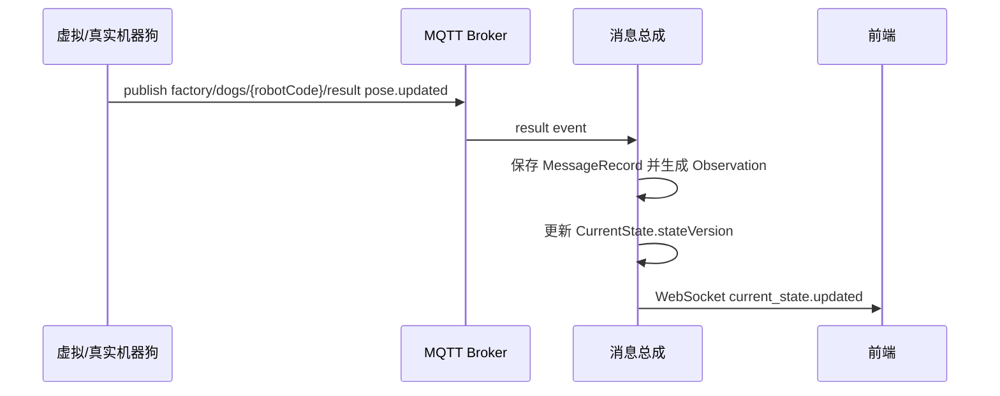
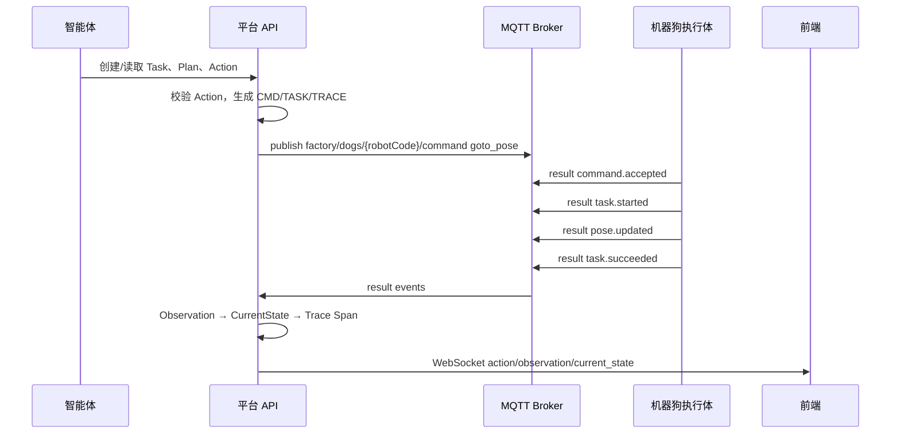
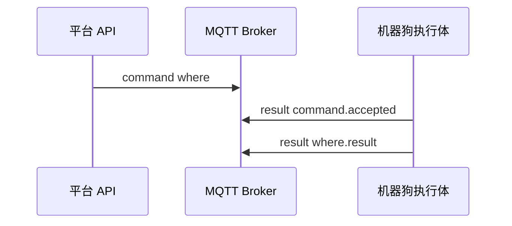
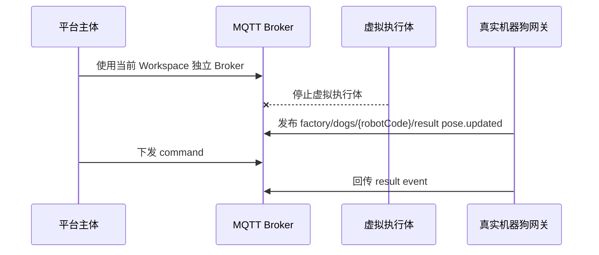
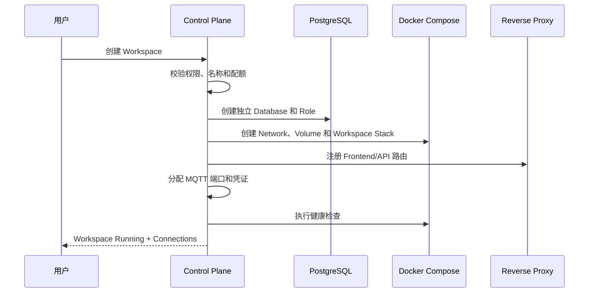
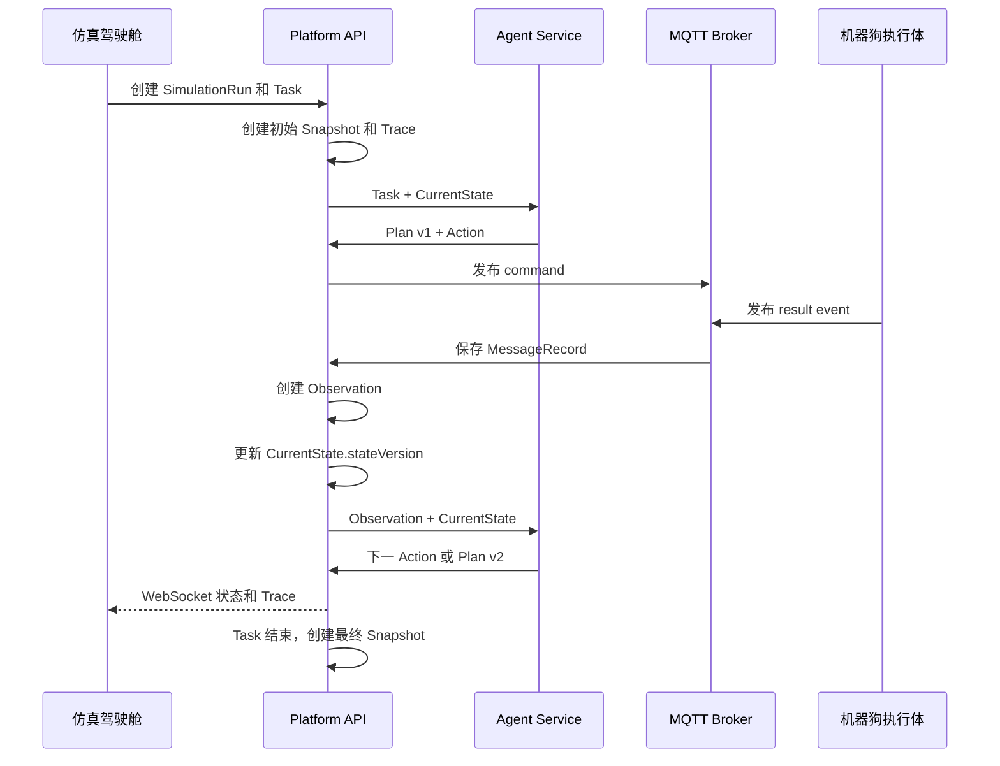

# 通信规范：MQTT、API 与完整通信流程

## 文档信息

| 项目 | 内容 |
|---|---|
| 文档类型 | 通信标准文档 |
| 版本 | v2.0 |
| 日期 | 2026-06-22 |
| 适用范围 | 1～20 Workspace、控制平面、REST、WebSocket、MQTT、仿真驾驶舱、智能体和机器狗联调 |
| 关联文档 | `实施文档_20260617.md`、`数据库与数据结构规范_20260617.md`、`机器狗MQTT接口标准_20260618.md`、`多用户与Workspace架构标准_20260622.md`、`仿真驾驶舱规划_20260622.md` |

## 1. 通信目标

本规范用于统一平台各模块之间的通信方式、消息结构、Topic 命名、API 契约、联调参数和完整通信流程。

核心目标：

- 平台与机器狗执行体统一使用 MQTT。
- 机器狗 MQTT 对外接口采用 `command/result` 双 Topic 标准。
- REST API 使用 OpenAPI 管理。
- WebSocket 只用于前端实时展示。
- 虚拟执行体与真实机器人网关必须实现同一 MQTT 契约。
- 所有指令、结果、状态、事件、日志可追踪、可导出。
- 控制平面与 Workspace 业务通信分离。
- Task、Plan、Action、Observation、CurrentState、Snapshot、Trace 使用统一关联标识。

## 2. 通信组件

| 组件 | 通信方式 | 职责 |
|---|---|---|
| 前端地图编辑与展示层 | REST、WebSocket | 查询数据、编辑地图配置草稿、接收实时状态、展示导入导出结果 |
| 仿真驾驶舱 | REST、WebSocket | Run、Task、Plan、Action、Observation、Snapshot、Trace 展示和授权操作 |
| 共享控制平面 | REST、OIDC、Docker API/受控脚本 | User、Workspace、实例、路由、配额和镜像管理 |
| 平台 API | REST | 查询、配置、导入导出、审计、契约管理、指令创建 |
| 消息总成 | REST、WebSocket、MQTT、内部事件 | MQTT 桥接、消息记录、事件分发、链路追踪 |
| 智能体服务 | REST 或内部消息 | 获取观测、下发动作、接收反馈 |
| MQTT Broker | MQTT | 机器狗 command/result 通道 |
| 虚拟机器狗执行体 | MQTT | 订阅 command，发布 result event |
| 真实机器狗网关 | MQTT | 后续替换虚拟执行体 |
| 导出服务 | REST、异步任务 | 导出配置、日志、消息、事件、指标和联调记录 |

## 3. 协议分工

| 协议 | 使用场景 | 契约文档 |
|---|---|---|
| REST | 查询、配置、导入导出、会话、消息、事件、指标、指令创建 | OpenAPI |
| WebSocket | 前端实时状态、事件、消息推送 | 本文第 8 节 |
| MQTT | 机器狗控制与结果回传 | `机器狗MQTT接口标准_20260618.md` |
| 内部事件 | 消息总成内部处理、导出任务、指标聚合 | 内部事件契约 |

通信边界：

- Control Plane 使用 `/api/control/v1`，不得调用机器狗 command。
- Workspace API 使用 `/api/v1`，只访问当前 Workspace 数据。
- 驾驶舱 WebSocket 使用 Workspace 和 Run 作用域。
- 每 Workspace 使用独立 MQTT Broker，机器狗 Topic 和 Payload 不增加 Workspace 字段。

## 4. MQTT 标准

### 4.1 Topic 命名

平台只通过一个 Topic 向机器狗下发命令：

```text
factory/dogs/{robotCode}/command
```

机器狗只通过一个 Topic 向平台回传结果：

```text
factory/dogs/{robotCode}/result
```

Topic 规则：

- `{robotCode}` 必须与消息体中的 `robotCode` 一致。
- command topic 只承载 `messageType=command`。
- result topic 只承载 `messageType=event`。
- command 消息禁止 retained。
- 第一阶段只固定 `goto_pose`、`stop`、`where` 三类命令。
- 每 Workspace 使用独立 MQTT Broker 和独立凭证。
- `workspaceId` 只存在于平台连接上下文，不进入机器狗终版 Topic 和 Payload。
- 相同 `robotCode` 可存在于不同 Workspace，但不得存在于同一 Workspace。

### 4.2 Topic 清单

| Topic | 方向 | 说明 | QoS | Retain |
|---|---|---|---:|---|
| `factory/dogs/{robotCode}/command` | 平台 -> 机器狗 | 命令下发 | 1 | false |
| `factory/dogs/{robotCode}/result` | 机器狗 -> 平台 | 确认、任务、位置、查询和错误事件 | 1 | false |

### 4.3 MQTT 联调参数

| 参数 | 标准 |
|---|---|
| brokerHost | 局域网：`{PUBLIC_HOST}`；Docker 内部：`mqtt-broker` |
| brokerPort | Workspace 从 `18830～18849` 分配；Docker 内部 `1883` |
| protocolVersion | MQTT 3.1.1 |
| keepAlive | 30s |
| cleanSession | true |
| command QoS | 1 |
| result QoS | 1 |
| retainCommand | false |
| retainResult | false |
| willTopic | `factory/dogs/{robotCode}/result` |
| willPayload | `event=device.offline` |
| schemaVersion | `1.0` |
| Workspace Isolation | 独立 Broker、端口、用户/证书和 ACL |

### 4.4 Last Will

机器狗执行体必须配置 Last Will。

推荐 willTopic：

```text
factory/dogs/{robotCode}/result
```

推荐 willPayload：

```json
{
  "schemaVersion": "1.0",
  "messageType": "event",
  "event": "device.offline",
  "eventId": "EVT-20260528-000001",
  "commandId": null,
  "taskId": null,
  "requestId": null,
  "robotCode": "DOG-001",
  "traceId": "TRACE-DOG-001-POSE",
  "source": "mqtt",
  "timestamp": "2026-05-28T10:01:30+08:00",
  "data": {
    "lastSeenAt": "2026-05-28T10:01:20+08:00"
  },
  "error": {
    "errorCode": "DEVICE_OFFLINE",
    "errorMessage": "device disconnected unexpectedly",
    "retryable": true,
    "source": "mqtt"
  }
}
```

## 5. MQTT Payload 标准

### 5.1 Command Payload

```json
{
  "schemaVersion": "1.0",
  "messageType": "command",
  "commandId": "CMD-20260528-000001",
  "taskId": "TASK-20260528-000001",
  "requestId": null,
  "robotCode": "DOG-001",
  "traceId": "TRACE-20260528-000001",
  "command": "goto_pose",
  "issuedAt": "2026-05-28T10:00:00+08:00",
  "timeoutMs": 120000,
  "operatorId": "scheduler",
  "source": "scheduler",
  "params": {
    "x": 12.34,
    "y": 56.78
  }
}
```

| 字段 | 类型 | 必填 | 说明 |
|---|---|---|---|
| `schemaVersion` | string | 是 | 固定 `1.0` |
| `messageType` | string | 是 | 固定 `command` |
| `commandId` | string | 是 | 单次命令唯一 ID |
| `taskId` | string/null | 任务类必填 | `goto_pose`、任务内 `stop` 必填 |
| `requestId` | string/null | 查询类必填 | `where` 必填 |
| `robotCode` | string | 是 | 机器狗编码 |
| `traceId` | string | 是 | 链路追踪 ID |
| `command` | string | 是 | `goto_pose`、`stop`、`where` |
| `issuedAt` | string | 是 | 平台下发时间，ISO 8601 |
| `timeoutMs` | number | 建议 | 超时时间 |
| `operatorId` | string/null | 否 | 操作人或系统调用方 |
| `source` | string | 是 | `api`、`scheduler`、`agent`、`system` |
| `params` | object | 是 | 命令参数 |

### 5.2 Result Payload

```json
{
  "schemaVersion": "1.0",
  "messageType": "event",
  "event": "task.succeeded",
  "eventId": "EVT-20260528-000001",
  "commandId": "CMD-20260528-000001",
  "taskId": "TASK-20260528-000001",
  "requestId": null,
  "robotCode": "DOG-001",
  "traceId": "TRACE-20260528-000001",
  "source": "device",
  "timestamp": "2026-05-28T10:01:20+08:00",
  "data": {
    "result": 1,
    "x": 12.34,
    "y": 56.78,
    "yaw": 1.57,
    "battery": 80
  },
  "error": null
}
```

| 字段 | 类型 | 必填 | 说明 |
|---|---|---|---|
| `schemaVersion` | string | 是 | 固定 `1.0` |
| `messageType` | string | 是 | 固定 `event` |
| `event` | string | 是 | 标准事件名 |
| `eventId` | string | 建议 | 事件唯一 ID |
| `commandId` | string/null | 命令相关必填 | 关联平台下发命令 |
| `taskId` | string/null | 任务相关必填 | 关联业务任务 |
| `requestId` | string/null | 查询相关必填 | 关联查询请求 |
| `robotCode` | string | 是 | 机器狗编码 |
| `traceId` | string | 是 | 沿用 command 的 `traceId` |
| `source` | string | 是 | 设备回传固定 `device` |
| `timestamp` | string | 是 | 事件发生时间，ISO 8601 |
| `data` | object | 是 | 事件数据 |
| `error` | object/null | 否 | 错误对象，无错误时为 null |

### 5.3 命令与事件清单

| command | 用途 | 设备预期响应 |
|---|---|---|
| `goto_pose` | 移动到指定坐标或业务点位 | `command.accepted/rejected`、`task.started`、`task.succeeded/failed` |
| `stop` | 停止当前任务 | `command.accepted/rejected`、`task.stopped` |
| `where` | 查询当前位置 | `where.result` 或 `where.failed` |

| event | 用途 |
|---|---|
| `command.accepted` | 设备接受命令 |
| `command.rejected` | 设备拒绝命令 |
| `task.started` | 任务开始 |
| `task.succeeded` | 任务成功 |
| `task.failed` | 任务失败 |
| `task.stopped` | 停止完成 |
| `task.timeout` | 任务超时 |
| `pose.updated` | 周期位置和电量，也是心跳 |
| `where.result` | where 成功 |
| `where.failed` | where 失败 |
| `device.offline` | 平台判定离线 |

## 6. REST API 标准

### 6.1 基础约定

| 项 | 标准 |
|---|---|
| Base URL | `/api/v1` |
| 请求格式 | JSON |
| 响应格式 | JSON |
| 时间格式 | ISO 8601 |
| 链路 ID | `traceId` |
| 认证 | OIDC/JWT |
| Workspace 上下文 | JWT `workspaceId`，不得仅信任请求体或 Query |
| 控制平面 Base URL | `/api/control/v1` |
| Workspace Base URL | `/api/v1` |

### 6.2 关键 API

| 方法 | 路径 | 说明 |
|---|---|---|
| GET | `/health` | 健康检查 |
| GET | `/connections` | 当前局域网连接信息和 MQTT Topic |
| GET | `/mqtt/contract` | 当前 MQTT command/result 契约 |
| POST | `/commands` | 创建机器狗 command |
| GET | `/commands/{commandId}/trace` | 查询 command/result 链路 |
| GET | `/robots` | 查询机器人状态 |
| GET | `/messages` | 查询消息总成记录 |
| POST | `/events` | 控制台事件触发 |

### 6.3 控制平面 API

```text
POST /api/control/v1/workspaces
GET  /api/control/v1/workspaces
GET  /api/control/v1/workspaces/{workspaceId}
POST /api/control/v1/workspaces/{workspaceId}/start
POST /api/control/v1/workspaces/{workspaceId}/stop
POST /api/control/v1/workspaces/{workspaceId}/upgrade
GET  /api/control/v1/workspaces/{workspaceId}/health
GET  /api/control/v1/workspaces/{workspaceId}/connections
PUT  /api/control/v1/workspaces/{workspaceId}/members
```

控制平面只管理 Workspace 生命周期，不发布机器人 command。

### 6.4 仿真驾驶舱 API

```text
POST /api/v1/simulation-runs
GET  /api/v1/simulation-runs/{runId}
POST /api/v1/simulation-runs/{runId}/start
POST /api/v1/simulation-runs/{runId}/pause
POST /api/v1/simulation-runs/{runId}/resume
POST /api/v1/simulation-runs/{runId}/stop
POST /api/v1/simulation-runs/{runId}/tasks
GET  /api/v1/tasks/{taskId}/plans
GET  /api/v1/actions/{actionId}
GET  /api/v1/observations
GET  /api/v1/current-states/{runId}
GET  /api/v1/simulation-runs/{runId}/snapshots
GET  /api/v1/traces/{traceId}
GET  /api/v1/traces/{traceId}/spans
```

现有 `/commands` 是 Action Service 的底层设备指令接口；驾驶舱默认创建 Task，只有手动联调模式可请求单个 Action。

### 6.5 消息筛选参数

`GET /api/v1/messages` 支持以下查询参数：

| 参数 | 说明 |
|---|---|
| `limit` | 返回数量，默认 100 |
| `messageType` | 消息类型，如 `command`、`event` |
| `robotCode` | 机器狗编码 |
| `commandId` | command ID |
| `traceId` | 链路追踪 ID |
| `taskId` | 任务 ID |
| `requestId` | 查询请求 ID |
| `event` | result event，如 `pose.updated` |
| `topic` | Topic 包含匹配 |
| `source` | 消息来源 |
| `createdFrom` | 起始时间，ISO 8601 |
| `createdTo` | 截止时间，ISO 8601 |

示例：

```text
GET /api/v1/messages?robotCode=robot-001&event=pose.updated&limit=20
GET /api/v1/messages?commandId=CMD-20260618-000001
GET /api/v1/messages?traceId=TRACE-20260618-000001
```

### 6.6 Command REST 兼容输入

平台 REST `POST /api/v1/commands` 支持新旧两类输入：

新格式：

```json
{
  "robotCode": "DOG-001",
  "command": "goto_pose",
  "params": {
    "x": 12.34,
    "y": 56.78
  },
  "issuedBy": "agent"
}
```

兼容格式：

```json
{
  "robotId": "robot-001",
  "commandType": "move",
  "target": {
    "x": 760,
    "y": 420
  },
  "issuedBy": "console"
}
```

兼容映射：

| REST 输入 | MQTT 输出 |
|---|---|
| `robotId` | `robotCode` |
| `commandType=move` | `command=goto_pose` |
| `commandType=carry` | `command=goto_pose` |
| `target` | `params` |

设备侧只以 MQTT command/result 协议为准。

## 7. WebSocket 推送标准

### 7.1 连接

```text
/ws/v1/workspaces/{workspaceId}/runs/{runId}
```

现有 `/ws/v1/sessions/{sessionId}` 仅作为 MVP 兼容路径。

### 7.2 当前推送类型

驾驶舱标准推送类型：

```text
run.updated
task.updated
plan.activated
action.updated
observation.created
current_state.updated
snapshot.created
trace.span.created
robot.pose.updated
```

当前 MVP 的 `snapshot` 消息可在迁移期继续使用：

```json
{
  "messageId": "ws-xxx",
  "type": "snapshot",
  "sessionId": "session-local",
  "timestamp": "2026-06-18T00:00:00Z",
  "data": {
    "robots": [],
    "messages": []
  }
}
```

推送要求：

- WebSocket 只用于前端展示。
- 前端不得通过 WebSocket 下发机器人控制指令。
- WebSocket 断开后前端必须回退到 REST 轮询。
- 服务端必须校验 JWT 中 `workspaceId` 与路径参数一致。
- CurrentState 推送必须包含 `stateVersion`，前端不得应用更旧版本。

## 8. 完整通信流程

### 8.1 执行体上线



### 8.2 智能体下发 goto_pose



### 8.3 where 查询



### 8.4 真实机器人替换虚拟执行体



### 8.5 Workspace 创建与启动



### 8.6 仿真驾驶舱完整闭环



## 9. 幂等、超时与重试

| 场景 | 标准 |
|---|---|
| 重复 command | 使用 `commandId` 去重 |
| command 超时 | 平台标记 timeout，执行体后续 result 仍需记录为 late result |
| MQTT 重连 | 执行体恢复后先上报 `pose.updated` |
| result 丢失 | 平台以 command timeout 和后续 pose/result 补偿判断 |
| 状态乱序 | 使用 `timestamp` 排序 |
| 旧命令误执行 | command Topic 禁止 retained |
| Observation 重复 | 使用 `eventId/messageId` 去重 |
| CurrentState 并发 | 使用单调递增 `stateVersion` 乐观更新 |
| 延迟 result | 保存并标记 late，不覆盖更新版本 CurrentState |
| Plan 重规划 | 创建新 `planVersion`，旧 Plan 标记 superseded |

## 10. 安全规范

- MQTT 生产环境必须启用认证。
- 生产环境建议启用 TLS。
- Topic 权限按 `robotCode` 隔离。
- 前端不可直接连接机器狗 command Topic。
- 导出接口需要权限控制。
- MQTT 参数导出时不得导出密码、证书私钥。
- 所有写操作进入审计日志。
- API 和 WebSocket 校验 JWT `workspaceId`。
- 每 Workspace 独立 Broker、Database、Role、Redis、Network 和 Volume。
- Workspace Secret 不进入前端、日志、Snapshot、Trace 和导出包。

## 11. 联调验收清单

- [ ] MQTT Broker 可连接。
- [ ] 平台可发布 `factory/dogs/{robotCode}/command`。
- [ ] 执行体可返回 `command.accepted`。
- [ ] 执行体可返回 `task.started`。
- [ ] 执行体可返回 `pose.updated`。
- [ ] 执行体可返回 `task.succeeded` 或 `task.failed`。
- [ ] `where` 可返回 `where.result`。
- [ ] Last Will 可产生 `device.offline`。
- [ ] command 不 retained。
- [ ] 前端可实时看到状态。
- [ ] 智能体可收到反馈。
- [ ] 导出可包含 command/result 全量消息。
- [ ] result event 可生成 Observation 并更新带版本的 CurrentState。
- [ ] Task、Plan、Action、Observation、Snapshot 和 Trace 可完整关联。
- [ ] WebSocket 使用 Workspace/Run 作用域并校验 JWT。
- [ ] 两个 Workspace 使用相同 `robotCode` 时 MQTT 消息互不串流。
- [ ] Control Plane 不具备发布机器狗 command 的权限。
