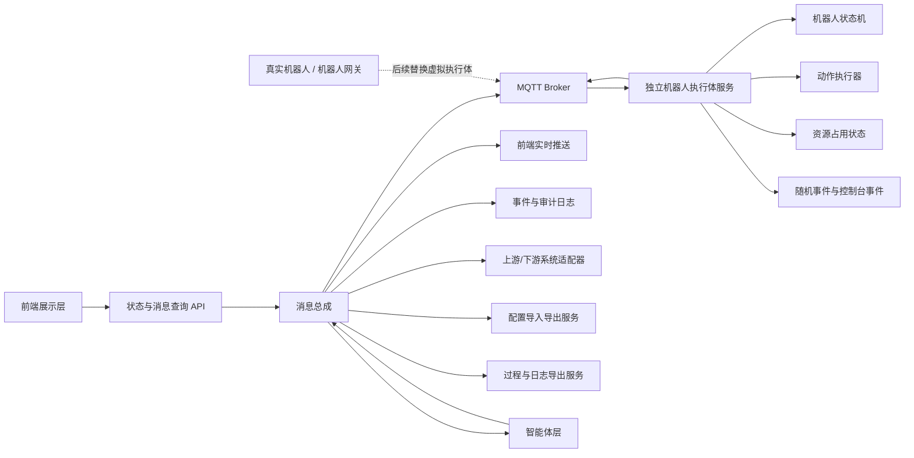

# 具身智能业务流程仿真平台方案

## 任务背景

本方案面向“基于二维数据的具身智能业务流程仿真平台”。平台目标不是做三维物理仿真，也不是直接控制真实机器人，而是用二维场地数据、虚拟机器人执行体、消息接口和智能体调度闭环，建立一个可观察、可触发、可验证的业务仿真环境。

平台用于在真实系统上线前验证以下问题：

- 智能体下发的任务流和动作指令是否能跑通。
- 单任务、批量任务、并发任务在虚拟机器人执行侧的耗时是否符合预期。
- 工位、路径、机器人、接口、资源是否存在瓶颈。
- 机器人动作集、状态流转、异常处理是否合理。
- 上下游消息收发是否完整、可追踪、可重放。
- AI 调度或智能体决策时，是否有稳定的观测、动作、反馈和评估闭环。

## 用户需求

用户明确要求：

- 前端支持二维地图环境编辑与运行态展示，不做任务编排、调度控制或机器人指令下发。
- 地图编辑需要显示坐标轴，鼠标移动到地图上时实时显示坐标点。
- 地图上的区域、障碍物、工位、路径、资源点等内容可以在地图上直接创建、选择、拖拽、调整、删除和保存。
- 地图环境编辑属于配置编辑，所有保存必须经过后端校验、版本化和审计，不允许前端直接修改运行态。
- 不做三维物理仿真。
- 区域、障碍物、工位、路径、机器人类型等作为后端配置或外部配置数据，前端只读取并展示。
- 后端不做仿真运行服务，不负责仿真的启动、暂停、恢复、停止、任务规划或指令编排。
- 仿真的启动、任务规划、动作指令等由智能体下发。
- 平台后端不直接模拟机器人，独立虚拟机器人执行体通过 MQTT 接收智能体或控制台下发的指令并模拟执行。
- 独立虚拟机器人执行体模拟自己是相关机器人，模拟分拣、抓取、搬运、等待、到位、异常等动作和状态。
- 独立虚拟机器人执行体将机器人状态、动作进度、事件和结果通过 MQTT 上报，平台后端负责消息桥接、查询、审计和推送。
- 前端负责显示，智能体负责信息收集、下一步规划和继续下发指令。
- 支持机器人的动作集配置和动作耗时配置。
- 动作耗时采用时间区间配置，例如 30-35 秒，实际完成时间在区间内随机生成。
- 支持随机事件和控制台手动触发事件，用于模拟异常、阻塞、失败、延迟等情况。
- 支持与上下游进行消息收发。
- 与机器人设备的消息交互统一使用 MQTT。
- 需要建立完善的 API 契约、MQTT Topic 契约、机器人控制联调参数说明和消息版本规范。
- 需要消息总成，统一管理所有消息、接口、事件等。
- 需要智能体层，能够发送动作指令、接收机器人信息，并通过 AI 决策后下发指令。
- 所有前端、后端、智能体、消息、虚拟机器人执行体等服务均使用 Docker 部署。
- 前端配置支持导入和导出，但导入内容必须由后端校验、版本化和审计，不允许前端直接改写运行态。
- 所有过程数据、消息、事件、日志和联调记录支持导出。
- 虚拟机器人执行体必须单独搭建为独立服务，接口与真实机器人保持清晰边界，后续真实机器人接入时只替换虚拟执行体，不重构平台主体。
- 前端界面要求使用 `design-taste-frontend`、`minimalist-ui`、`full-output-enforcement` 作为设计约束。
- 前端视觉风格采用 Apple + Linear 风格，强调高级感、极简、少 AI 味、高级 typography、克制动效和响应式体验。
- 前端实现技术要求包含 Tailwind CSS、shadcn/ui、Framer Motion。
- 本次只给出完整方案并形成文档，不进行代码开发。

## 当前代码现状

当前项目根目录：

- `D:\app\仿真\0616`

当前相关文件：

- `智能体仿真平台-新.txt`：包含本次需求草稿。
- `.codex/plans/具身智能业务流程仿真平台方案_20260616.md`：本方案文档。
- `.codex/docs/实施文档_20260617.md`：标准化实施文档。
- `.codex/docs/通信规范_MQTT_API_20260617.md`：MQTT、API 与完整通信流程标准文档。
- `.codex/docs/数据库与数据结构规范_20260617.md`：数据库和数据结构标准文档。

本次只创建和修改文档，不修改业务源代码。

## 标准化文档索引

本方案已拆分为以下标准化实施文档，后续进入开发、评审和联调时应优先以这些文档作为执行依据：

| 文档 | 路径 | 用途 |
|---|---|---|
| 总体方案 | `.codex/plans/具身智能业务流程仿真平台方案_20260616.md` | 说明总体目标、边界、架构、技术栈和建设方向 |
| 实施文档 | `.codex/docs/实施文档_20260617.md` | 指导阶段建设、服务边界、Docker 部署、交付物和验收 |
| 通信规范 | `.codex/docs/通信规范_MQTT_API_20260617.md` | 规范 MQTT、REST API、WebSocket、完整通信流程和联调参数 |
| 数据库规范 | `.codex/docs/数据库与数据结构规范_20260617.md` | 规范 PostgreSQL Schema、表结构、字段、索引、枚举和生命周期 |

## 总体定位

平台建议定位为“二维机器人执行体仿真与智能体调度验证平台”。平台不内置完整仿真运行编排服务，而是由智能体驱动仿真过程，独立机器人执行体负责扮演虚拟机器人并模拟执行指令，平台后端负责 API、消息总成、配置、导出、查询和审计。

核心能力由四层组成：

1. 二维环境编辑与展示层：编辑场地、区域、障碍物、工位、路径、资源点等环境配置，并展示机器人状态、动作进度、事件和消息。
2. 机器人执行体层：通过 MQTT 接收控制指令并上报状态；首期为虚拟机器人执行体，后续可替换为真实机器人设备或真实机器人网关。
3. 消息总成层：统一承载指令、状态、事件、接口消息、MQTT 消息、告警、回执和上下游集成。
4. 智能体调度层：接收环境观测，规划下一步动作，输出动作指令，支持规则调度、AI 调度和后续强化学习或大模型接入。

推荐优先采用“指令驱动 + MQTT 交互 + 事件触发 + 动作耗时区间随机”的设计，而不是由平台后端统一编排仿真运行。这样可以让机器人执行体更接近真实机器人或设备端，智能体更接近真实调度系统，便于验证智能体决策链路。

## 设计边界

### 明确包含

- 二维地图环境编辑与机器人状态展示。
- 区域、障碍物、工位、路径、资源点等配置数据可视化编辑和展示。
- 坐标轴、鼠标坐标点、网格、吸附、对象选中和编辑辅助能力。
- 机器人类型、机器人实例、动作集、动作耗时区间等配置数据读取与展示。
- 虚拟机器人状态模拟。
- 智能体下发动作指令后的虚拟执行模拟。
- 分拣、抓取、搬运、等待、到位、异常等机器人动作模拟。
- MQTT 机器人控制、状态上报、事件上报和联调参数说明。
- API 契约、MQTT Topic 契约、消息版本和字段说明。
- 随机事件和控制台事件触发。
- 工位、路径、充电桩、缓存位等资源占用状态模拟。
- 统一消息、接口、事件总线。
- 上下游接口模拟与真实接口适配。
- 智能体观测、决策、指令下发、结果反馈闭环。
- 指令、状态、事件、消息记录与统计分析。
- 前端配置导入导出。
- 过程、日志、事件、消息、指标和联调记录导出。
- 前后端、智能体、消息组件、虚拟机器人执行体全量 Docker 化部署。

### 明确不包含

- 三维建模。
- 刚体碰撞、动力学、传感器级物理仿真。
- 真实机器人底盘控制。
- 真实 SLAM、导航、避障算法。
- AI 模型训练平台本身。
- 后端仿真运行编排服务。
- 前端任务编排、调度和控制能力。
- 前端绕过后端直接写入配置或运行态。
- 虚拟机器人执行体与平台主体强耦合。
- 对真实生产系统的不可逆操作。

## 业务价值

平台可以解决以下业务问题：

- 在真实部署前验证智能体任务规划和动作指令链路是否合理。
- 评估不同机器人数量、路径规划、工位布局对吞吐的影响。
- 发现工位、路径、充电点、接口响应、消息堆积等瓶颈。
- 为 AI 调度提供低成本试错环境。
- 为上下游系统提供接口联调沙箱。
- 为方案评审提供可视化演示、指标报告和事件证据。

## 总体架构

建议架构如下：



架构替换原则：

- 平台主体不直接依赖虚拟机器人内部实现，只依赖机器人控制 API 契约和 MQTT 消息契约。
- 虚拟机器人执行体作为独立服务接入 MQTT Broker，模拟真实机器人收指令、执行动作、报状态。
- 后续接入真实机器人时，保留智能体、消息总成、前端、日志、指标和配置服务，只将虚拟机器人执行体替换为真实机器人或机器人网关。
- 虚拟执行体和真实机器人必须使用同一套 Topic 规范、消息字段、指令回执和状态语义。
- 所有前端、后端、智能体、MQTT Broker、数据库、缓存、虚拟机器人执行体、导出服务均以 Docker 镜像方式交付和部署。

## 技术栈选型

技术栈选型应围绕当前边界展开：前端只展示，平台后端负责 API、契约、消息总成、配置和导出，独立机器人执行体负责通过 MQTT 执行指令并上报状态，智能体负责规划和下发指令。

### 选型原则

- 优先选择成熟、社区活跃、文档完整、团队容易招聘和维护的技术。
- MVP 阶段优先降低复杂度，避免过早引入重型中间件。
- 消息、事件、指令和状态需要天然支持追踪、回放和审计。
- 二维展示需要稳定、性能可控，不引入三维渲染和物理引擎。
- 智能体层需要与后端解耦，便于后续接入规则策略、大模型、强化学习或外部调度服务。
- 所有外部接口必须有契约文档、版本管理和模拟能力。

### 推荐主技术栈

| 层级 | 推荐技术 | 选型结论 | 主要原因 |
|---|---|---|---|
| 前端语言 | TypeScript | 推荐 | 类型约束明确，适合复杂状态展示和接口契约联动 |
| 前端框架 | React | 推荐 | 组件生态成熟，适合监控台、消息中心、指标页等复杂展示界面 |
| 前端构建 | Vite | 推荐 | 本地开发快，配置轻，适合中后台展示型应用 |
| 样式系统 | Tailwind CSS | 推荐 | 适合构建高度定制、极简、响应式的 Apple + Linear 风格界面 |
| UI 组件 | shadcn/ui | 推荐 | 组件可控、风格克制，适合构建低 AI 味、高级感的产品界面 |
| 动效 | Framer Motion / Motion for React | 推荐 | 适合页面切换、状态反馈、列表入场、面板展开等克制动效 |
| 二维展示 | Konva.js / PixiJS | 推荐二选一 | Konva 更适合可交互二维对象，PixiJS 更适合大量对象高性能渲染 |
| 图表分析 | Apache ECharts | 推荐 | 适合吞吐、耗时、资源利用率、消息延迟等图表 |
| 前端状态 | Zustand | 推荐 | 轻量，适合前端只展示的状态管理 |
| 服务端状态请求 | TanStack Query | 推荐 | 适合接口查询、缓存、刷新和错误态处理 |
| 实时通信 | WebSocket，SSE 作为备选 | 推荐 | WebSocket 适合状态和事件实时推送；SSE 适合只读单向推送 |
| 后端语言 | Python | 推荐 | 与 AI、仿真、策略插件和数据分析生态匹配 |
| 后端框架 | FastAPI | 推荐 | 支持异步 API、WebSocket、OpenAPI 文档和类型校验 |
| 后端运行 | Uvicorn / Gunicorn | 推荐 | Python ASGI 常用部署组合 |
| 数据库 | PostgreSQL | 推荐 | 适合配置、会话、指令、事件索引、接口记录等结构化数据 |
| 缓存与轻量事件 | Redis | 推荐 | 适合在线状态、短期缓存、分布式锁、轻量队列和临时事件 |
| 消息总成 | Redis Streams 起步，Kafka 增强 | 分阶段推荐 | MVP 用 Redis Streams 降低复杂度；后期 Kafka 支持高吞吐、持久化、重放和多消费者 |
| 机器人设备交互 | MQTT Broker | 必选 | 机器人控制、状态上报、事件上报和联调统一走 MQTT |
| 协议适配 | REST、WebSocket、MQTT、Kafka Connector | 分场景使用 | REST 适合管理和查询；WebSocket 适合实时展示；MQTT 作为机器人设备主通道；Kafka 适合企业事件流 |
| API 契约 | OpenAPI + AsyncAPI | 推荐 | OpenAPI 管理 REST；AsyncAPI 管理消息、事件和异步协议 |
| 智能体服务 | Python Strategy Service | 推荐 | 先支持规则智能体，再接入 AI 决策服务 |
| AI 接入 | OpenAI-compatible API 抽象层 | 推荐 | 统一云端模型、本地模型和后续私有化模型调用方式 |
| 日志 | Loki 或 ELK / OpenSearch | 二选一 | Loki 更轻量；ELK/OpenSearch 更适合复杂检索 |
| 指标 | Prometheus + Grafana | 推荐 | 适合服务指标、消息延迟、资源利用率和运行状态看板 |
| 链路追踪 | OpenTelemetry | 推荐 | 统一采集 API、消息、智能体决策、平台后端消息桥接和执行体执行链路 |
| 容器化 | Docker | 必选 | 前端、后端、智能体、MQTT、虚拟机器人执行体、导出服务全部镜像化 |
| 编排 | Docker Compose 起步，Kubernetes 增强 | 分阶段推荐 | MVP 用 Compose 管理全服务；多环境、多实例、高可用后再上 Kubernetes |
| 网关 | Nginx / Traefik | 推荐 | 统一静态资源、API 代理、WebSocket 转发和 TLS |
| 测试 | Pytest、Vitest、Playwright、k6 | 推荐 | 覆盖后端单测、前端单测、端到端测试和性能压测 |
| 文档 | Markdown + OpenAPI + AsyncAPI | 推荐 | 适合方案、接口契约、消息契约和建设过程沉淀 |

### 前端技术栈说明

前端负责二维地图环境编辑与运行态展示，因此需要具备可视化地图编辑能力，但不需要任务流低代码编排器、三维引擎或大型运行态状态机框架。

推荐组合：

- React + TypeScript + Vite。
- Tailwind CSS 作为样式系统。
- shadcn/ui 作为基础组件体系。
- Framer Motion / Motion for React 作为克制动效方案。
- Konva.js 或 PixiJS 做二维场地、路径、工位、机器人状态展示。
- ECharts 做指标图表。
- Zustand 管理当前页面展示状态。
- TanStack Query 管理查询、缓存、刷新和错误态。
- WebSocket 接收机器人状态、动作进度、事件和消息推送。
- 地图编辑能力支持坐标轴、鼠标坐标显示、网格、吸附、对象选择、拖拽、缩放、节点编辑和草稿保存。

二维渲染选择建议：

| 场景 | 推荐 |
|---|---|
| 地图对象较少，强调工位、路径、机器人状态清晰展示 | Konva.js |
| 机器人、路径、事件对象数量较大，强调渲染性能 | PixiJS |
| 只做静态平面图和少量状态点位 | SVG + React 即可 |

前端不建议引入：

- Three.js：当前明确不做三维物理仿真。
- 复杂流程编排器：任务规划由智能体负责。
- 前端持久化运行态：运行态事实源应来自后端状态与消息流。

### 二维地图环境编辑规范

地图环境编辑是前端允许承担的配置编辑能力，目标是在二维场地上直接完成环境建模。编辑结果必须提交给平台后端，由后端进行校验、版本化和审计。

编辑对象：

| 对象 | 编辑能力 |
|---|---|
| 场地 | 设置尺寸、坐标单位、原点、比例尺、背景参考图 |
| 区域 | 绘制多边形、移动顶点、调整范围、设置区域类型 |
| 障碍物 | 创建矩形、多边形或圆形障碍物，支持移动、缩放、删除 |
| 工位 | 放置点位，设置方向、容量、支持动作和资源属性 |
| 路径节点 | 创建、移动、删除路径节点 |
| 路径边 | 连接节点，设置方向、长度、容量、权重 |
| 资源点 | 放置充电桩、缓存位、泊车点、设备接口等 |

坐标与辅助能力：

- 地图必须显示 X/Y 坐标轴。
- 鼠标移动到地图上时必须实时显示当前坐标点。
- 支持网格显示和隐藏。
- 支持网格吸附开关。
- 支持缩放和平移。
- 支持对象 hover 高亮、选中高亮和属性面板。
- 支持对象层级管理，例如区域、障碍物、路径、工位、机器人状态层。
- 支持撤销和重做。
- 支持编辑前后差异预览。

编辑流程：

1. 用户进入地图编辑模式。
2. 前端加载当前配置版本并创建草稿。
3. 用户在地图上直接编辑区域、障碍物、工位、路径、资源点等对象。
4. 前端进行基础格式校验，例如坐标合法、必填字段完整。
5. 用户保存草稿。
6. 后端进行拓扑校验、引用校验、资源校验和冲突校验。
7. 校验通过后生成新配置版本。
8. 新仿真会话可选择使用新配置版本，历史会话不受影响。

后端校验要求：

- 坐标必须在场地范围内。
- 路径边必须连接有效节点。
- 工位必须在允许区域内。
- 障碍物不得与关键工位非法重叠。
- 禁行区不得被路径穿越，除非显式允许。
- 路径容量、方向、权重必须合法。
- 删除对象时必须检查引用关系。
- 发布配置必须写入审计日志。

权限要求：

- Viewer 只能查看地图和运行态。
- Editor 可以创建和保存地图草稿。
- Reviewer 可以校验和发布配置版本。
- Admin 可以回滚配置版本和管理导入导出。

前端边界：

- 前端可以编辑环境配置草稿。
- 前端不直接改运行态。
- 前端不直接下发机器人动作指令。
- 前端不决定任务规划结果。
- 前端不绕过后端发布配置版本。

### 前端视觉与交互规范

前端界面需采用 Apple + Linear 风格，整体方向是高级、极简、安静、克制、工程化，不做营销页式大色块和强 AI 味视觉包装。

设计约束：

- `design-taste-frontend`：界面必须体现成熟产品感，信息层级清楚，视觉细节克制，不使用模板化、堆砌式、炫技式设计。
- `minimalist-ui`：减少装饰，减少无意义卡片和渐变，优先使用留白、排版、细线、浅阴影、状态色和高质量间距建立层级。
- `full-output-enforcement`：每个页面必须覆盖完整输出状态，包括加载、空数据、正常、异常、离线、权限不足、消息延迟、数据过期和重连中状态。

视觉目标：

- 高级感：使用克制配色、细腻边框、轻阴影、稳定间距和一致圆角。
- 极简：页面不做无关装饰，不使用大面积炫彩渐变，不用拟人化 AI 插画。
- 少 AI 味：避免“AI 大脑”“发光神经网络”“机器人插画”等常见 AI 视觉套路。
- 高级 typography：通过字号、字重、行高、数字等宽、标题层级和信息密度体现专业感。
- 响应式：桌面端优先信息密度，平板端保持监控可读性，移动端优先关键状态和告警。

界面风格要求：

| 设计项 | 要求 |
|---|---|
| 整体风格 | Apple + Linear，安静、精密、克制 |
| 主色 | 中性色为主，少量蓝、绿、红、黄用于状态 |
| 背景 | 浅色或深色均可，但必须避免廉价渐变和高饱和背景 |
| 卡片 | 只用于独立信息块，不做卡片套卡片 |
| 圆角 | 保持克制，建议 6-10px，避免过度圆润 |
| 边框 | 使用低对比细边框表达层级 |
| 阴影 | 轻量使用，不使用厚重投影 |
| 字体 | 优先系统字体，数字和指标可使用 tabular nums |
| 图标 | 使用一致线性图标，不混用多套风格 |
| 动效 | 只用于状态变化、面板切换、列表进入、地图聚焦和告警反馈 |

Framer Motion 使用原则：

- 动效必须服务状态理解，不做无意义炫动。
- 页面切换应短促、轻量，避免拖慢监控效率。
- 机器人状态变化可使用轻微位置、透明度或高亮过渡。
- 告警出现、消息进入、面板展开可使用 120-240ms 的克制动效。
- 长列表和高频状态更新应避免过多动画，防止性能问题。
- 必须尊重用户的 reduced motion 偏好。

Tailwind 与 shadcn/ui 使用原则：

- Tailwind 用于建立统一设计 token：颜色、间距、字号、圆角、阴影和断点。
- shadcn/ui 作为基础组件来源，组件需按 Apple + Linear 风格统一二次整理。
- 不直接堆叠默认组件，所有表格、弹窗、按钮、标签、状态徽标需要统一视觉语言。
- 状态色必须语义化：运行、等待、异常、完成、离线、重连、超时分别有稳定表达。
- 响应式布局必须覆盖桌面、平板、移动端。

关键页面设计要求：

| 页面 | 设计重点 |
|---|---|
| 二维地图环境编辑页 | 地图应成为主视觉，支持坐标轴、鼠标坐标点、对象编辑，右侧或底部展示对象属性、机器人、事件、资源摘要 |
| 机器人状态页 | 强调状态、当前指令、动作进度、异常原因和最近事件 |
| 指令执行状态页 | 用时间线和状态徽标表达指令生命周期 |
| 消息中心页 | 类 Linear 的紧凑列表、筛选、详情抽屉和消息状态 |
| 事件列表页 | 高密度、可筛选、可定位关联机器人和指令 |
| 基础指标页 | 使用克制图表，不做炫彩大屏风格 |
| 智能体观测页 | 展示观测输入、决策输出、校验结果和执行反馈 |

响应式要求：

- 桌面端：支持 1440px 及以上宽屏监控，保留地图、事件、指标多栏布局。
- 笔记本端：支持 1280px 左右宽度，关键状态不折叠到不可见区域。
- 平板端：地图和列表可上下布局，保留核心筛选。
- 移动端：只展示关键状态、告警、机器人摘要和消息详情，不强求完整地图操作。

设计验收标准：

- 页面截图不能呈现模板化后台感或 AI 生成感。
- 所有核心页面都有 loading、empty、error、offline、reconnecting 状态。
- 所有指标数字、状态标签、时间戳、动作进度保持视觉对齐。
- 高密度列表在小屏下不溢出、不重叠、不遮挡。
- 动效不会影响信息读取和操作效率。
- 页面在浅色和深色主题下均可读。

### 后端技术栈说明

平台后端的核心不是“仿真运行服务”，而是 API 契约、消息总成、状态查询、配置管理、导入导出、日志导出和对独立机器人执行体的消息桥接。因此平台后端应强调异步处理、指令校验、事件记录、实时推送和审计。

推荐组合：

- Python + FastAPI。
- Pydantic 做请求、指令、状态、事件和配置模型校验。
- SQLAlchemy 或 SQLModel 做数据库访问。
- Alembic 做数据库迁移。
- Redis 做在线状态、短期缓存、轻量队列和分布式锁。
- PostgreSQL 存储配置、会话、指令、事件索引、指标聚合结果。
- 后台任务使用 Celery、RQ 或轻量 asyncio worker，MVP 可先用 asyncio task，避免过早复杂化。

后端关键模块建议：

| 模块 | 技术建议 |
|---|---|
| 指令 API | FastAPI REST |
| 实时推送 | FastAPI WebSocket |
| 指令校验 | Pydantic + 业务校验器 |
| 机器人状态机 | Python 状态机封装，MVP 可自研简单有限状态机 |
| 动作执行 | asyncio worker 或任务队列 |
| 随机事件 | 独立事件生成器，支持随机种子 |
| 控制台事件 | 独立管理接口，写入消息总成 |
| 指标计算 | 定时聚合 + 查询时聚合结合 |
| 配置导入导出 | 后端 API + 文件校验 + 版本化 |
| 过程与日志导出 | 后端导出任务 + 对象存储或文件下载 |

后端不建议首期引入：

- 大型工作流引擎：会与“智能体负责规划”边界冲突。
- 复杂微服务拆分：MVP 阶段会增加部署和联调成本。
- 物理仿真引擎：不符合二维业务仿真目标。

### 独立机器人执行体技术栈说明

机器人执行体必须从平台主体中拆出，作为可替换服务独立部署。

首期机器人执行体为虚拟实现：

- 通过 MQTT 订阅机器人控制指令。
- 按动作集和耗时区间模拟分拣、抓取、搬运、等待、到位、异常等动作。
- 通过 MQTT 发布机器人状态、动作进度、事件和回执。
- 支持随机事件和控制台事件影响执行状态。
- 支持多实例部署，模拟多台机器人。

后期真实机器人接入：

- 保留平台主体不变。
- 保留 MQTT Topic 契约不变。
- 保留指令、状态、事件、回执字段不变。
- 将虚拟机器人执行体替换为真实机器人设备、机器人边缘网关或机器人厂商适配器。

执行体边界：

| 边界 | 要求 |
|---|---|
| 输入 | 只通过 MQTT 接收标准机器人控制指令 |
| 输出 | 只通过 MQTT 上报标准状态、事件、回执和心跳 |
| 状态 | 执行体维护自身运行状态，但关键状态需上报平台 |
| 配置 | 动作集、耗时区间、机器人能力通过配置版本加载 |
| 替换 | 真实机器人只需实现同一套 MQTT 契约即可替换虚拟执行体 |
| 部署 | 独立 Docker 镜像，独立环境变量，独立日志输出 |

### 消息总成技术栈说明

消息总成是本平台的关键基础设施，应支持指令、状态、事件、接口、回执、告警和审计。

推荐分阶段：

| 阶段 | 消息技术 | 适用原因 |
|---|---|---|
| MVP | MQTT Broker + Redis Streams | MQTT 负责机器人交互，Redis Streams 负责平台内部轻量事件和审计 |
| 增强 | Kafka | 支持高吞吐、多消费者、事件重放、消息保留和跨系统集成 |
| 真实机器人接入 | MQTT Broker | 作为机器人控制、状态、事件、回执的标准通道 |

消息设计原则：

- 所有智能体指令必须写入消息总成。
- 所有机器人控制指令必须通过 MQTT 下发到机器人执行体。
- 所有机器人状态、事件、回执和心跳必须通过 MQTT 上报并进入消息总成。
- 所有控制台事件必须写入消息总成。
- 所有上下游接口请求、响应和回调必须写入消息总成。
- 消息必须有全局 ID、会话 ID、机器人 ID、指令 ID、来源、目标、时间戳、版本和状态。
- 消息体结构必须版本化，避免后续 AI 智能体和外部系统升级时破坏兼容性。

MQTT 设计原则：

- 控制指令、状态上报、事件上报、回执、心跳使用独立 Topic。
- Topic 必须包含环境、场地、机器人 ID 和消息类型。
- 控制指令默认不使用 retained message，避免机器人重连后误执行旧指令。
- 状态快照和能力描述可使用 retained message，便于平台或智能体重连后获得最新状态。
- 控制指令建议使用 QoS 1，状态高频上报可使用 QoS 0 或 QoS 1，关键回执和异常事件使用 QoS 1。
- 每条控制指令必须有 `commandId` 和幂等键，机器人执行体必须避免重复执行。
- 每条状态、事件、回执必须关联 `sessionId`、`robotId`、`commandId` 或 `actionId`。
- 必须配置 Last Will，用于机器人执行体异常离线时自动上报离线状态。

### 数据存储技术栈说明

推荐使用 PostgreSQL 作为主数据库，Redis 作为在线状态和轻量事件支撑。

数据分类建议：

| 数据类型 | 推荐存储 | 说明 |
|---|---|---|
| 地图、区域、工位、路径 | PostgreSQL | 结构化配置，支持版本管理 |
| 机器人类型、动作集、耗时区间 | PostgreSQL | 需要可追踪、可审计、可回滚 |
| 仿真会话 | PostgreSQL | 记录会话、智能体版本、配置版本 |
| 指令记录 | PostgreSQL + 消息流 | 数据库用于查询，消息流用于事件驱动 |
| 高频状态 | Redis + 定期落库 | 前端展示优先读最新状态，历史按策略落库 |
| 事件日志 | PostgreSQL 起步，Kafka 或 OpenSearch 增强 | 小规模可直接入库，大规模需事件流或搜索引擎 |
| 指标聚合 | PostgreSQL / TimescaleDB 可选 | 指标量大时可考虑时序扩展 |
| 回放快照 | PostgreSQL + 对象存储可选 | 大型快照或导出文件可放 MinIO/S3 |

### 智能体层技术栈说明

智能体层应独立于平台后端和机器人执行体，保持“观测、决策、动作、反馈”闭环。

推荐组合：

- Python 独立服务。
- 规则智能体作为首期基线。
- 策略插件接口用于替换调度策略。
- AI 适配层使用 OpenAI-compatible API 抽象，避免绑定单一模型供应商。
- 支持本地模型、云端模型、私有化模型三种接入方式。

智能体内部建议分层：

| 子模块 | 职责 |
|---|---|
| Observation Collector | 收集机器人状态、资源状态、事件和消息 |
| State Builder | 将原始消息整理为智能体可决策状态 |
| Policy Engine | 规则、启发式、AI 或混合决策 |
| Action Planner | 生成下一条或多条动作指令 |
| Command Sender | 通过消息总成下发指令 |
| Feedback Evaluator | 评估动作结果和策略效果 |

AI 接入边界：

- AI 只能输出候选动作。
- 候选动作必须经过指令校验器。
- AI 不直接修改后端状态。
- AI 决策输入和输出必须记录，便于审计和复盘。
- 规则智能体必须长期保留，作为 AI 异常时的回退策略。

### 部署与基础设施技术栈

所有前端、后端、智能体、MQTT Broker、数据库、缓存、虚拟机器人执行体、导出服务和可观测性组件都必须使用 Docker 部署。MVP 建议使用 Docker Compose，避免一开始就引入 Kubernetes 的复杂度。进入多环境、多实例、高可用或团队协作阶段后，再迁移到 Kubernetes。

推荐演进：

| 阶段 | 部署方式 | 说明 |
|---|---|---|
| 本地开发 | Docker Compose | 前端、后端、数据库、Redis、消息组件本地一键启动 |
| 测试环境 | Docker Compose 或轻量 Kubernetes | 支持接口联调、自动化测试和演示 |
| 预生产环境 | Kubernetes | 接近生产拓扑，验证网关、证书、日志和监控 |
| 生产环境 | Kubernetes | 支持弹性扩缩容、滚动发布、服务发现和高可用 |

基础设施建议：

- Nginx 或 Traefik 作为统一入口。
- PostgreSQL 使用独立实例或托管服务。
- Redis 使用持久化配置，避免关键状态丢失。
- MQTT Broker 作为机器人控制主通道，必须支持认证、Topic 权限和持久化配置。
- Kafka 仅在消息量、重放和多系统消费需求明确后引入。
- MinIO 或 S3 用于大文件、回放导出和快照归档。

Docker 服务清单建议：

| 服务 | 说明 |
|---|---|
| frontend | 前端展示应用 |
| platform-api | 平台后端 API、查询、导入导出、审计 |
| message-hub | 消息总成和内部事件处理 |
| agent-service | 规则智能体和 AI 智能体适配 |
| mqtt-broker | MQTT Broker，用于机器人控制和状态上报 |
| virtual-robot-runner | 独立虚拟机器人执行体，可横向扩展多个实例 |
| postgres | 配置、会话、指令、事件、指标存储 |
| redis | 在线状态、缓存、轻量事件 |
| exporter-worker | 配置、日志、过程、消息和指标导出任务 |
| object-storage | 可选，保存导出文件、快照和回放文件 |
| observability | 可选，Prometheus、Grafana、Loki 或 OpenSearch |

Docker 部署要求：

- 每个服务独立 Dockerfile。
- 每个服务通过环境变量注入配置，不在镜像内写死环境参数。
- 前端、平台后端、智能体、虚拟机器人执行体分别独立镜像。
- MQTT Broker、PostgreSQL、Redis 必须配置持久化卷。
- 导出文件和回放文件必须落到持久化卷或对象存储。
- Docker Compose 至少提供 `local` 和 `test` 两套配置。
- 服务健康检查必须覆盖 API、MQTT Broker、数据库、Redis 和执行体。
- 虚拟机器人执行体可按机器人数量或场地拆分多个容器实例。

### 可观测性与运维技术栈

平台必须能解释“某个智能体为什么下发了某条指令、独立机器人执行体如何执行、事件如何影响结果”。

推荐组合：

- OpenTelemetry：统一采集 Trace、Metric、Log 上下文。
- Prometheus：采集服务指标。
- Grafana：指标看板。
- Loki 或 ELK/OpenSearch：日志检索。
- Alertmanager：告警通知。

核心观测指标：

- API 延迟。
- WebSocket 连接数。
- 指令接收量。
- 指令成功率。
- 指令拒绝率。
- 动作平均耗时。
- 动作耗时区间命中率。
- 随机事件发生率。
- 控制台事件触发次数。
- 消息积压量。
- 智能体决策耗时。
- 前端状态推送延迟。

### 测试技术栈

测试应覆盖“配置、指令、状态、事件、消息、展示、智能体闭环”。

| 测试类型 | 推荐技术 | 验证重点 |
|---|---|---|
| 后端单元测试 | Pytest | 状态机、指令校验、动作耗时、随机事件 |
| 后端集成测试 | Pytest + Testcontainers 可选 | PostgreSQL、Redis、消息流、接口适配 |
| 前端单元测试 | Vitest | 展示组件、状态格式化、图表数据处理 |
| 前端 E2E | Playwright | 页面展示、实时状态刷新、消息中心筛选 |
| 契约测试 | OpenAPI / AsyncAPI 校验 | REST 与消息契约兼容性 |
| 性能测试 | k6 或 Locust | 指令吞吐、消息延迟、WebSocket 推送 |
| AI 策略回归 | 固定随机种子 + 回放数据 | 不同策略在同一场景下可对比 |

### 安全与权限技术栈

首期即使只是仿真平台，也需要隔离高风险操作，尤其是控制台事件和真实接口适配。

推荐能力：

- JWT 或 OIDC 登录认证。
- RBAC 权限模型。
- 控制台事件触发权限。
- 智能体指令权限。
- 外部接口访问密钥管理。
- 审计日志。
- 请求签名或内部服务 Token。
- 测试环境与真实接口环境隔离。

权限建议：

| 角色 | 权限 |
|---|---|
| Viewer | 查看前端展示、消息和指标 |
| Operator | 触发控制台事件、查看回放 |
| AgentService | 下发智能体动作指令 |
| Integrator | 管理上下游接口配置 |
| Admin | 管理配置、权限和系统参数 |

## 分层设计

### 1. 前端二维环境编辑与展示层

前端负责二维地图环境编辑与运行态展示。前端可以编辑场地、区域、障碍物、工位、路径、资源点等环境配置草稿；不承担任务编排、调度控制、仿真启动或动作下发。前端从后端读取配置、机器人、消息、事件和指标数据，并通过实时推送展示虚拟机器人状态变化。

主要页面建议：

- 二维地图环境编辑页：展示并编辑区域、障碍物、工位、路径、充电点、缓存区、禁行区，支持坐标轴和鼠标坐标点显示。
- 机器人状态页：展示机器人类型、机器人实例、当前位置、当前动作、动作进度、异常状态。
- 实时监控页：展示机器人位置、状态、指令执行进度、路径占用、资源占用。
- 消息中心页：查看指令、事件、状态、接口消息、异常、回执。
- 智能体观测页：查看智能体接收到的状态、事件、决策指令和执行反馈。
- 指标分析页：展示吞吐量、平均耗时、等待时间、资源利用率、失败率等。
- 配置导入导出页：上传配置文件、查看校验结果、导出配置版本；实际校验、版本化和提交由后端完成。
- 日志导出页：按会话、机器人、指令、时间范围导出过程、消息、事件和联调记录。

二维展示对象：

| 对象 | 说明 |
|---|---|
| 场地 | 一个仿真空间，包含坐标系、尺寸、缩放比例 |
| 区域 | 可行驶区、作业区、缓存区、禁行区、充电区等 |
| 障碍物 | 不可穿越或影响路径的二维对象 |
| 工位 | 机器人执行取放、加工、检测、装卸等动作的位置 |
| 路径 | 节点和边组成的通行网络，可配置长度、方向、容量 |
| 资源点 | 充电桩、缓存位、泊车位、设备接口等可占用资源 |
| 机器人 | 在二维地图上展示的虚拟机器人实例、动作和状态 |

前端关键原则：

- 可以创建、编辑或删除地图环境配置草稿，包括区域、障碍物、工位、路径和资源点。
- 机器人类型、动作集等配置如需编辑，仍建议通过配置表单或导入导出完成，不在地图上直接编辑。
- 可以提供配置导入导出入口，但导入必须调用后端校验、预览、版本化和审计流程。
- 可以提供过程与日志导出入口，但导出任务由后端生成。
- 不创建任务模板。
- 不启动、暂停、恢复或停止仿真。
- 不下发机器人动作指令。
- 不直接计算业务意图或指令是否成功。
- 不直接决定机器人状态。
- 不直接修改运行态数据，所有机器人运行态变化由独立机器人执行体生成并通过 MQTT 上报。
- 不绕过后端校验、版本化和审计流程发布地图配置。
- 若需要控制台触发事件，建议作为单独的测试控制台或后端管理入口，不归入前端展示层职责。

### 2. 独立机器人执行体层

机器人执行体是独立服务，不属于平台后端内部模块。首期实现为虚拟机器人执行体，不负责仿真运行服务，也不负责整体任务规划。它通过 MQTT 接收智能体或控制台下发的指令后，模拟自己作为机器人执行分拣、抓取、搬运、等待、到位、异常等动作，并通过 MQTT 持续上报状态、事件和回执。

执行体职责边界：

- 通过 MQTT 接收指令。
- 校验指令格式和机器人当前状态。
- 按动作集配置模拟执行动作。
- 按动作耗时区间随机生成实际完成时间。
- 在动作执行过程中通过 MQTT 持续上报状态。
- 在动作完成、失败、超时或被事件打断时通过 MQTT 发送事件和回执。
- 模拟资源占用、释放、等待和冲突状态。
- 接收控制台触发的随机事件或手动事件。
- 不主动创建任务流。
- 不主动决定下一步动作。
- 不提供仿真启动、暂停、恢复、停止的运行编排服务。

核心模块建议：

| 模块 | 职责 |
|---|---|
| 配置读取服务 | 读取或订阅地图、路径、工位、机器人类型、动作集、动作耗时区间等配置 |
| MQTT 指令接收器 | 接收智能体或控制台通过 MQTT 下发的机器人动作指令 |
| 指令校验器 | 校验指令格式、机器人状态、动作合法性和资源前置条件 |
| 虚拟机器人状态机 | 管理机器人空闲、执行中、等待、异常、完成等状态 |
| 动作执行器 | 按动作集和耗时区间模拟分拣、抓取、搬运等动作 |
| 随机耗时生成器 | 在动作配置区间内生成本次动作实际耗时 |
| 位置与路径展示服务 | 根据指令和路径数据生成二维位置变化，用于展示 |
| 资源状态模拟器 | 模拟工位、路径段、充电桩、缓存位等占用、等待和释放 |
| 随机事件引擎 | 按概率或规则生成故障、阻塞、延迟、失败等事件 |
| 控制台事件入口 | 支持手动触发事件，用于测试异常和边界场景 |
| MQTT 状态上报器 | 向 MQTT Broker 发布机器人状态、动作进度、事件和回执 |
| 执行体日志 | 输出执行体本地日志，供平台采集和导出 |

### 3. 消息总成层

消息总成是平台的集成中枢，负责所有消息、接口、事件、指令、回执的统一管理。

它应覆盖：

- 上游任务下发消息。
- 下游设备或系统状态消息。
- 虚拟机器人状态消息。
- 智能体动作指令。
- 控制台事件触发指令。
- 虚拟机器人执行事件。
- 异常告警。
- 接口请求和响应。
- 消息回执。
- 死信、重试、超时记录。

消息分类建议：

| 类型 | 示例 | 用途 |
|---|---|---|
| Command | 智能体下发分拣、抓取、搬运、等待等动作 | 智能体驱动虚拟机器人执行 |
| Telemetry | 机器人位置、状态、电量、当前动作 | 提供环境观测 |
| Event | 指令接收、动作开始、动作完成、资源占用、异常发生 | 形成事件时间线 |
| Interface | 上下游系统请求、响应、回调 | 验证接口对接 |
| Ack | 指令接收、执行成功、执行失败 | 闭环确认 |
| Alert | 超时、资源冲突、机器人异常 | 风险提示 |
| Metric | 吞吐、耗时、利用率、拥堵率 | 分析与评估 |
| ConsoleEvent | 手动触发故障、阻塞、延迟、恢复 | 验证异常场景 |

消息总成能力建议：

- 统一消息 ID。
- 统一时间戳。
- 统一仿真会话 ID。
- 统一机器人 ID、业务意图 ID、指令 ID、接口 ID。
- 支持消息状态追踪。
- 支持消息重放。
- 支持消息过滤、搜索、聚合。
- 支持接口契约版本管理。
- 支持模拟接口和真实接口切换。
- 支持消息延迟、丢失、失败、重试等异常注入。
- 支持状态消息同时分发给前端和智能体。
- 支持控制台事件统一进入消息链路，避免绕过审计。

### 4. MQTT 机器人控制契约与联调参数

MQTT 是平台与机器人执行体之间的标准交互协议。虚拟机器人执行体和未来真实机器人必须遵守同一套 MQTT 契约。

#### Topic 命名规范

推荐 Topic 格式：

```text
sim/{env}/{siteId}/robot/{robotId}/{messageType}
```

字段说明：

| 字段 | 说明 | 示例 |
|---|---|---|
| env | 环境标识 | dev、test、staging、prod |
| siteId | 场地或仿真场景 ID | site-a |
| robotId | 机器人 ID | robot-001 |
| messageType | 消息类型 | command、state、event、ack、heartbeat、capability |

推荐 Topic 清单：

| Topic | 方向 | 说明 | QoS | Retain |
|---|---|---|---:|---|
| `sim/{env}/{siteId}/robot/{robotId}/command` | 平台 -> 机器人 | 下发动作指令 | 1 | false |
| `sim/{env}/{siteId}/robot/{robotId}/ack` | 机器人 -> 平台 | 指令接收、拒绝、执行结果回执 | 1 | false |
| `sim/{env}/{siteId}/robot/{robotId}/state` | 机器人 -> 平台 | 机器人当前状态快照 | 0/1 | true |
| `sim/{env}/{siteId}/robot/{robotId}/event` | 机器人 -> 平台 | 动作事件、异常事件、资源事件 | 1 | false |
| `sim/{env}/{siteId}/robot/{robotId}/heartbeat` | 机器人 -> 平台 | 心跳和在线状态 | 0/1 | true |
| `sim/{env}/{siteId}/robot/{robotId}/capability` | 机器人 -> 平台 | 机器人能力、动作集、版本 | 1 | true |
| `sim/{env}/{siteId}/broadcast/event` | 平台 -> 执行体 | 控制台广播事件，例如路径阻塞 | 1 | false |

#### 标准消息字段

所有 MQTT Payload 建议使用 JSON，并包含统一 envelope。

| 字段 | 必填 | 说明 |
|---|---|---|
| messageId | 是 | 全局唯一消息 ID |
| messageType | 是 | command、state、event、ack、heartbeat、capability |
| schemaVersion | 是 | 消息结构版本 |
| timestamp | 是 | 消息产生时间 |
| env | 是 | 环境标识 |
| siteId | 是 | 场地 ID |
| sessionId | 是 | 仿真会话 ID |
| robotId | 是 | 机器人 ID |
| commandId | 视情况 | 指令 ID，指令、回执、动作事件必须包含 |
| actionId | 视情况 | 动作实例 ID |
| correlationId | 建议 | 跨 API、MQTT、日志的链路关联 ID |
| source | 是 | 消息来源，例如 agent、platform、virtual-robot、real-robot |
| payload | 是 | 业务数据 |

#### 指令消息 payload

机器人控制指令示例字段：

| 字段 | 说明 |
|---|---|
| commandType | 动作类型，例如 move、pick、sort、carry、wait、release |
| target | 目标点、工位、路径节点或资源 ID |
| parameters | 动作参数 |
| timeoutMs | 指令超时时间 |
| priority | 指令优先级 |
| idempotencyKey | 幂等键，防止重复执行 |
| expectedState | 期望机器人前置状态 |
| issuedBy | 指令来源，agent 或 console |

#### 状态消息 payload

机器人状态上报字段：

| 字段 | 说明 |
|---|---|
| robotState | Idle、CommandReceived、Moving、WaitingResource、Working、Paused、Error、Completed |
| currentCommandId | 当前指令 ID |
| currentActionId | 当前动作 ID |
| position | 当前二维坐标或路径节点 |
| battery | 电量，可选 |
| loadState | 载荷状态，可选 |
| progress | 当前动作进度，0-100 |
| resourceLocks | 当前占用资源 |
| errorCode | 异常编码 |
| errorMessage | 异常说明 |

#### 回执消息 payload

指令回执字段：

| 字段 | 说明 |
|---|---|
| commandId | 指令 ID |
| ackType | received、accepted、rejected、started、succeeded、failed、timeout |
| accepted | 是否接受 |
| reasonCode | 拒绝或失败原因编码 |
| reasonMessage | 原因说明 |
| result | 执行结果 |
| startedAt | 开始时间 |
| finishedAt | 完成时间 |

#### 事件消息 payload

事件字段：

| 字段 | 说明 |
|---|---|
| eventType | action.started、action.progress、action.completed、robot.error、resource.blocked 等 |
| severity | info、warning、error、critical |
| affectedObject | 关联机器人、资源、路径或工位 |
| eventData | 事件详情 |
| recoverable | 是否可恢复 |

#### MQTT 联调参数说明

联调时必须明确以下参数：

| 参数 | 说明 |
|---|---|
| brokerHost | MQTT Broker 地址 |
| brokerPort | MQTT Broker 端口 |
| protocolVersion | MQTT 版本，建议 MQTT 5，兼容时可用 3.1.1 |
| clientId | 客户端 ID，需包含服务名和实例 ID |
| username/password 或 cert | 认证方式 |
| tlsEnabled | 是否启用 TLS |
| keepAlive | 心跳保持时间 |
| cleanStart / cleanSession | 会话策略 |
| reconnectPolicy | 断线重连策略 |
| qosCommand | 指令 QoS，建议 1 |
| qosState | 状态 QoS，高频可 0，关键状态可 1 |
| qosEvent | 事件 QoS，建议 1 |
| retainState | 状态是否 retain，建议 true |
| retainCommand | 指令是否 retain，必须 false |
| willTopic | Last Will Topic |
| willPayload | 异常离线消息 |
| topicPrefix | Topic 前缀 |
| schemaVersion | 消息版本 |
| maxPayloadSize | 最大消息大小 |
| heartbeatIntervalMs | 心跳间隔 |
| commandTimeoutMs | 指令超时时间 |

#### MQTT 联调验收

- 虚拟机器人执行体能连接 MQTT Broker 并上报 capability。
- 平台能向指定机器人 Topic 下发 command。
- 虚拟机器人能返回 received、accepted、started、succeeded 或 failed 回执。
- 前端能看到 MQTT 上报的状态变化。
- 智能体能接收到状态和事件反馈。
- 重复 commandId 或 idempotencyKey 不会导致重复执行。
- 机器人异常断线时 Last Will 能上报离线状态。
- 控制台广播事件能影响虚拟机器人执行体状态。
- 将虚拟执行体替换为真实机器人网关时，平台主体无需改造。

### 5. 智能体调度层

智能体层是仿真过程的主要驱动方。智能体负责启动业务意图、收集机器人状态、规划下一步动作，并通过消息总成和 MQTT 契约向独立机器人执行体下发指令。平台后端不主动规划任务，机器人执行体不主动决定下一步动作。

智能体闭环建议：

1. 接收环境观测：机器人状态、当前动作、资源占用、路径占用、异常事件、控制台事件。
2. 进行决策：选择下一条动作指令、目标机器人、目标工位、异常处理策略。
3. 下发指令：通过消息总成发送标准动作指令，例如分拣、抓取、搬运、等待、释放资源。
4. 接收反馈：获取指令回执、动作执行进度、动作执行结果、状态变化。
5. 评估效果：计算耗时、吞吐、等待、失败率、资源利用率。

智能体类型建议分阶段支持：

| 阶段 | 智能体类型 | 说明 |
|---|---|---|
| 初期 | 规则智能体 | 按最近距离、空闲优先、业务优先级等规则调度 |
| 中期 | 策略插件 | 可替换调度策略，便于 A/B 测试 |
| 后期 | AI 决策服务 | 接入大模型、强化学习、启发式搜索或混合策略 |

智能体动作边界：

- 允许发起业务流程。
- 允许下发机器人动作指令。
- 允许根据状态反馈规划下一步动作。
- 允许处理异常和恢复策略。
- 不允许直接改写机器人内部状态。
- 不允许绕过资源占用规则。
- 不允许绕过消息审计。
- 不依赖后端任务流引擎替它完成规划。

## 核心数据模型

### 场地与地图模型

| 实体 | 关键字段 | 说明 |
|---|---|---|
| SiteMap | 地图 ID、名称、尺寸、坐标单位、版本 | 二维场地基础信息 |
| Zone | 区域 ID、类型、坐标范围、规则 | 表示作业区、禁行区、缓存区等 |
| Obstacle | 障碍物 ID、形状、坐标、影响范围 | 用于路径或可视化约束 |
| Station | 工位 ID、位置、能力、容量、动作约束 | 任务执行位置 |
| PathNode | 节点 ID、坐标、可停靠属性 | 路径网络节点 |
| PathEdge | 边 ID、起点、终点、长度、方向、容量 | 路径网络边 |
| ResourcePoint | 资源 ID、类型、容量、占用规则 | 充电桩、缓存位、设备接口等 |

### 机器人模型

| 实体 | 关键字段 | 说明 |
|---|---|---|
| RobotType | 类型 ID、名称、速度、载荷、动作集 | 描述一类机器人能力 |
| RobotInstance | 机器人 ID、类型、初始位置、状态 | 具体虚拟机器人 |
| RobotState | 位置、电量、当前指令、当前动作、异常 | 机器人运行态 |
| ActionDefinition | 动作编码、动作名称、输入参数、最小耗时、最大耗时、事件规则 | 可执行动作定义 |
| ActionRuntime | 动作实例、开始时间、结束时间、执行结果 | 动作运行记录 |

### 业务意图与指令模型

| 实体 | 关键字段 | 说明 |
|---|---|---|
| BusinessIntent | 意图 ID、来源、目标、优先级、状态 | 智能体发起或接收的业务目标 |
| AgentPlan | 规划 ID、意图 ID、步骤摘要、当前步骤、状态 | 智能体侧规划结果记录 |
| RobotCommand | 指令 ID、机器人 ID、动作、目标、参数、状态 | 智能体下发给虚拟机器人的动作指令 |
| CommandDependency | 前置指令、后置指令、依赖条件 | 支持智能体规划的动作链路 |

### 消息与接口模型

| 实体 | 关键字段 | 说明 |
|---|---|---|
| MessageRecord | 消息 ID、类型、来源、目标、时间、状态 | 所有消息统一记录 |
| EventRecord | 事件 ID、事件类型、关联对象、时间 | 仿真事件记录 |
| InterfaceEndpoint | 接口 ID、方向、协议、版本、状态 | 上下游接口定义 |
| CommandRecord | 指令 ID、指令类型、参数、回执、结果 | 指令生命周期 |
| ConsoleEventRecord | 事件 ID、触发人、事件类型、目标对象、参数 | 控制台手动触发事件记录 |
| MqttTopicContract | Topic、方向、QoS、Retain、Payload Schema、版本 | MQTT 机器人控制契约 |
| MqttConnectionProfile | Broker、端口、认证、TLS、心跳、重连策略 | MQTT 联调参数 |

### 仿真会话与执行记录模型

| 实体 | 关键字段 | 说明 |
|---|---|---|
| SimulationSession | 会话 ID、地图版本、机器人配置、智能体版本、状态 | 一次由智能体驱动的仿真会话 |
| ExecutionTrace | 指令 ID、动作 ID、状态变化、事件链路 | 指令执行全过程记录 |
| SimulationSnapshot | 时间点、机器人状态、指令状态、资源状态 | 回放和调试依据 |
| MetricResult | 指标名称、统计周期、数值、关联对象 | 仿真结果分析 |

### 导入导出与执行体模型

| 实体 | 关键字段 | 说明 |
|---|---|---|
| ImportJob | 导入任务 ID、类型、文件、校验状态、差异、提交状态 | 配置导入流程 |
| ExportJob | 导出任务 ID、类型、筛选条件、状态、文件地址、过期时间 | 配置、日志、过程、指标导出 |
| ConfigPackage | 包 ID、配置类型、版本、schemaVersion、内容摘要 | 可导入导出的配置包 |
| LogExportScope | 会话、机器人、指令、事件类型、时间范围 | 日志导出范围 |
| RobotExecutorInstance | 实例 ID、类型、版本、连接状态、MQTT clientId | 虚拟或真实机器人执行体实例 |
| RobotGatewayProfile | 网关 ID、厂商、协议版本、能力、状态 | 真实机器人网关接入信息 |

## 状态机设计

### 机器人状态

建议机器人状态包括：

- Offline：离线。
- Idle：空闲。
- CommandReceived：已接收指令。
- Moving：移动中。
- WaitingResource：等待资源。
- Working：执行动作中。
- Charging：充电中。
- Paused：暂停。
- Error：异常。
- Completed：当前动作或指令完成。

关键状态流转：

- Idle -> CommandReceived：收到智能体动作指令。
- CommandReceived -> Moving：开始前往目标位置。
- Moving -> WaitingResource：目标资源不可用。
- WaitingResource -> Working：资源可用并成功占用。
- Working -> Completed：当前动作完成。
- Completed -> Idle：动作结果已上报，等待下一条指令。
- 任意运行态 -> Paused：收到暂停指令。
- 任意运行态 -> Error：出现随机事件、控制台事件、异常或超时。

### 业务意图状态

业务意图状态主要由智能体侧维护，后端只记录关联指令和动作结果。

- Created：已创建。
- Planning：智能体规划中。
- Commanding：智能体下发指令中。
- Running：执行中。
- Waiting：等待资源或条件。
- Succeeded：成功。
- Failed：失败。
- Cancelled：取消。
- Timeout：超时。

### 指令状态

建议指令状态包括：

- Created：已创建。
- Sent：已发送。
- Accepted：已接收。
- Rejected：被拒绝。
- Running：执行中。
- Succeeded：执行成功。
- Failed：执行失败。
- Timeout：超时。

## 仿真机制

### 推荐采用指令驱动事件仿真

平台更适合采用“指令驱动事件仿真”，而不是由后端主动启动一个完整的仿真运行服务。

核心思想：

- 智能体根据观测信息决定下一步动作。
- 智能体通过消息总成和 MQTT Broker 向独立机器人执行体下发动作指令。
- 独立机器人执行体接收指令后模拟机器人执行动作。
- 每个指令接收、动作开始、动作进度、动作完成、动作失败、资源占用、资源释放、随机事件、控制台事件都被记录为事件。
- 独立机器人执行体根据事件更新机器人状态和资源状态，平台后端根据上报消息更新查询视图和审计记录。
- 后端将状态和事件同时发送给前端展示层与智能体层。
- 前端按状态流和事件流展示二维状态。

优点：

- 性能更稳定。
- 结果更容易复现。
- 便于回放和排查。
- 更贴近“智能体决策、虚拟机器人执行、状态反馈、智能体再决策”的真实闭环。

### 动作耗时模型

动作耗时可由以下因素组成：

- 时间区间耗时：例如分拣 30-35 秒，抓取 8-12 秒，搬运按路径距离计算后再叠加区间扰动。
- 距离耗时：移动耗时 = 路径长度 / 机器人速度。
- 资源等待耗时：等待工位、路径、充电桩、设备接口。
- 接口耗时：上下游消息响应延迟。
- 随机扰动：用于模拟真实环境波动，实际动作完成时间从配置区间内随机生成。
- 异常耗时：失败重试、超时恢复、人工介入。

建议每个动作支持以下配置：

- 最小耗时。
- 最大耗时。
- 时间单位。
- 随机分布方式。
- 随机种子策略。
- 超时时间。
- 是否可中断。
- 是否需要资源。
- 是否产生事件。
- 失败概率。
- 重试策略。

动作耗时示例：

| 动作 | 最小耗时 | 最大耗时 | 实际完成时间 |
|---|---:|---:|---|
| 分拣 | 30 秒 | 35 秒 | 每次执行时在 30-35 秒之间随机生成 |
| 抓取 | 8 秒 | 12 秒 | 每次执行时在 8-12 秒之间随机生成 |
| 搬运 | 距离耗时 + 5 秒 | 距离耗时 + 10 秒 | 根据路径距离和区间随机共同决定 |

### 随机事件与控制台事件

平台的仿真效果主要通过随机事件和手动事件触发体现。

随机事件示例：

- 机器人动作失败。
- 抓取失败。
- 分拣超时。
- 搬运路径阻塞。
- 工位临时不可用。
- 资源释放延迟。
- 接口响应超时。
- 消息重复或乱序。

控制台事件示例：

- 手动触发某台机器人故障。
- 手动触发某条路径阻塞。
- 手动触发某个工位不可用。
- 手动触发接口超时。
- 手动触发机器人恢复。
- 手动触发资源释放。

事件处理原则：

- 所有随机事件和控制台事件都必须进入消息总成。
- 事件必须关联仿真会话、机器人、指令、动作或资源。
- 事件触发后由独立机器人执行体更新状态并通过 MQTT 上报。
- 状态变化同步推送给前端和智能体。
- 智能体基于事件反馈重新规划下一步动作。
- 为了支持复现，随机事件建议支持随机种子记录。

### 路径与拥堵模型

二维路径建议以节点和边表示。

可选能力：

- 单向或双向路径。
- 路径段容量限制。
- 路径段占用时间。
- 工位入口排队。
- 路径冲突检测。
- 禁行区和障碍物约束。
- 简化寻路。
- 多机器人避让策略。

初期建议采用“路径段容量 + 队列等待”的逻辑拥堵模型，不做真实碰撞计算。

### 资源占用模型

资源可包括：

- 工位。
- 设备。
- 缓存位。
- 充电桩。
- 路径段。
- 升降机。
- 门禁。
- 接口调用配额。

资源占用规则：

- 独占资源：同一时刻只能一个指令、动作或机器人占用。
- 共享资源：支持容量上限。
- 队列资源：按优先级、时间或策略排队。
- 条件资源：需要前置状态满足才能占用。

## 智能体指令链路验证能力

平台需要支持以下验证：

- 智能体是否能基于状态反馈规划下一步动作。
- 单机器人连续动作链路是否能跑通。
- 多机器人并发指令是否能正确执行。
- 分拣、抓取、搬运等动作状态是否能正确上报。
- 动作耗时区间随机生成是否符合配置。
- 资源占用、等待、释放是否能正确反馈给智能体。
- 随机事件是否能触发异常状态和告警。
- 控制台事件是否能影响虚拟机器人执行结果。
- 接口超时、消息重复、消息乱序是否能被记录和反馈。
- AI 调度策略对比验证。

关键指标：

| 指标 | 说明 |
|---|---|
| 业务意图总耗时 | 从智能体发起业务意图到完成的总时间 |
| 指令耗时 | 从指令发送到收到最终回执的耗时 |
| 动作耗时 | 每个动作实际耗时 |
| 动作耗时偏差 | 实际耗时与配置区间、期望耗时的偏差 |
| 等待耗时 | 等待资源、接口、路径或恢复事件的耗时 |
| 机器人利用率 | 工作时间 / 总运行时间 |
| 资源利用率 | 资源被占用时间 / 总时间 |
| 吞吐量 | 单位时间完成业务意图或动作链数量 |
| 失败率 | 失败指令 / 总指令 |
| 重试次数 | 动作或接口重试次数 |
| 消息延迟 | 指令、状态、事件消息的端到端耗时 |
| 随机事件影响 | 随机事件导致的失败、延迟、重试次数 |
| 调度收益 | 不同调度策略下指标差异 |

## 上下游接口设计

平台建议支持两类接口模式：

### 模拟接口模式

用于早期验证，不依赖真实系统。

能力包括：

- 模拟上游任务下发。
- 模拟下游设备回调。
- 模拟接口成功。
- 模拟接口失败。
- 模拟接口超时。
- 模拟消息乱序。
- 模拟消息重复。
- 模拟消息丢失。

### 真实接口适配模式

用于后期联调。

建议通过适配器接入：

- REST API。
- WebSocket。
- MQTT。
- Kafka 或其他消息队列。
- 文件导入导出。
- 数据库视图或中间表。

适配器原则：

- 仿真核心不绑定具体协议。
- 所有外部消息先进入消息总成。
- 所有指令和回执必须可追踪。
- 外部接口失败不能破坏仿真会话和虚拟机器人执行状态。
- 支持接口版本管理。

### API 契约治理

平台必须建立完整 API 契约，覆盖 REST、WebSocket、MQTT 和导出接口。

契约类型：

| 契约 | 管理方式 | 覆盖范围 |
|---|---|---|
| REST API | OpenAPI | 查询、配置导入导出、会话、消息、事件、指标、导出任务 |
| WebSocket | AsyncAPI 或等价文档 | 前端实时状态、事件、消息推送 |
| MQTT | AsyncAPI 或等价文档 | 机器人控制、状态、事件、回执、心跳、能力上报 |
| 文件导入导出 | JSON Schema + 版本说明 | 地图、机器人类型、动作集、耗时区间、场景配置 |
| 日志导出 | 导出字段说明 + 文件格式说明 | 过程日志、消息日志、事件日志、接口日志、联调记录 |

REST API 建议分组：

| 分组 | 示例能力 |
|---|---|
| `/api/maps` | 地图、区域、工位、路径配置查询 |
| `/api/robots` | 机器人类型、实例、能力、状态查询 |
| `/api/sessions` | 仿真会话查询、回放、快照 |
| `/api/commands` | 指令查询、详情、链路追踪 |
| `/api/messages` | 消息查询、筛选、详情 |
| `/api/events` | 事件查询、筛选、详情 |
| `/api/metrics` | 指标查询、策略对比 |
| `/api/imports` | 配置导入、校验、预览、提交 |
| `/api/exports` | 配置、日志、过程、消息、事件、指标导出 |
| `/api/mqtt` | MQTT 连接参数、Topic 契约、联调状态查询 |

契约治理要求：

- 所有接口必须有版本号。
- 所有请求和响应必须定义字段、类型、必填项、枚举、错误码。
- 所有异步消息必须定义 Topic、方向、QoS、Retain、Payload Schema。
- 所有导入文件必须有 schemaVersion。
- 所有导出文件必须记录导出时间、导出人、筛选条件和数据范围。
- 破坏性变更必须新增版本，不直接覆盖旧契约。

### 配置导入导出

前端可以提供配置导入导出入口，但不直接修改运行态。导入文件必须先由后端校验、预览、生成差异，再由具备权限的用户确认提交。

支持导入导出的配置：

| 配置 | 导入 | 导出 | 说明 |
|---|---|---|---|
| 地图配置 | 支持 | 支持 | 场地、坐标系、缩放、版本 |
| 区域配置 | 支持 | 支持 | 作业区、禁行区、缓存区等 |
| 工位配置 | 支持 | 支持 | 工位位置、能力、容量 |
| 路径配置 | 支持 | 支持 | 节点、边、方向、容量 |
| 机器人类型 | 支持 | 支持 | 速度、载荷、动作集 |
| 动作集 | 支持 | 支持 | 动作编码、参数、耗时区间 |
| 随机事件规则 | 支持 | 支持 | 事件类型、概率、影响范围 |
| MQTT 联调参数 | 支持 | 支持 | Topic 前缀、QoS、心跳、超时等非敏感参数 |

导入流程：

1. 上传配置文件。
2. 后端校验文件格式和 schemaVersion。
3. 后端校验业务引用关系，例如路径节点、工位 ID、机器人类型 ID。
4. 生成导入预览和差异报告。
5. 用户确认后创建新配置版本。
6. 写入审计日志。
7. 新仿真会话可选择使用新配置版本，历史会话不受影响。

导出流程：

1. 用户选择配置类型和版本。
2. 后端生成导出任务。
3. 导出文件包含 schemaVersion、配置版本、导出时间、导出人。
4. 敏感字段不导出或脱敏。
5. 导出文件可用于其他环境导入。

### 过程、日志与联调记录导出

所有关键过程和日志应支持导出，便于审计、复盘、问题定位、外部评审和机器人联调。

支持导出范围：

| 类型 | 内容 |
|---|---|
| 指令过程 | command、ack、action、state、event 全链路 |
| 消息日志 | REST、WebSocket、MQTT、上下游接口消息 |
| 事件日志 | 随机事件、控制台事件、机器人异常、资源异常 |
| 机器人状态 | 状态快照、心跳、位置、动作进度 |
| 智能体决策 | 观测输入、决策输出、校验结果、执行反馈 |
| 接口联调 | 请求、响应、回调、超时、重试、错误码 |
| MQTT 联调 | Topic、QoS、Payload、连接状态、重连、Last Will |
| 指标报告 | 耗时、失败率、资源利用率、消息延迟、策略对比 |

导出格式建议：

- CSV：适合表格型日志和指标。
- JSONL：适合事件流、消息流和回放。
- JSON：适合配置、契约和单次会话详情。
- PDF 或 Markdown：适合评审报告和联调报告。

导出要求：

- 支持按会话、机器人、指令、时间范围、事件类型筛选。
- 支持异步导出任务，避免大数据量阻塞请求。
- 支持导出任务状态查询。
- 支持导出文件过期清理。
- 敏感信息必须脱敏。
- 导出动作必须写入审计日志。

## AI 调度接入方案

AI 调度接入建议采用“观测-决策-动作-反馈”闭环。

### 观测输入

智能体应接收：

- 当前会话时间。
- 机器人状态列表。
- 当前指令列表。
- 执行中动作列表。
- 可用动作集。
- 工位状态。
- 路径占用状态。
- 资源占用状态。
- 最近事件流。
- 最近异常和告警。
- 历史指标摘要。

### 动作输出

智能体可输出：

- 发起业务意图。
- 指定机器人移动到目标点。
- 指定机器人执行分拣、抓取、搬运等动作。
- 指定机器人等待或释放资源。
- 暂停或恢复某台虚拟机器人。
- 取消或终止某条指令。
- 选择异常恢复策略。

### 决策约束

为了保证仿真稳定，AI 输出必须经过校验：

- 指令格式校验。
- 机器人状态校验。
- 动作集合法性校验。
- 资源可用性校验。
- 权限边界校验。
- 业务意图前置条件校验。
- 超时与重试规则校验。

### 评估机制

AI 调度策略应按以下指标评估：

- 业务意图或指令链平均完成时间。
- P95 完成时间。
- 吞吐量。
- 机器人空闲率。
- 资源冲突次数。
- 失败率。
- 接口超时率。
- 指令拒绝率。
- 调度计算耗时。

## 页面与功能清单

### MVP 页面

- 二维地图环境编辑页。
- 机器人状态展示页。
- 指令执行状态页。
- 二维运行监控页。
- 消息中心页。
- 事件列表页。
- MQTT 联调状态页。
- 配置导入导出页。
- 过程与日志导出页。
- 基础指标页。

### 增强页面

- 智能体观测与决策记录页。
- 接口适配器管理页。
- MQTT Topic 契约查看页。
- 事件回放页。
- 策略对比页。
- 资源瓶颈分析页。
- 指令链路甘特图。
- 消息时序图。
- 独立测试控制台：用于手动触发故障、阻塞、延迟、恢复等事件，不承担前端展示层职责。

## 实施阶段建议

### 阶段 1：二维展示与虚拟机器人执行

目标：

- 支持读取二维地图、路径、工位、机器人类型、动作集配置。
- 支持前端展示二维场地、机器人位置和状态。
- 支持地图坐标轴显示和鼠标坐标点显示。
- 支持在地图上直接编辑区域、障碍物、工位、路径节点、路径边和资源点。
- 支持地图编辑草稿保存、后端校验、版本化和审计。
- 支持独立虚拟机器人执行体通过 MQTT 接收智能体动作指令。
- 支持单机器人按时间区间随机耗时执行动作。
- 支持动作开始、动作进度、动作完成状态上报。
- 支持前端、后端、智能体、MQTT Broker、虚拟机器人执行体 Docker 化启动。

验收标准：

- 能展示一个既有场地。
- 能显示 X/Y 坐标轴。
- 鼠标移动到地图上能显示当前坐标点。
- 能在地图上创建、移动、调整和删除区域、障碍物、工位、路径和资源点。
- 地图编辑结果能保存为草稿，并由后端校验后生成配置版本。
- 能展示至少一种机器人类型和一个机器人实例。
- 智能体能下发一条动作指令。
- 虚拟机器人执行体能通过 MQTT 接收并模拟执行该指令，在配置区间内随机完成。
- 前端和智能体能收到动作开始、动作完成事件。
- 所有核心服务可通过 Docker Compose 启动。

### 阶段 2：资源、并发和事件触发

目标：

- 支持多机器人并发接收和执行指令。
- 支持工位、路径、充电桩等资源占用。
- 支持等待、排队、失败、重试。
- 支持随机事件。
- 支持控制台手动触发事件。
- 支持基础指标统计。

验收标准：

- 能验证多条智能体指令并发下的资源瓶颈。
- 能输出业务意图耗时、指令耗时、等待时间和资源利用率。
- 能触发机器人故障、路径阻塞、工位不可用等事件。
- 能看到事件对动作执行结果和智能体下一步规划的影响。

### 阶段 3：消息总成与接口对接

目标：

- 建立统一消息模型。
- 建立 REST、WebSocket、MQTT 契约。
- 建立 MQTT 机器人控制联调参数说明。
- 支持上下游模拟接口。
- 支持消息审计、搜索、重放。
- 支持接口异常注入。
- 支持配置导入导出。
- 支持过程、日志、消息、事件和联调记录导出。

验收标准：

- 所有业务意图、指令、状态、事件可在消息中心追踪。
- 能模拟接口超时、失败、重试。
- 能通过适配器对接至少一种外部协议。
- 能通过 MQTT Topic 契约完成虚拟机器人控制联调。
- 能导出单次仿真会话的完整过程和日志。

### 阶段 4：智能体调度接入

目标：

- 建立智能体观测接口。
- 建立动作指令接口。
- 建立指令校验和反馈机制。
- 支持规则智能体和 AI 智能体切换。

验收标准：

- 智能体能接收机器人、指令、动作、资源和事件状态。
- 智能体能下发动作指令。
- 独立机器人执行体能接收指令、模拟执行并上报反馈。
- 平台能记录智能体决策、指令、回执和效果指标。
- 能对比规则调度与 AI 调度效果。

## 建设规划

建设规划建议采用“先闭环、再增强、后规模化”的路线。平台的首要目标不是一次性覆盖所有复杂场景，而是尽快完成智能体下发指令、虚拟机器人模拟执行、状态回传、前端展示和消息审计的最小闭环。

### 建设路线总览

| 阶段 | 建设目标 | 核心交付 | 建议周期 |
|---|---|---|---|
| 0. 需求澄清与原型 | 明确边界、场景、数据结构和页面原型 | 场景清单、接口草案、页面原型、数据模型草案 | 1-2 周 |
| 1. MVP 闭环 | 打通智能体指令到独立虚拟机器人执行体再到状态展示的闭环 | 前端展示、独立虚拟执行体、MQTT Broker、消息总成雏形、规则智能体、Docker Compose | 4-6 周 |
| 2. 并发与事件 | 支持多机器人、多指令、资源占用、随机事件和控制台事件 | 资源模型、事件模型、控制台事件、基础指标 | 4-6 周 |
| 3. 接口与回放 | 支持上下游模拟接口、MQTT 联调、消息审计、导入导出、事件回放和接口异常 | API 契约、MQTT 契约、接口适配器、消息中心、事件回放、配置与日志导出 | 4-6 周 |
| 4. AI 调度增强 | 接入 AI 智能体，支持策略对比和评估 | AI 适配层、策略评估、回退机制、策略报告 | 4-8 周 |
| 5. 工程化与规模化 | 提升稳定性、可观测性、权限、安全和部署能力 | CI/CD、监控告警、权限审计、压测报告 | 持续建设 |

### 阶段 0：需求澄清与原型

目标：

- 明确首期仿真场景。
- 明确机器人类型和动作集。
- 明确二维场地展示对象。
- 明确智能体输入输出边界。
- 明确平台后端负责 API、消息桥接、配置和审计，独立机器人执行体负责接收 MQTT 指令并模拟执行。
- 明确控制台事件的触发方式和权限边界。

关键产出：

- 场景说明文档。
- 机器人动作集清单。
- 动作耗时区间表。
- 状态机说明。
- 消息类型清单。
- MQTT Topic 契约草案。
- MQTT 机器人控制联调参数草案。
- REST API 初稿。
- WebSocket 或消息事件初稿。
- 配置导入导出格式草案。
- 过程和日志导出范围草案。
- 前端页面原型。
- 数据模型草案。

完成标准：

- 至少有 1 个完整业务场景可用于 MVP。
- 至少有 1 类机器人、3-5 个动作、1 张二维场地。
- 智能体能明确输出哪些动作指令。
- 后端能明确返回哪些状态、事件和回执。

### 阶段 1：MVP 闭环建设

目标：

- 建立前端只读展示页面。
- 建立独立虚拟机器人执行体。
- 建立 MQTT Broker 接入链路。
- 建立基础消息总成。
- 建立规则智能体。
- 打通一条完整指令链路。
- 建立 Docker Compose 一键启动能力。

核心能力：

- 前端展示二维场地、工位、路径、机器人状态。
- 智能体发送动作指令。
- 平台将智能体指令转换为 MQTT command。
- 独立虚拟机器人执行体通过 MQTT 接收指令、校验指令、模拟执行。
- 动作耗时从区间内随机生成。
- 独立机器人执行体通过 MQTT 发送动作开始、动作进度、动作完成事件。
- 消息中心展示指令、状态、事件、回执。
- 所有服务使用 Docker 镜像运行。

建议技术落地：

- 前端：React + TypeScript + Vite + Tailwind CSS + shadcn/ui + Framer Motion。
- 后端：FastAPI + PostgreSQL + Redis。
- 消息：MVP 使用 Redis Streams 或数据库事件表。
- 实时推送：WebSocket。
- 测试：Pytest + Playwright 基础 E2E。

完成标准：

- 智能体下发 `move`、`pick`、`sort`、`carry` 等动作指令后，虚拟机器人能按区间耗时执行。
- 前端能看到机器人状态变化。
- 消息中心能追踪完整指令链路。
- 固定随机种子下，执行结果可复现。
- MQTT Broker、平台主体、虚拟机器人执行体、前端均可通过 Docker Compose 启动。

### 阶段 2：并发、资源与事件建设

目标：

- 支持多机器人并发执行。
- 支持资源占用和等待。
- 支持随机事件。
- 支持控制台手动触发事件。

核心能力：

- 工位、路径、充电桩、缓存位资源占用。
- 资源容量和排队。
- 动作失败、路径阻塞、工位不可用、接口延迟等随机事件。
- 控制台手动触发故障、阻塞、恢复等事件。
- 事件影响独立机器人执行体状态，并反馈给智能体。

建议技术落地：

- Redis 存储机器人在线状态和资源当前占用。
- PostgreSQL 存储事件、指令和会话记录。
- 引入基础指标聚合任务。
- 前端增加事件列表、资源状态和基础指标页面。

完成标准：

- 多台机器人并发执行时不会出现资源状态不一致。
- 控制台事件必须进入消息总成。
- 智能体能接收异常事件并下发恢复指令。
- 动作耗时、等待耗时、失败率和资源利用率可统计。

### 阶段 3：接口、审计与回放建设

目标：

- 支持上下游模拟接口。
- 支持 MQTT 机器人控制联调。
- 支持消息审计、筛选、搜索和回放。
- 支持接口异常注入。
- 支持配置导入导出。
- 支持过程、日志、消息和联调记录导出。

核心能力：

- REST 接口适配。
- WebSocket 状态推送。
- MQTT 机器人控制主通道。
- Kafka 适配预留。
- 消息全链路追踪。
- 事件时间线。
- 仿真会话回放。
- 接口超时、失败、重试、重复消息和乱序消息模拟。
- 配置文件导入校验、版本化和导出。
- 过程日志、MQTT 联调日志和消息链路导出。

建议技术落地：

- OpenAPI 管理 REST 契约。
- AsyncAPI 管理消息契约。
- AsyncAPI 或等价文档管理 MQTT Topic、Payload、QoS 和 Retain 规则。
- 消息量较小时继续使用 Redis Streams。
- 消息量变大或需要多消费者时引入 Kafka。
- 日志检索可先用数据库查询，后续引入 OpenSearch 或 Loki。

完成标准：

- 任意指令可以追踪到智能体决策、消息记录、独立执行体执行、状态上报和最终回执。
- 任意异常事件可以定位到关联机器人、指令、动作、资源和接口。
- 可按时间线回放一次仿真会话。
- 可导出完整会话过程、日志、事件、消息和 MQTT 联调记录。
- 真实机器人网关实现同一 MQTT 契约后，可替换虚拟执行体进行联调。

### 阶段 4：AI 调度增强建设

目标：

- 在规则智能体稳定后接入 AI 智能体。
- 支持策略对比。
- 支持 AI 决策审计。
- 支持 AI 异常回退。

核心能力：

- 统一智能体观测格式。
- 统一动作输出格式。
- 规则智能体和 AI 智能体共用同一指令接口。
- AI 输出先经过指令校验器。
- 支持策略评估指标。
- 支持相同场景、相同随机种子下策略对比。

建议技术落地：

- 智能体服务独立部署。
- AI 适配层使用 OpenAI-compatible API。
- 决策输入、输出、校验结果和执行反馈全部入库。
- 保留规则智能体作为兜底策略。

完成标准：

- AI 智能体能基于机器人状态、资源状态和事件反馈下发动作指令。
- 非法指令能被拒绝并记录原因。
- AI 策略与规则策略可以在同一场景下对比。
- AI 服务不可用时可以回退到规则智能体。

### 阶段 5：工程化与规模化建设

目标：

- 提升平台稳定性、可维护性和交付效率。
- 支持多环境、多团队和长期演进。

核心能力：

- CI/CD。
- 自动化测试。
- 统一配置管理。
- 权限和审计。
- 可观测性。
- 压测和容量评估。
- 数据归档和清理。
- 灾备和恢复策略。

建议技术落地：

- Docker Compose 用于本地和测试环境。
- Kubernetes 用于预生产和生产环境。
- Prometheus + Grafana 做指标监控。
- OpenTelemetry 做链路追踪。
- Loki 或 OpenSearch 做日志检索。
- Playwright 做前端 E2E。
- k6 或 Locust 做性能压测。

完成标准：

- 每次发布有自动化测试和基础回归。
- 指令链路、消息延迟、机器人状态和智能体决策耗时可观测。
- 故障可以定位到服务、接口、消息、机器人或智能体决策。
- 有明确的数据保留、归档和清理策略。

### 团队分工建议

| 角色 | 主要职责 |
|---|---|
| 产品 / 业务分析 | 梳理业务场景、机器人动作、异常事件和验收指标 |
| 架构师 | 把控边界、技术选型、服务拆分、数据模型和接口契约 |
| 前端工程师 | 建设二维展示、监控页面、消息中心、指标页面 |
| 后端工程师 | 建设平台 API、消息总成、配置导入导出、日志导出、资源模型和接口契约 |
| 机器人执行体工程师 | 建设独立虚拟机器人执行体、状态机、动作执行、MQTT 接入和真实机器人替换接口 |
| AI / 算法工程师 | 建设规则智能体、AI 智能体、策略评估和回退机制 |
| 测试工程师 | 建设自动化测试、接口测试、E2E、性能测试和场景回归 |
| DevOps / 运维 | 建设部署、监控、日志、告警、环境和发布流程 |

### 环境规划

| 环境 | 用途 | 特点 |
|---|---|---|
| Local | 开发自测 | Docker Compose，少量模拟数据 |
| Dev | 联调开发 | 自动部署开发分支，允许频繁变更 |
| Test | 测试验证 | 稳定测试数据，执行自动化测试 |
| Staging | 预生产演练 | 接近生产部署拓扑，验证权限、监控和接口 |
| Prod | 正式演示或生产使用 | 权限、审计、备份、监控和告警完整 |

### 数据建设规划

数据建设需要与功能同步推进，避免后期无法回放、无法对比、无法解释 AI 决策。

首期必须沉淀：

- 地图配置数据。
- 机器人类型数据。
- 动作集与耗时区间数据。
- 资源点数据。
- 智能体指令数据。
- 机器人状态数据。
- 事件数据。
- 消息回执数据。
- 基础指标数据。

后续增强：

- 真实任务日志导入。
- 动作耗时参数校准。
- 事件概率参数校准。
- 策略对比数据集。
- 标准回放样例库。
- 压测数据集。

### 发布规划

建议采用小版本迭代：

| 版本 | 目标 |
|---|---|
| v0.1 | 文档、原型、数据模型和接口草案 |
| v0.2 | 单机器人单指令闭环 |
| v0.3 | 多机器人、多动作、基础消息中心 |
| v0.4 | 资源占用、随机事件、控制台事件 |
| v0.5 | 上下游模拟接口、回放和指标 |
| v0.6 | 规则智能体稳定版 |
| v0.7 | AI 智能体接入和策略对比 |
| v1.0 | 权限、审计、监控、部署和验收闭环 |

### 验收规划

验收应按业务闭环，而不是只按页面或接口数量验收。

核心验收场景：

- 智能体下发搬运动作，虚拟机器人接收并执行。
- 动作耗时在配置区间内随机生成。
- 前端展示机器人状态和动作进度。
- 消息中心能追踪指令、事件、状态和回执。
- 控制台触发路径阻塞后，机器人进入异常或等待状态。
- 智能体接收异常事件后下发恢复或绕行动作。
- 多机器人并发执行时，资源占用状态一致。
- 同一随机种子下，仿真会话可复现。
- AI 智能体异常时可回退规则智能体。

## 可调整、改进、补充的地方

### 1. 仿真粒度

可选方案：

- 指令驱动事件仿真：推荐，适合智能体下发动作、虚拟机器人执行、状态反馈的闭环验证。
- 固定时间步展示：适合更细粒度动画，但不作为后端状态推进依据。
- 混合模式：后端按指令和事件推进状态，前端用插值动画展示。

建议：

- 初期采用指令驱动事件仿真。
- 前端动画只做视觉平滑，不参与仿真控制和状态计算。

### 2. 地图建模深度

可调整项：

- 是否只支持路径网络。
- 是否支持自由区域移动。
- 是否支持路径容量。
- 是否支持单向路径。
- 是否支持路径权重。
- 是否支持动态禁行区。

建议：

- MVP 先支持节点和路径段。
- 后续再补充动态禁行区和路径权重。

### 3. 动作耗时模型

可调整项：

- 每个动作配置最小耗时和最大耗时。
- 实际完成时间在区间内随机生成。
- 搬运动作可按距离计算基础耗时，再叠加区间随机扰动。
- 按机器人类型差异化耗时。
- 按动作类型差异化耗时。
- 按随机分布方式生成耗时。
- 按接口响应时间动态决定耗时。

建议：

- 初期所有动作都使用时间区间，例如 30-35 秒。
- 后续引入距离耗时、失败概率、接口耗时和不同随机分布。

### 4. 机器人状态复杂度

可调整项：

- 是否模拟电量。
- 是否模拟充电。
- 是否模拟故障。
- 是否模拟载荷。
- 是否模拟维护状态。
- 是否模拟通信离线。

建议：

- MVP 支持空闲、移动、工作、等待、异常。
- 后续补充电量、充电、维护、离线。

### 5. 资源模型

可调整项：

- 资源是否独占。
- 资源是否支持容量。
- 资源排队规则。
- 资源是否有占用超时。
- 资源是否支持预约。

建议：

- 初期支持独占和容量两类。
- 后续加入预约和排队策略。

### 6. 消息协议

可调整项：

- 内部事件总线。
- REST 接口。
- WebSocket 实时推送。
- MQTT。
- Kafka。
- 文件导入导出。

建议：

- MVP 使用 REST + WebSocket。
- 后续根据真实上下游系统选择 MQTT 或 Kafka。

### 7. 智能体决策方式

可调整项：

- 固定规则。
- 启发式算法。
- 大模型决策。
- 强化学习策略。
- 混合策略。

建议：

- 先实现规则调度作为基线。
- AI 调度必须和规则调度共用同一套观测、动作和评估接口。

### 8. 异常注入范围

可调整项：

- 机器人故障。
- 动作失败。
- 接口超时。
- 消息丢失。
- 消息重复。
- 路径阻塞。
- 工位不可用。
- 资源长时间占用。
- 控制台手动触发事件。
- 随机事件概率配置。

建议：

- 阶段 2 支持动作失败、资源等待、随机事件和控制台事件。
- 阶段 3 支持接口和消息异常。

### 9. 指标体系

可补充指标：

- P50、P90、P95、P99 业务意图或指令链耗时。
- 单机器人利用率。
- 单工位利用率。
- 路径拥堵热力。
- 业务意图或指令失败原因分布。
- 消息延迟分布。
- 智能体指令有效率。
- 策略收益对比。

### 10. 数据持久化

可调整项：

- 配置数据是否版本化。
- 仿真会话是否全量保存。
- 快照保存频率。
- 消息保存周期。
- 指标是否预聚合。

建议：

- 地图、机器人类型、动作集、动作耗时区间必须版本化。
- 仿真会话可保存事件流、指令链路和关键快照。
- 大规模运行时避免保存每一帧前端动画数据。

### 11. 权限与安全

可补充能力：

- 配置读取权限。
- 智能体指令权限。
- 控制台事件触发权限。
- 接口调用权限。
- 审计日志。
- 高风险指令人工确认。

建议：

- 真实接口接入前必须增加权限、审计和环境隔离。

### 12. 与真实系统的差距校准

可补充能力：

- 导入真实任务日志。
- 对比真实耗时和仿真耗时。
- 自动校准动作耗时参数。
- 生成仿真可信度报告。

建议：

- 后期通过真实运行数据校准模型，否则仿真结果只能作为相对比较，不宜直接作为绝对生产指标。

### 13. 接口契约治理

可补充能力：

- REST API 使用 OpenAPI 管理。
- WebSocket、MQTT、Kafka 等异步消息使用 AsyncAPI 管理。
- 每类消息定义版本号。
- 每个接口定义请求、响应、错误码和幂等策略。
- 指令类接口必须定义回执语义。
- 事件类消息必须定义触发条件和关联对象。

建议：

- MVP 阶段先沉淀核心 REST 和 WebSocket 契约。
- 接入上下游系统前必须补齐 AsyncAPI 或等价消息契约文档。
- 接口变更必须保持向后兼容或提供迁移说明。

### 14. 配置版本与场景管理

可补充能力：

- 地图版本管理。
- 机器人类型版本管理。
- 动作集版本管理。
- 动作耗时区间版本管理。
- 随机事件概率版本管理。
- 仿真会话绑定配置版本。
- 场景模板管理。

建议：

- 每次仿真会话必须记录使用的配置版本。
- 同一个场景应能在不同智能体策略下重复运行。
- 修改配置后不能影响历史回放。

### 15. 回放与复现机制

可补充能力：

- 事件流回放。
- 指令链路回放。
- 状态快照回放。
- 固定随机种子回放。
- 指定时间点恢复。
- 关键异常片段导出。

建议：

- MVP 至少保存事件流和关键状态快照。
- 随机事件和动作耗时生成必须记录随机种子或实际取值。
- 回放数据不应依赖当前配置，而应绑定历史配置版本。

### 16. 容量与性能规划

可补充能力：

- 最大机器人数量规划。
- 最大并发指令数量规划。
- 每秒状态推送数量规划。
- 消息保留周期规划。
- 前端地图对象数量规划。
- WebSocket 连接数规划。
- 数据库写入量规划。

建议：

- MVP 可先按 10-50 台虚拟机器人设计。
- 增强阶段再验证 100-500 台虚拟机器人。
- 如果状态推送频率较高，应在后端做节流和聚合，前端不需要接收每一个内部状态变化。

### 17. 异常矩阵

可补充能力：

- 机器人异常矩阵。
- 动作异常矩阵。
- 资源异常矩阵。
- 接口异常矩阵。
- 消息异常矩阵。
- 智能体异常矩阵。

示例：

| 类型 | 异常 | 影响 | 期望处理 |
|---|---|---|---|
| 机器人 | 执行中故障 | 当前指令失败或暂停 | 上报异常，等待智能体恢复指令 |
| 动作 | 抓取失败 | 动作失败 | 按策略重试或上报失败 |
| 资源 | 工位不可用 | 指令等待 | 上报等待状态和资源原因 |
| 接口 | 上游超时 | 消息延迟 | 记录超时事件并触发重试策略 |
| 消息 | 重复指令 | 可能重复执行 | 使用幂等键拒绝重复执行 |
| 智能体 | 输出非法动作 | 指令不可执行 | 指令校验器拒绝并返回原因 |

建议：

- 异常矩阵应作为测试用例来源。
- 控制台事件优先覆盖高频异常。

### 18. 数据生命周期

可补充能力：

- 在线状态保存周期。
- 事件明细保存周期。
- 指标聚合保存周期。
- 回放快照保存周期。
- 大文件归档策略。
- 数据脱敏策略。
- 数据清理任务。

建议：

- 高频状态只保留最新状态和必要历史片段。
- 指令、事件、回执和审计数据保留时间应长于普通状态数据。
- 指标数据可以按分钟、小时、天进行聚合保存。

### 19. AI 策略评估体系

可补充能力：

- 规则智能体基线。
- 多策略对比。
- 固定场景评测集。
- 固定随机种子评测。
- 策略评分。
- 策略回归测试。
- AI 决策可解释记录。

建议：

- AI 智能体上线前必须与规则智能体对比。
- AI 输出非法指令、超时决策、重复决策都应纳入评分。
- 策略评估不只看总耗时，也要看稳定性、失败率、资源冲突和消息延迟。

### 20. 运维与演示能力

可补充能力：

- 一键启动演示环境。
- 标准演示场景。
- 标准异常触发脚本。
- 运行状态看板。
- 健康检查。
- 数据重置能力。
- 演示报告导出。

建议：

- 早期就准备一套稳定演示数据，避免每次评审临时造数据。
- 演示环境与开发环境隔离。
- 控制台事件应提供“恢复默认状态”能力。

## 风险点

| 风险 | 说明 | 应对建议 |
|---|---|---|
| 仿真过度复杂 | 过早追求物理真实会拖慢业务验证 | 坚持二维逻辑仿真，不做三维物理 |
| AI 决策不可控 | AI 可能输出非法或低质量指令 | 增加指令校验、规则兜底、审计回放 |
| 消息体系膨胀 | 消息、事件、接口边界不清会导致混乱 | 建立统一消息模型和版本规范 |
| 结果不可复现 | 随机扰动和异步事件可能导致难排查 | 使用随机种子、事件日志、快照回放 |
| 与真实系统偏差 | 仿真参数不准会影响结论 | 引入真实日志校准和参数版本管理 |
| 前端职责越界 | 前端如果加入编辑、控制或调度，会破坏“只展示”边界 | 前端只读展示，控制台和智能体指令通过消息总成进入 |
| 后端职责越界 | 平台后端如果开始编排任务流或直接模拟机器人，会削弱智能体调度验证价值和真实机器人替换能力 | 平台后端只做 API、消息桥接、配置、导出和审计；执行体只按 MQTT 指令执行 |
| 控制台绕过审计 | 手动触发事件如果不入消息链路，会导致结果不可追踪 | 控制台事件必须进入消息总成并记录审计 |
| MQTT 契约不稳定 | Topic、Payload、QoS 和 Retain 规则频繁变化会影响真实机器人接入 | 使用 AsyncAPI 或等价文档管理版本，破坏性变更新增版本 |
| 指令重复执行 | MQTT 重连或 QoS 1 可能导致重复投递 | 使用 commandId 和 idempotencyKey 做幂等 |
| 旧指令误执行 | command 使用 retained message 可能导致机器人重连后执行旧命令 | command Topic 禁止 retain |
| 虚拟执行体耦合平台 | 如果虚拟执行体依赖平台内部实现，后续无法替换真实机器人 | 执行体只依赖 MQTT 契约和配置版本 |
| Docker 环境漂移 | 手工部署会导致环境不一致 | 全服务 Docker 化，环境变量和 Compose 文件版本化 |
| 导出数据泄露 | 日志和联调记录可能包含敏感信息 | 导出脱敏、权限控制、审计和过期清理 |
| 接口副作用 | 联调真实系统可能误触发业务动作 | 使用沙箱环境和只读/模拟模式 |

## 待确认问题

以下问题会影响后续实施细节：

1. 首期是否只做单场地，还是需要多场地、多楼层、多区域切换？
   - A. 单场地优先，后续扩展多场地。推荐。
   - B. 首期直接支持多场地。

2. 路径模型首期是否采用节点和边？
   - A. 采用节点和边。推荐。
   - B. 采用自由二维区域移动。

3. 机器人动作集是否需要按机器人类型隔离？
   - A. 按机器人类型配置动作集。推荐。
   - B. 所有机器人共用一套动作集。

4. 上下游接口首期是否只做模拟接口？
   - A. 先做模拟接口。推荐。
   - B. 首期直接对接真实接口。

5. 首期配置数据来源如何确定？
   - A. 后端配置文件或种子数据提供，前端只展示。推荐。
   - B. 外部系统下发配置，平台只读取。

6. 控制台事件触发采用哪种形式？
   - A. 独立测试控制台或后端管理入口。推荐。
   - B. 暂不做控制台，只做随机事件。

7. 动作耗时区间的随机分布方式如何选择？
   - A. 均匀分布，例如 30-35 秒内等概率。推荐。
   - B. 正态分布或按业务权重分布。

8. AI 调度首期是否先用规则智能体作为基线？
   - A. 先实现规则智能体。推荐。
   - B. 直接接入 AI 决策服务。

9. 仿真结果是否需要长期保存和回放？
   - A. 保存事件流和关键快照。推荐。
   - B. 只保存最终指标。

10. 后端主技术栈是否采用 Python + FastAPI？
   - A. 采用 Python + FastAPI。推荐。
   - B. 采用 Java Spring Boot 或 Node.js NestJS。

11. MVP 消息总成采用哪种技术？
   - A. MQTT Broker + Redis Streams 起步，后续按规模引入 Kafka。推荐。
   - B. MQTT Broker + Kafka 起步。

12. 二维展示渲染技术如何选择？
   - A. Konva.js 起步，适合对象清晰、交互轻量的二维展示。推荐。
   - B. PixiJS 起步，适合大量机器人和高频动画。

13. 前端视觉风格是否固定为 Apple + Linear？
   - A. 固定为 Apple + Linear，后续所有页面按该风格验收。推荐。
   - B. 只作为参考风格，允许后续调整为传统中后台风格。

14. 前端组件体系是否固定使用 Tailwind CSS + shadcn/ui？
   - A. 固定使用 Tailwind CSS + shadcn/ui。推荐。
   - B. 允许改回 Ant Design 等传统中后台组件库。

15. Framer Motion 使用强度如何控制？
   - A. 只用于状态变化、面板切换、列表入场、告警反馈等克制动效。推荐。
   - B. 页面大范围使用动效，强调演示效果。

16. 主题策略如何选择？
   - A. 同时支持浅色和深色主题。推荐。
   - B. 首期只做浅色主题。

17. 部署方式如何规划？
   - A. 全服务 Docker 化，Docker Compose 起步，后续 Kubernetes。推荐。
   - B. 全服务 Docker 化，首期直接 Kubernetes。

18. AI 接入方式如何规划？
   - A. 先规则智能体，再接 OpenAI-compatible API 抽象层。推荐。
   - B. 首期直接接入具体 AI 模型供应商。

19. MQTT 协议版本如何选择？
   - A. MQTT 5 优先，必要时兼容 MQTT 3.1.1。推荐。
   - B. 只支持 MQTT 3.1.1。

20. MQTT Broker 如何选择？
   - A. 先使用开源 Broker，后续根据真实机器人接入要求替换或增强。推荐。
   - B. 首期直接选择企业级托管 Broker。

21. MQTT command Topic 是否允许 retained message？
   - A. 禁止 retained，避免机器人重连误执行旧指令。推荐。
   - B. 允许 retained。

22. 配置导入导出范围如何确定？
   - A. 地图、区域、工位、路径、机器人类型、动作集、耗时区间、随机事件规则、MQTT 非敏感联调参数。推荐。
   - B. 首期只支持地图和机器人动作集。

23. 过程和日志导出范围如何确定？
   - A. 指令、消息、事件、机器人状态、智能体决策、接口联调、MQTT 联调、指标报告。推荐。
   - B. 首期只导出消息和事件。

24. 真实机器人替换边界如何确定？
   - A. 真实机器人或机器人网关实现同一 MQTT 契约即可替换虚拟执行体。推荐。
   - B. 后续真实机器人接入时重新设计接口。

## 执行计划

- [ ] 确认首期业务场景和验收目标。
- [ ] 确认二维展示对象范围：区域、障碍物、工位、路径、资源点、机器人。
- [ ] 确认配置数据来源：后端配置、种子数据或外部系统。
- [ ] 确认前端技术栈：React、TypeScript、Vite、Tailwind CSS、shadcn/ui、Framer Motion、二维渲染库。
- [ ] 确认后端技术栈：Python、FastAPI、PostgreSQL、Redis。
- [ ] 确认消息总成技术路线：MQTT Broker + Redis Streams 起步还是 MQTT Broker + Kafka 起步。
- [ ] 确认 MQTT Broker、协议版本、Topic 规范、QoS、Retain、Last Will 和联调参数。
- [ ] 确认部署路线：全服务 Docker 化，Docker Compose 起步还是直接 Kubernetes。
- [ ] 确认独立虚拟机器人执行体服务边界和真实机器人替换契约。
- [ ] 确认机器人类型、动作集、动作耗时区间配置方式。
- [ ] 确认智能体业务意图、指令和动作链路模型。
- [ ] 确认指令驱动事件仿真机制。
- [ ] 确认机器人状态机、指令状态机和动作状态机。
- [ ] 确认资源占用和排队规则。
- [ ] 确认随机事件、控制台事件和事件触发规则。
- [ ] 确认消息总成的消息类型、接口边界和审计要求。
- [ ] 确认 OpenAPI 和 AsyncAPI 契约管理方式。
- [ ] 确认配置导入导出的文件格式、校验规则、版本策略和审计要求。
- [ ] 确认过程、日志、消息、事件、MQTT 联调记录的导出范围和脱敏规则。
- [ ] 确认上下游接口首期采用模拟模式还是真实适配。
- [ ] 确认智能体层的观测、动作、反馈和评估指标。
- [ ] 确认可观测性建设：日志、指标、链路追踪和告警。
- [ ] 确认自动化测试范围：单测、集成测试、E2E、性能测试。
- [ ] 制定 MVP 功能清单和里程碑。
- [ ] 进入原型设计或技术开发阶段。

## 验证方式

后续开发完成后，建议按以下维度验证：

### 功能验证

- 能展示二维场地。
- 能展示区域、障碍物、工位、路径。
- 能读取并展示机器人类型和动作集。
- 能展示机器人实例。
- 能接收智能体动作指令。
- 能按动作耗时区间随机生成实际完成时间。
- 能展示机器人状态、指令状态和动作状态。
- 能记录消息、事件、指令和回执。
- 能通过控制台触发事件并进入消息总成。
- 能通过 MQTT 下发机器人控制指令。
- 能通过 MQTT 接收机器人状态、事件、回执和心跳。
- 能导入配置文件并完成后端校验、预览、版本化和审计。
- 能导出配置版本。
- 能导出过程、日志、消息、事件、指标和 MQTT 联调记录。
- 前端、平台后端、智能体、MQTT Broker、虚拟机器人执行体、数据库、缓存均能通过 Docker 启动。

### 流程验证

- 单机器人连续指令链能完整执行。
- 多机器人多指令能并发执行。
- 工位被占用时指令或机器人进入等待。
- 路径容量不足时机器人排队。
- 动作失败时按策略重试或失败。
- 随机事件能影响动作执行结果。
- 控制台事件能触发故障、阻塞、恢复等状态变化。
- 接口超时时生成事件和告警。
- 智能体指令能被校验、执行和反馈。
- MQTT 重连后不会重复执行旧指令。
- 重复 commandId 或 idempotencyKey 不会导致重复执行。
- Last Will 能在执行体异常离线时生成离线事件。
- 虚拟机器人执行体替换为符合契约的真实机器人网关后，平台主体不需要改造。

### 指标验证

- 业务意图耗时统计正确。
- 指令耗时统计正确。
- 动作耗时统计正确。
- 动作实际耗时落在配置区间内。
- 等待时间统计正确。
- 机器人利用率统计正确。
- 资源利用率统计正确。
- 消息延迟统计正确。
- 策略对比结果可复现。
- MQTT 指令延迟、状态上报延迟和回执耗时可统计。
- 导出文件的数据范围、筛选条件、导出人和导出时间记录正确。

### 回放验证

- 同一仿真会话可按事件时间线回放。
- 回放结果与原始运行记录一致。
- 异常事件可定位到关联指令、动作、机器人、资源和消息。
- 回放可以关联 MQTT command、ack、state、event、heartbeat 记录。

## 回滚方案

由于本次仅产出方案文档，没有修改业务代码，回滚方式为：

- 删除本方案文档：`.codex/plans/具身智能业务流程仿真平台方案_20260616.md`
- 如不再需要计划目录，可删除 `.codex/plans/`

后续若进入开发阶段，应按以下原则支持回滚：

- 地图配置、机器人类型、动作集、动作耗时区间全部版本化。
- 仿真会话数据与配置版本绑定。
- 数据库变更必须有迁移和回滚脚本。
- 接口适配器必须支持关闭和模拟模式切换。
- AI 调度必须支持回退到规则调度。

## 推荐 MVP 范围

首期建议控制范围，避免一次性做成复杂平台。

推荐 MVP：

- 二维地图环境编辑：区域、障碍物、工位、路径、资源点。
- 坐标轴显示、鼠标坐标点显示、网格、吸附、对象选择和属性面板。
- 机器人类型展示：速度、动作集、动作耗时区间。
- 机器人实例状态展示。
- 智能体动作指令接收。
- MQTT 机器人控制指令下发。
- MQTT 机器人状态、事件、回执、心跳上报。
- MQTT Topic 契约和联调参数说明。
- 单场景仿真会话。
- 多机器人指令执行。
- 独立虚拟机器人执行体服务。
- 动作耗时区间随机生成。
- 随机事件和控制台事件触发。
- 工位和路径资源占用。
- 基础消息中心。
- 配置导入导出。
- 过程、日志、消息、事件和联调记录导出。
- 基础指标统计。
- 规则智能体。
- AI 智能体接口预留，但不强依赖 AI 模型。
- 全服务 Docker Compose 部署。

暂不建议首期实现：

- 三维可视化。
- 复杂低代码流程编排器。
- 后端仿真运行编排服务。
- 真实物理碰撞。
- 复杂强化学习训练。
- 多租户权限体系。
- 大规模分布式仿真。
- 复杂外部系统全量对接。

## 官方参考资料

以下资料用于校准技术栈选型方向。正式开发前应基于项目环境、团队能力和部署约束锁定具体版本。

- React 官方文档：`https://react.dev/learn`
- Vite 官方文档：`https://vite.dev/guide/`
- Tailwind CSS 官方文档：`https://tailwindcss.com/docs/installation/using-vite`
- shadcn/ui 官方文档：`https://ui.shadcn.com/docs`
- Motion for React 官方文档：`https://motion.dev/docs/react`
- Apache ECharts 官方网站：`https://echarts.apache.org/en/index.html`
- FastAPI 官方文档：`https://fastapi.tiangolo.com/`
- PostgreSQL 官方文档：`https://www.postgresql.org/docs/`
- Redis 官方文档：`https://redis.io/docs/latest/`
- Apache Kafka 官方文档：`https://kafka.apache.org/documentation/`
- MQTT 官方规范入口：`https://mqtt.org/mqtt-specification/`
- OpenAPI Initiative：`https://www.openapis.org/`
- AsyncAPI 官方文档：`https://www.asyncapi.com/docs`
- Docker 官方文档：`https://docs.docker.com/`
- Kubernetes 官方文档：`https://kubernetes.io/docs/home/`
- OpenTelemetry 官方文档：`https://opentelemetry.io/docs/`
- Playwright 官方文档：`https://playwright.dev/docs/intro`

## 结论

该平台应以“二维状态展示、虚拟机器人执行、消息闭环、智能体驱动”为核心，而不是以“机器人物理真实性”或“后端任务流编排”为核心。

最合理的技术路线是：

1. 用二维地图和路径网络展示场地。
2. 由智能体负责业务规划和动作指令下发。
3. 用 MQTT 作为平台与机器人执行体之间的标准控制和状态通道。
4. 将虚拟机器人执行体单独服务化，后续真实机器人或机器人网关实现同一 MQTT 契约即可替换。
5. 用随机事件和控制台事件模拟异常、阻塞、失败、延迟和恢复。
6. 用消息总成统一承载指令、状态、事件、接口、MQTT 消息和回执。
7. 用配置导入导出、过程日志导出和事件回放支撑联调、审计和复盘。
8. 用全服务 Docker 化保证开发、测试、部署环境一致。
9. 用规则智能体建立可解释基线，再接入 AI 智能体。
10. 用事件日志、快照和指标体系支撑回放、验证和策略评估。

这样可以在较低成本下验证智能体规划、MQTT 指令执行、动作耗时、资源占用、机器人状态、接口对接和后续 AI 调度接入能力，并为后续真实机器人接入提供可复用的数据模型、MQTT 契约、API 契约、部署方式和验证方法。
